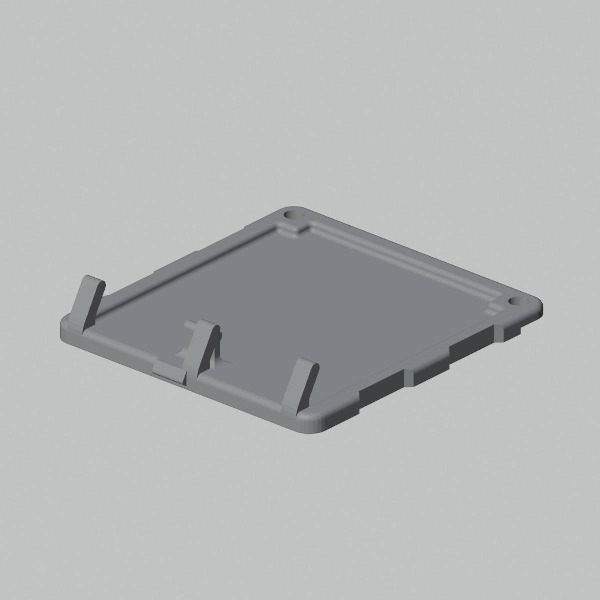
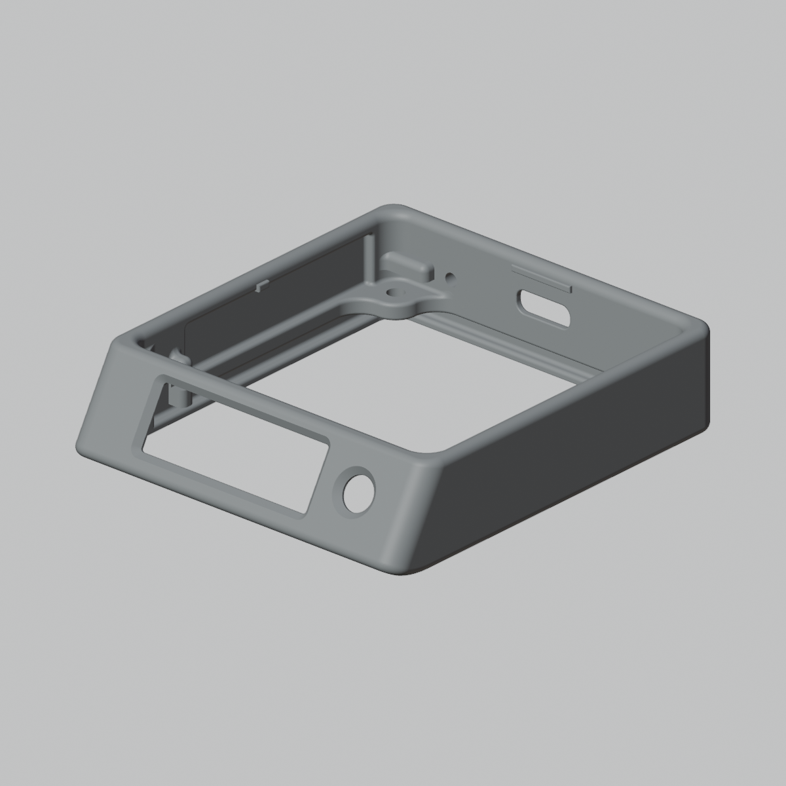
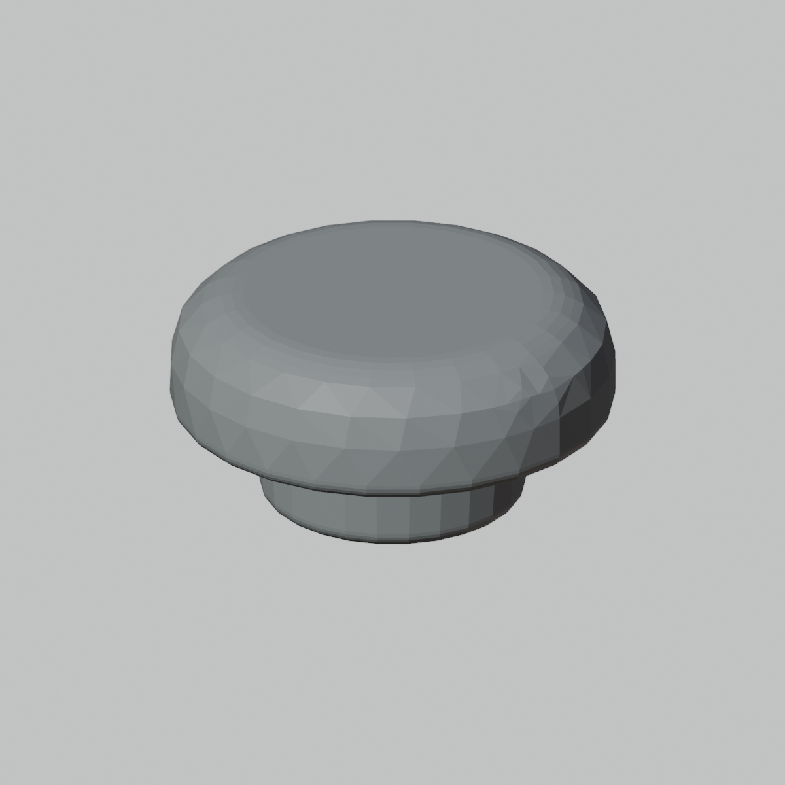

# Flux Purr 5.6cm Enclosure Models

This document indexes the print-ready enclosure STL assets for the `56 mm x 56 mm` Flux Purr heater-plate family. The models are stored as manufacturing support assets; the editable STEP sources remain outside the repository.

## Scope

- Target heater plate footprint: `56 mm x 56 mm`
- Related heater profiles:
  - [heater-5p6-3p2](heater-plates/heater-5p6-3p2.md)
  - [heater-5p6-4p5](heater-plates/heater-5p6-4p5.md)
- Asset directory: [models/enclosure-5p6cm](models/enclosure-5p6cm)
- STL storage: Git LFS under `docs/hardware/models/**/*.stl`

## Print-Ready Assets

| Part | Repository file | Source file | Bounding box `X x Y x Z` (mm) | Triangles | SHA-256 |
| --- | --- | --- | ---: | ---: | --- |
| `Bottom shell` | [flux-purr-enclosure-5p6cm-bottom.stl](models/enclosure-5p6cm/flux-purr-enclosure-5p6cm-bottom.stl) | `flux-purr-Bottom-repaired-precision.stl` | `50.90 x 54.27 x 9.59` | `3066` | `8fb99e723ae4c7ba9fa94922ab5a7ecc68971988855a21df5b28ad001fef5cf3` |
| `Inner frame` | [flux-purr-enclosure-5p6cm-inner-frame.stl](models/enclosure-5p6cm/flux-purr-enclosure-5p6cm-inner-frame.stl) | `flux-purr-Iframe-repaired-precision.stl` | `56.00 x 63.02 x 15.00` | `1441460` | `67a74134f86f44065baff455088e3a99e6fb607254ddcebf081ae12c6af32af0` |
| `Joystick cap` | [flux-purr-enclosure-5p6cm-joystick.stl](models/enclosure-5p6cm/flux-purr-enclosure-5p6cm-joystick.stl) | `flux-purr-Joystick-repaired-precision.stl` | `7.00 x 6.99 x 3.50` | `2092` | `66d3cd411858f2f824fc0b8dd583b41b13b4dd2a10799a918e53d75f50974347` |

## Previews

| Part | Preview |
| --- | --- |
| `Bottom shell` |  |
| `Inner frame` |  |
| `Joystick cap` |  |

## Validation

The STL files are binary STL meshes. The checked copies match the source SHA-256 values listed above.

Blender 3D Print Toolbox validation result:

| Part | Non-manifold edges | Intersect faces | Zero faces | Thin faces | Shells |
| --- | ---: | ---: | ---: | ---: | ---: |
| `Bottom shell` | `0` | `0` | `0` | `0` | `1` |
| `Inner frame` | `0` | `0` | `0` | `0` | `1` |
| `Joystick cap` | `0` | `0` | `0` | `0` | `1` |

Machine-readable validation report:

```text
docs/hardware/models/enclosure-5p6cm/validation/blender-stl-check.json
```

## Source Policy

Only print-ready STL files are checked into this repository. STEP sources and intermediate repair outputs are intentionally not copied; use the SHA-256 values and source filenames above to trace the archived generation outputs when editable CAD sources are needed.
