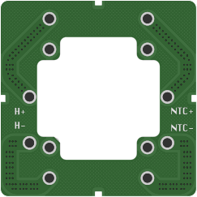
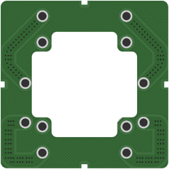
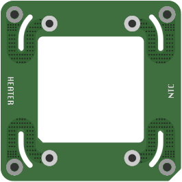
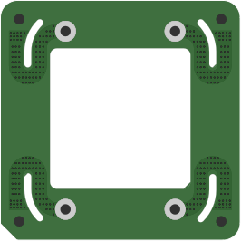

# Flux Purr 7.0cm Heater Stack Support Boards

This document defines the non-heater support boards used with the `70 mm x 70 mm` heater stack. The heater plate itself remains documented in [heater-plates/heater-7p0-3p2.md](heater-plates/heater-7p0-3p2.md).

The stack uses two companion boards:

- `support top board` (`顶板`)
- `insulation board` (`隔热板`)

These boards are part of the heater stack structure and wiring path. They are not heater-plate variants and must not be treated as firmware-facing heater load profiles.

## 1) Role in the Stack

The `support top board` and `insulation board` are used to keep the `7.0 cm` heater stack mechanically constrained while preserving the heater and NTC electrical paths.

Shared responsibilities:

- provide a rigid mounting pattern aligned to the `70 mm x 70 mm` stack footprint
- carry the heater and NTC interconnect pads between the stack contact points
- keep the heater-current path broad and symmetric instead of forcing a narrow wire harness path inside the stack
- preserve electrical separation between heater power and NTC sense routing

The `insulation board` is the board that carries the documented stitched `H+` and `H-` high-current copper regions used for the heater-current path estimate in this document. The `support top board` carries the companion stack contact geometry and also keeps the heater and NTC landing pattern aligned across the assembled stack.

These boards exist to make the stack easier to assemble, clamp, and service. They are not introduced as thermal-performance claims by themselves.

## 2) Relationship to the Heater Plate

The `heater-7p0-3p2` board remains the only board in this stack that belongs to the heater-plate family and the firmware-facing `3.2 ohm` load class.

Do not merge these support boards into the heater-plate identity:

- the heater plate defines `R20`, routed heater length, and source-power compatibility
- the support boards define stack structure, interconnect geometry, and local heater/NTC path distribution
- firmware still reasons about the heater plate as a calibrated resistive load, not about these companion boards as an additional profile dimension

## 3) Archived Gerber Packages

The archived manufacturing packages are stored at:

```text
docs/hardware/gerbers/heater-stack-support-7p0cm/flux-purr-heater-stack-support-top-board-7p0cm-gerbers.zip
docs/hardware/gerbers/heater-stack-support-7p0cm/flux-purr-heater-stack-insulation-board-7p0cm-gerbers.zip
```

Source file mapping:

- `Gerber_顶板.zip` -> `flux-purr-heater-stack-support-top-board-7p0cm-gerbers.zip`
- `Gerber_隔热板.zip` -> `flux-purr-heater-stack-insulation-board-7p0cm-gerbers.zip`

SHA-256:

```text
support top board: d189a8358bb667971d3f710f5105b2198a80cee51d3faa6fafd74c909b91dc6c
insulation board: d5726df593b0e4873f5c4818ed318504d69b1c0bf29729747e5e6becf59fcc29
```

The packages are archived as-is. The zip contents are not repacked or renamed internally so that the archived checksums continue to identify the original manufacturing exports.

## 4) Rendered Board Views

### Support Top Board

Top view:



Bottom view:



### Insulation Board

Top view:



Bottom view:



## 5) Electrical Intent

The stack support boards are designed so the heater path does not depend on a single narrow conductor inside the assembly.

Important routing boundaries:

- `H+` and `H-` are the heater-current nets
- `NTC+` and `NTC-` remain separate sense nets and must not be counted as heater-current copper
- the `insulation board` uses broad copper regions and dense via stitching so the heater-current path is shared between both sides of the board
- the `support top board` keeps the mechanical and contact geometry aligned with the heater and NTC landing points used in the assembled stack

This is why the stack uses board-shaped conductors instead of only wires or isolated tabs: the structure and current path are solved together, and the large copper regions keep the heater-current loss negligible relative to the heater load itself.

## 6) First-Order Current-Path Estimate

The following estimate is a first-order copper-only model for the `insulation board` heater path:

- copper weight: `1 oz`
- copper temperature: `100 C`
- current: `5 A`
- copper resistivity corrected with the standard first-order copper temperature coefficient
- both sides of the `H+` / `H-` path treated as stitched parallel copper regions

Approximate result:

```text
R_total(H+ + H-) ≈ 1.05 mΩ
P_total @ 5 A ≈ 26 mW
additional copper self-heating ≈ 1 C class
```

Interpretation:

- copper resistance rises with temperature, so `100 C` resistance is higher than `20 C`
- even after that correction, PCB copper loss stays tiny compared with heater power
- for this stack, the dominant thermal and reliability concerns are more likely to be contact resistance, pad pressure, solder joints, and repeated thermal cycling, not copper trace ampacity on these support boards

Out of model:

- contact resistance at pressure interfaces
- solder-joint resistance
- heater-plate body resistance
- ambient cooling and thermal coupling into the rest of the stack

## 7) Design Boundary

This document explains why the stack uses these two support boards:

- to hold the stack geometry
- to distribute heater and NTC contacts across stable board features
- to keep heater-current copper wide enough that the support path is electrically insignificant next to the heater plate
- to preserve a modular stack where heater plate and support boards can be reasoned about separately

It does not claim:

- verified thermal insulation performance
- verified long-term thermal-cycle lifetime
- verified contact resistance over life
- a new firmware-facing heater profile
