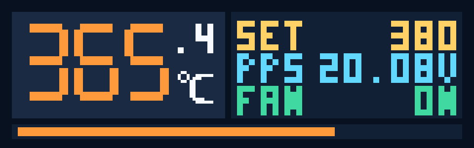
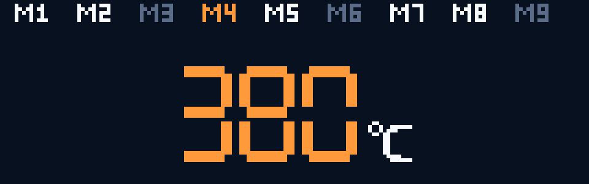
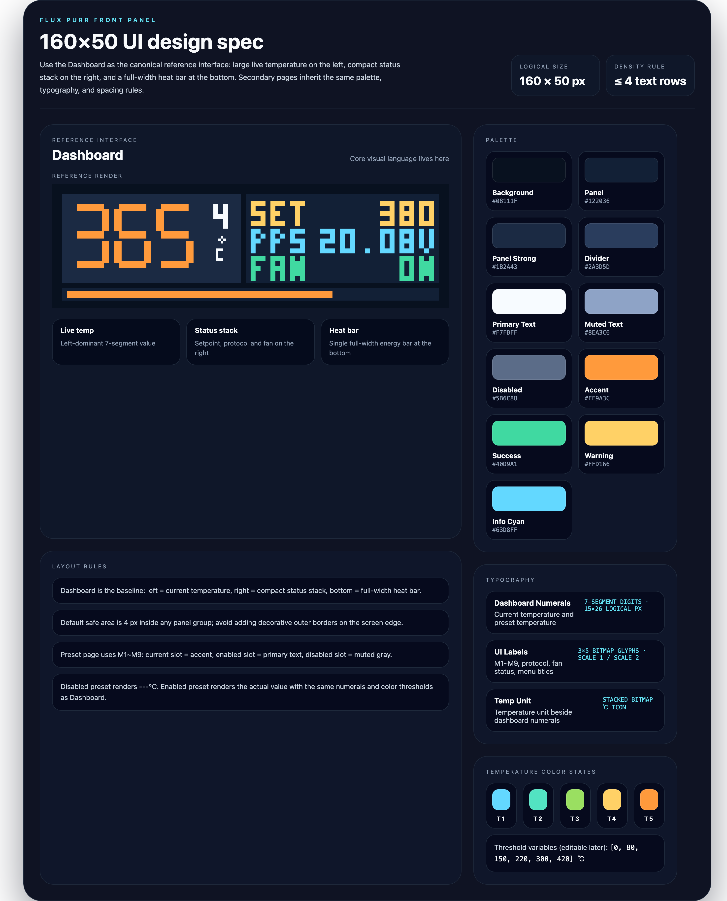

# Flux Purr 160×50 前面板 UI 契约（#223uj）

## 状态

- Status: 已完成
- Created: 2026-04-10
- Last: 2026-04-16

## 背景 / 问题陈述

- 当前仓库已经冻结 `ESP32-S3` 前面板硬件基线，但还没有一套可复用的前面板显示视觉契约，后续若直接做固件画屏，容易在信息层级、字体预算和导航结构上反复返工。
- 已确认当前显示面板属于与 `iso-usb-hub` 同类的 `1.12"` 小彩屏，按 `160×50` / RGB565 口径处理；这个尺寸极小，不适合移植常规仪表盘式布局，必须围绕“单主值 + 紧凑状态栈”重新设计。
- 若不先冻结 on-device UI 合同，后续热控、风扇、Wi‑Fi 和设备信息页面即使字段齐全，也可能因为文案过长、状态挤压或菜单层级不清而失去可用性。

## 目标 / 非目标

## 交互继承说明

- 本 spec 继续作为 `160×50` 前面板的视觉 token、布局和渲染基线。
- 五向输入、手势阈值、菜单路由和 Key Test 诊断行为，统一迁移到 `#fk3u7`。
- heater PID、fan 运行态、fault-latch 与 Dashboard 真相源统一迁移到 `#q2aw6`。
- 若 `#223uj` 与 `#fk3u7` 在导航或交互描述上冲突，以 `#fk3u7` 为准。
- 若 `#223uj` 与 `#q2aw6` 在 heater/fan/runtime 文案上冲突，以 `#q2aw6` 为准。

### Goals

- 冻结 `160×50` 前面板主界面与两级设置菜单的视觉和导航契约。
- 为 `Dashboard`、`Key Test`、`Menu L1`、`Preset Temp`、`Active Cooling`、`WiFi Info`、`Device Info` 提供确定性渲染源。
- 约束屏幕网格、字体预算、颜色 token、状态文案和五向键导航映射。
- 在 `web/` 中提供可截图的 1:1 预览实现，作为当前最稳定的 render truth source。
- 输出一张界面设计规范图，明确配色、字体、温度分段与小屏布局规则。

### Non-goals

- 不落地真实 LCD 驱动、framebuffer 管线或固件侧 draw API。
- 不扩展 HTTP / WebSocket 契约，也不新增设备遥测字段。
- 不在本轮定义热控算法、风扇控制策略或 Wi‑Fi 配置写回逻辑。
- 不处理多语言字体资产；本轮 on-device 文案默认只用短英文与缩写。

## 范围（Scope）

### In scope

- `docs/specs/223uj-frontpanel-ui-contract/SPEC.md` 与 `docs/specs/README.md`。
- `web/src/features/frontpanel-preview/**` 的显示模型、渲染器与 mock state。
- `web/src/stories/FrontPanelDisplay.stories.tsx` 的 docs/gallery 与状态故事。
- 与该 spec 绑定的前面板视觉证据资产。

### Out of scope

- `docs/interfaces/http-api.md`。
- `firmware/` 下任何真实显示驱动或菜单状态机实现。
- 现有 device console 的布局重构。

## 需求（Requirements）

### MUST

- 逻辑分辨率固定为 `160×50`。
- 主界面必须把温度作为第一视觉焦点，且在 1× 逻辑尺寸下仍能一眼识别。
- 主界面必须同时显示：实时温度、设定温度、feature-selected 的 `PPS` 电压（默认 `20V`）与 `OFF/AUTO/RUN` 三态风扇显示。
- 主界面暂不显示当前命中的 preset 标识，保持既有视觉基线不变。
- `Preset Temp` 页面顶部必须显示 `M1 ~ M9` 预设槽位。
- 预设槽位状态必须固定为：当前项=主题色、已启用=正常文本色、未启用=置灰。
- `Preset Temp` 必须支持 `---℃` 表示预设未启用。
- `Preset Temp` 中灰色 `---` 槽位仍可进入与编辑；灰色仅表示当前值不可用。
- `Preset Temp` 的实际温度显示必须复用 Dashboard 温度字体与温度分段颜色。
- 一级菜单必须一次显示 `Preset Temp`、`Active Cooling`、`WiFi Info`、`Device Info` 四项。
- 五向键的手势与路由行为不再由本 spec 冻结；输入与导航合同以 `#fk3u7` 为准。
- 二级页面必须维持“单主任务”结构，不得塞入多个同级编辑面板。
- 预览实现必须支持确定性截图，不依赖真实固件或真实设备。

### SHOULD

- 颜色使用深色底 + 安全橙高亮 + 青蓝状态色，兼顾高对比和工业感。
- 文案长度应严格控制，避免超过 8 个大写/数字字符的行级标签。
- 页面底部保留轻量按键提示，帮助后续固件移植时维持交互一致性。

### COULD

- 后续在同一预览体系上扩展 fault / negotiating / wifi-disconnected 等状态。

## 功能与行为规格（Functional/Behavior Spec）

## 设计令牌（Design Tokens）

### Palette

| Token | Value | Usage |
| --- | --- | --- |
| `bg` | `#08111F` | 全局屏幕背景 |
| `panel` | `#122036` | 次级信息面 |
| `panelStrong` | `#1B2A43` | 主信息面 / 顶部图标栏 |
| `border` | `#2A3D5D` | 内部分隔线 |
| `text` | `#F7FBFF` | 启用文字 / 常规图标 |
| `muted` | `#8EA3C6` | 次级说明文字 |
| `disabled` | `#5B6C88` | 未启用状态 |
| `accent` | `#FF9A3C` | 当前选中项 / 主题强调 |
| `success` | `#40D9A1` | 风扇启用 / 正常状态 |
| `warning` | `#FFD166` | 设定温度 / 警示信息 |
| `cyan` | `#63D8FF` | 协议 / 联网 / 信息状态 |

### Typography

| Role | Spec | Usage |
| --- | --- | --- |
| Dashboard Numerals | 7-segment digits, `15×26` logical px per glyph | Dashboard / Preset 温度主值 |
| UI Labels | 3×5 bitmap glyphs, scale `1` 或 `2` | 菜单标题、状态标签、`M1~M9` |
| Temp Unit | stacked bitmap `℃` icon | 所有温度主值单位 |

### Temperature states

- 默认 8 段颜色：`#193B72` → `#2F6CFF` → `#63D8FF` → `#52E3C2` → `#9ADF61` → `#FFD166` → `#FF9A3C` → `#FF6B57`
- 默认 8 个阈值变量：`[0, 40, 60, 100, 150, 200, 250, 300]`
- 阈值后续允许在设置界面调整，但颜色映射顺序固定不变。

### Core flows

- `Dashboard`
  - 左侧为大温度区，显示当前实时温度。
  - 右侧为紧凑状态栈，至少承载 `SET` / `PPS` / `FAN` 三行。
  - 过温告警激活时，`SET` 行切换为 `WARN / OTEMP` 并闪烁；`FAN` 行仍保持 `OFF/AUTO/RUN` 三态显示。
  - 底部细条用于表达 heater 实际输出强度。
  - 不显示当前命中的 `MAN / Mx` 或其他 preset 标签。
- `Menu L1`
  - 采用横向图标菜单，四个入口按一行切换。
  - 底部显示当前选中项的标题与一行说明文字。
  - 当前选中项以橙色高亮底和反白图标突出。
- `Preset Temp`
  - 顶部一行显示 `M1 ~ M9` 预设槽位。
  - `M1 ~ M9` 标签靠近屏幕上边缘，与主值区拉开足够层级。
  - 当前选中槽位使用主题色；启用槽位用正常文本色；未启用槽位用灰色。
  - 中央主值必须使用与 Dashboard 相同的 7-segment 温度字体。
  - 未启用预设显示 `---℃`；启用预设显示实际温度值并复用 Dashboard 温度分段颜色。
- `Active Cooling`
  - 用明确的 `ON/OFF` 和两行只读策略说明表达主动降温状态。
  - 第一行固定概括 `PD 20V | <35 OFF >40 50% >60 MAX`；`20V` 为默认 build，`12V / 28V` 变体只替换电压值，不改变布局。
  - 第二行固定概括 `SAFE >100 PLS >350 50% >360 MAX`。
- `WiFi Info`
  - 只显示最关键的三行：`SSID`、`RSSI`、`IP`。
- `Device Info`
  - 只显示 `Board`、`FW`、`Serial` 三组紧凑信息。

### Edge cases / errors

- 若连接状态异常，允许把右侧最底行切换为 `FAULT` / `NEGOT.` / `OFFLINE`，但不得挤压温度主视觉区。
- 若字符串超出预算，必须使用缩写或截断，不允许自动缩小主字号来硬塞内容。
- 若风扇策略开启但当前无需工作，状态必须明确显示 `AUTO`；若策略关闭，则必须显示 `OFF`，不得仍显示占空比数值造成歧义。

## 接口契约（Interfaces & Contracts）

### 接口清单（Inventory）

| 接口（Name） | 类型（Kind） | 范围（Scope） | 变更（Change） | 契约文档（Contract Doc） | 负责人（Owner） | 使用方（Consumers） | 备注（Notes） |
| --- | --- | --- | --- | --- | --- | --- | --- |
| `FrontPanelScreen` | TypeScript type | internal | New | None | web | Storybook / future firmware port | 前面板单屏渲染联合类型 |
| `FrontPanelDisplay` | React component | internal | New | None | web | Storybook / preview pages | 160×50 逻辑屏预览组件 |
| `frontPanelStoryStates` | Mock data | internal | Updated | None | web | Storybook | 冻结 Key Test + Dashboard/Menu/subpage 主要画面状态 |

### 契约文档（按 Kind 拆分）

None

## 验收标准（Acceptance Criteria）

- Given `Dashboard` 画面，When 在 1× 逻辑尺寸审视屏幕，Then 目标温度仍是最显著元素，且 heater / fan 状态均可读。
- Given `Menu L1`，When 在同屏展示 4 个菜单项，Then 所有菜单项完整可见且选中项不与其他行混淆。
- Given `Preset Temp` 页面，When 观察屏幕，Then 目标温度为单一主任务，不出现第二个竞争主视觉块。
- Given `Preset Temp` 页面，When 某个槽位显示为灰色 `---`，Then 该槽位仍可被选中与重新调整为有效值。
- Given `Active Cooling` 页面，When 观察屏幕，Then 开关状态与两行安全策略摘要清晰分层，不依赖外部图例理解。
- Given `WiFi Info` 页面，When 观察屏幕，Then `SSID/RSSI/IP` 均可读，且没有超过屏宽的断行。
- Given `Device Info` 页面，When 观察屏幕，Then `Board/FW/Serial` 结构清楚且信息密度不显拥挤。
- Given Storybook docs/gallery，When 打开前面板故事集，Then 至少存在 `Key Test`、`Dashboard`、`Menu`、四个子页与 1 个总览画面。

## 实现前置条件（Definition of Ready / Preconditions）

- 前面板硬件基线已明确为 `160×50` / RGB565 级别小彩屏。
- 本轮只冻结视觉契约，不做真实固件画屏。
- on-device 文案默认使用英文短词和缩写。

## 非功能性验收 / 质量门槛（Quality Gates）

### Testing

- Type/lint: `bun run --cwd web check`
- App build: `bun run --cwd web build`
- Storybook build: `bun run --cwd web storybook:ci`

### UI / Storybook (if applicable)

- Storybook 必须提供 docs/gallery 入口。
- 视觉证据必须绑定到本 spec 目录下的 `assets/`。

## 文档更新（Docs to Update）

- `docs/specs/README.md`: 新增索引项，并在交付收口时更新状态与备注。
- `docs/specs/223uj-frontpanel-ui-contract/SPEC.md`: 随实现与视觉证据同步更新。

## 实现里程碑（Milestones / Delivery checklist）

- [x] M1: 冻结前面板小屏 UI spec、网格与导航契约
- [x] M2: 落地前面板 160×50 预览组件与 mock 状态模型
- [x] M3: 补齐 Storybook docs/gallery 与主要交互状态故事
- [x] M4: 回填视觉证据并通过 web + Storybook 质量门

## 方案概述（Approach, high-level）

- 使用浏览器侧的 `canvas` 作为最小稳定渲染器，把所有前面板画面统一约束到 `160×50` 逻辑像素。
- 主界面采用“左大温度 / 右侧状态栈”的强层级布局，确保小屏条件下先读主值、再读功率和系统状态。
- 菜单页统一使用短词条和单任务二级页，减少主人后续把 Web 控制台思路误搬到前面板上的风险。

## 风险 / 开放问题 / 假设（Risks, Open Questions, Assumptions）

- 风险：浏览器字体渲染和未来固件字体栅格并非同一实现，最终落固件时仍需做像素级微调。
- 风险：`WiFi Info` 与 `Device Info` 一旦字段变长，必须依赖缩写策略，否则会挤压布局。
- 开放问题：后续是否需要加入中文字体或多语言切换，本轮暂不处理。
- 假设（需主人确认）：当前样机的主要显示方向和 `160×50` 横屏布局一致。

## Visual Evidence

- 证据来源：Storybook `canvas` + docs gallery（`160×50` 逻辑像素，nearest-neighbor 放大展示）
- 绑定说明：以下图片来自 `web/src/stories/FrontPanelDisplay.stories.tsx`；真机校准与最新 runtime 联动验证由 `#fk3u7` 持续承接。

### Screen renders

#### Dashboard

#### Menu Level 1

#### Preset Temp

#### Active Cooling

#### WiFi Info

#### Device Info

### Design spec board

## 变更记录（Change log）

- 2026-04-10: 创建前面板 UI 契约规格，冻结 `160×50` 小屏、主界面结构、两级菜单和视觉验证口径。
- 2026-04-10: 完成 `FrontPanelDisplay` 预览组件、Storybook 状态画廊与 6 张前面板渲染图落盘。
- 2026-04-16: 同步 `#fk3u7` 的最终口径，Dashboard 不再显示 preset 标签，`Preset Temp` 的灰色 `---` 槽位保持可进入可编辑。

## 参考（References）

- `/Users/ivan/Projects/Ivan/flux-purr/docs/hardware/s3-frontpanel-baseline.md`
- `/Users/ivan/Projects/Ivan/flux-purr/docs/interfaces/http-api.md`
- `repo://IvanLi-CN/iso-usb-hub/sha/51a1a0e9bb0cd0857ff18fdcae34969442c80a35/contents/docs/dashboard_spec.md`
