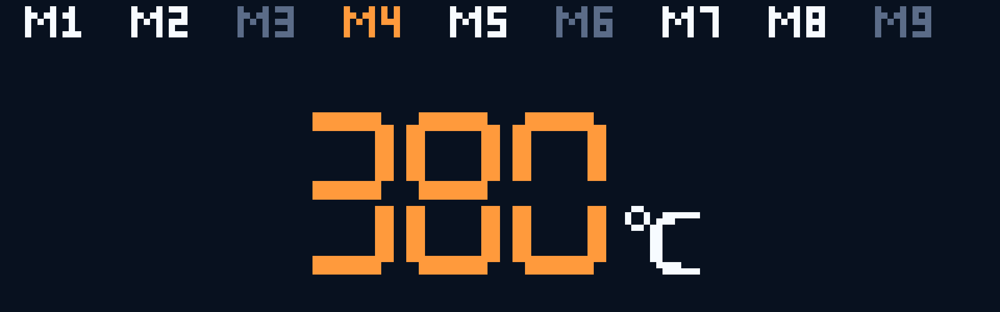
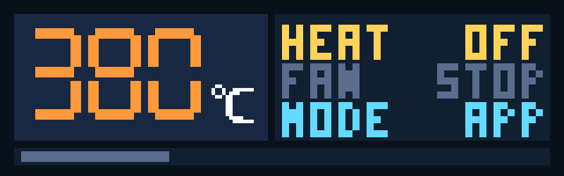
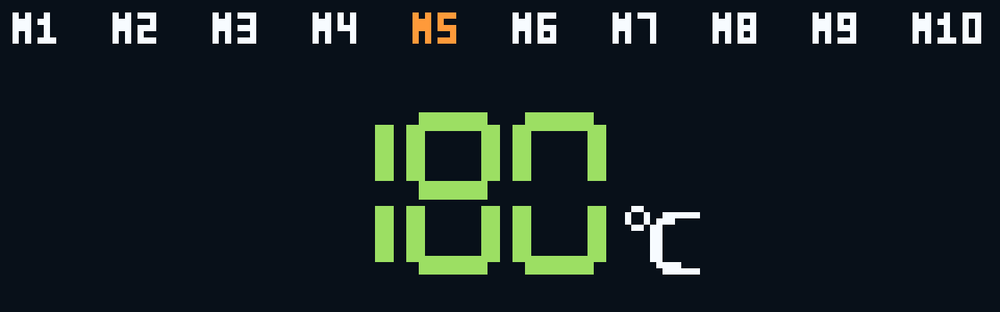

# Flux Purr 前面板五向输入与交互导航（#fk3u7）

## 状态

- Status: 已完成
- Created: 2026-04-13
- Last: 2026-04-16

## 背景 / 问题陈述

- `#223uj` 已冻结 `160×50` 前面板的视觉基线，但当前固件仍停留在启动后静态轮播，无法验证五向键的实际 GPIO 映射、手势判定和页面联动。
- 五向开关的中心键与 `GPIO0 / BOOT` 复用，若把诊断入口绑到上电长按，会把调试入口和启动约束耦死，给真机校准带来不必要风险。
- 若不先做“可校准的 Key Test + 可重放的页面联动”，后续把真实 heater / fan / preset 逻辑接进来时，很难分辨是输入映射错、手势阈值错，还是界面状态机错。

## 目标 / 非目标

### Goals

- 新建一份前面板输入与交互导航 spec，冻结两阶段范围、按键阈值、路由行为与验证口径。
- 在固件中新增真实五向输入域：`raw GPIO -> logical key -> short / double / long gesture`。
- 提供 build-time `FrontPanelRuntimeMode`：`KeyTest` 用于真机校准，`App` 用于 Dashboard/Menu/subpage mock 联动。
- 在 Web Storybook 中补齐 `Key Test`、`Dashboard`、`Menu` 与子页的确定性故事、docs/gallery 与 `play` 交互覆盖。
- 让固件显示从静态轮播切换为 reducer 驱动的动态渲染，并冻结五向键对 Dashboard / Menu / 子页的导航语义。

### Non-goals

- 不在本 spec 内冻结真实 heater 功率控制、真实 fan 执行链路、RTD/tach 闭环、Wi‑Fi 写回或预设持久化；这些运行态真相源以后续 spec 为准。
- 不扩展超过 `Preset Temp / Active Cooling / WiFi Info / Device Info` 的正式菜单结构。
- 不用桌面全屏截图或临时手工截图作为验收主证据源。

## 范围（Scope）

### In scope

- `/Users/ivan/Projects/Ivan/flux-purr/firmware/src/frontpanel/**`
- `/Users/ivan/Projects/Ivan/flux-purr/firmware/src/bin/flux_purr.rs`
- `/Users/ivan/Projects/Ivan/flux-purr/firmware/src/bin/frontpanel_preview.rs`
- `/Users/ivan/Projects/Ivan/flux-purr/web/src/features/frontpanel-preview/**`
- `/Users/ivan/Projects/Ivan/flux-purr/web/src/stories/FrontPanelDisplay.stories.tsx`
- `/Users/ivan/Projects/Ivan/flux-purr/docs/specs/fk3u7-frontpanel-input-interaction/**`
- `/Users/ivan/Projects/Ivan/flux-purr/docs/specs/223uj-frontpanel-ui-contract/SPEC.md`
- `/Users/ivan/Projects/Ivan/flux-purr/docs/specs/README.md`

### Out of scope

- `docs/interfaces/http-api.md`
- 真实温控、风扇闭环或联网设置的数据契约变更
- 非前面板 UI 的 console 页面结构变更

## 需求（Requirements）

### MUST

- 五向键去抖阈值固定在 `20-30ms`，当前实现口径使用 `20ms`。
- 长按阈值固定为 `500ms`；双击窗口固定为 `250ms`。
- 长按每次按住只允许发出一次 `long` 事件，且不得在释放时回补 `short`。
- App runtime 的手势识别必须按当前 route 的有效输入能力收窄；只有当前 route 支持同一逻辑键双击时，短按才等待双击窗口。
- `Key Test` 画面必须显示五向示意图，默认白色，短按=`Success`、双击=`Accent`、长按=`Info Cyan`。
- `Key Test` 必须同时显示 raw pin / logical key / gesture 诊断信息，用于真机回填 GPIO 映射表。
- 诊断入口不得依赖 `GPIO0` 上电长按；必须使用 build-time `FrontPanelRuntimeMode` 切换。
- `Dashboard` 上/下必须以 `1°C` 步进调整当前目标温度。
- `Dashboard` 左/右必须按“已启用记忆温度的实际温度值排序”找到最近的下一个温度，而不是按槽位顺序切换。
- `Dashboard` 暂不显示当前命中的预设槽位或 `MAN / Mx` 文案，保持既有视觉基线不变。
- `Dashboard` 中键短按只切 heater arm；中键双击切换主动降温（`active_cooling_enabled`）；中键长按只进菜单。
- 一级菜单必须固定为 `Preset Temp / Active Cooling / WiFi Info / Device Info` 四项，左右移动，中键短按进入，中键长按回 Dashboard。
- 子页默认中键短按退出，中键长按兜底退出；左键返回菜单。
- `Preset Temp` 页必须允许进入全部 `M1-M10` 槽位；灰色槽位只代表当前值无效，不代表不可进入。
- `Preset Temp` 默认预设温度必须固定为 `50 / 100 / 120 / 150 / 180 / 200 / 210 / 220 / 250 / 300°C`，并按 `M1-M10` 顺序展示。
- `Preset Temp` 页中，当槽位值降到 `0°C` 以下时必须进入 `---` 状态并置灰；再次上调时必须能从 `---` 回到 `0°C`。
- `Dashboard` 仅在左右切换记忆温度时忽略灰色 / `---` 槽位，不得把无效预设当作可命中的目标值。
- `Active Cooling` 页在当前正式 runtime 中为只读策略说明页；用户开启这一项时，口径统一称为“开启主动降温”；页面只保留返回/退出导航，不再承载可写 fan mock。
- `WiFi Info / Device Info` 必须保持只读页，仅处理返回/退出。
- 若 runtime 处于“fault 已消失但 attention reminder 仍待确认”状态，则第一次任意输入只负责确认/静音，不执行 heater/fan/menu 原动作；第二次输入才恢复正常语义。
- 所有已接受的前面板用户操作都必须有声音反馈；Dashboard 的 heater / 主动降温切换继续使用专用 cue，其余已接受交互（菜单导航、进入/退出子页、Preset Temp 编辑等）统一使用通用提示音。
- 真实 heater / fan 执行链路、保护与运行态真相源以 `#q2aw6` 为准；本 spec 只冻结输入与导航语义。
- Storybook 必须提供 docs/gallery 与交互故事，作为 Web 侧视觉主证据源。
- 视觉证据必须同时包含 Storybook render 与 firmware preview render，并绑定到本 spec 的 `assets/`。

### SHOULD

- raw-pin -> logical-key 映射表与扫描逻辑解耦，便于硬件校准后单点更新。
- 固件与 Web mock reducer 的路由与交互语义保持一致，避免“双实现”漂移。
- `Key Test` 和 App mock 页面都提供稳定的 host preview / Storybook 入口，方便后续回归。

### COULD

- 后续把 `Key Test` 的 raw mask / key label 导出为串口日志或 overlay 文本，辅助更快校准。

## 功能与行为规格（Functional / Behavior Spec）

### 输入域模型

- `RawFrontPanelKey`：表示物理采样位。
- `FrontPanelKey`：逻辑方向键，固定为 `Center / Right / Down / Left / Up`。
- `KeyGesture`：`ShortPress / DoublePress / LongPress / RepeatPress`。
- `KeyEvent`：一条稳定事件，包含逻辑键、手势与诊断元数据。
- `FrontPanelRuntimeMode`：`KeyTest` 或 `App`。

### Key Test（阶段 1）

- 默认停留在 `Key Test` 路由时，五向示意图全部白色。
- 任意键稳定触发 `short / double / long` 后，对应方向图形切换到目标颜色；`up/down` 的 hold-repeat 诊断显示为 `repeat`。
- 同时显示：
  - raw key label
  - logical key label
  - gesture label
  - raw mask label
- `Key Test` 仅更新诊断状态，不切页面。

### Dashboard（阶段 2）

- `Up short / repeat`：`targetTempC += 1`
- `Down short / repeat`：`targetTempC -= 1`
- `Left short`：跳到严格小于当前温度、且最接近的已启用预设值
- `Right short`：跳到严格大于当前温度、且最接近的已启用预设值
- `Center short`：切换 `heaterEnabled`
- `Center double`：切换 `active_cooling_enabled`
- `Center long`：进入 `Menu`
- 目标温度、路由、heater arm 与主动降温策略位进入统一 UI/runtime state；真实 fan runtime 由 `#q2aw6` 约束，不由双击直接切换

### Menu（一级菜单）

- `Left short / Right short`：循环切换菜单项
- `Center short`：进入当前项对应子页
- `Center long`：返回 `Dashboard`

### 子页默认行为

- `Preset Temp`
  - `Right short`：按槽位顺序循环到下一个 `M1-M10`
  - `Up short / repeat`：对当前槽位做 `+1°C`；若当前为 `---`，则恢复到 `0°C`
  - `Down short / repeat`：对当前槽位做 `-1°C`；若值降到 `0°C` 以下，则变成 `---`
  - `Left short / Center short / Center long`：返回 `Menu`
- `Active Cooling`
  - 只读显示当前安全策略（overtemp-only 风扇包线说明）
  - `Left short / Center short / Center long`：返回 `Menu`
- `WiFi Info / Device Info`
  - 只读显示
  - `Left short / Center short / Center long`：返回 `Menu`

### 边界条件

- 不同方向键的 pending click 不得互相串扰。
- 只有当前 route 支持同一逻辑键双击时，短按才必须等待双击窗口收敛；只支持短按的方向键必须在释放去抖后立即发出短按，避免快速连续单击被合成为无效双击。
- 长按阈值仍为 `500ms`；`up/down` 到达长按后进入温度 hold-repeat，先约每 `200ms` 产生一次 `repeat`，持续约 `1.5s` 后加速到约每 `100ms`，释放即停止且不得回补 `short`。
- hold-repeat 只用于 `up/down` 温度调整；`left/right/center` 长按仍只产生单次 `long`，不得重复触发导航或开关动作。
- 当没有更低或更高的已启用预设时，Dashboard 左/右保持当前温度不变。
- 当 runtime 仍在播放 fault-clear attention reminder 时，第一次任意输入必须被消费为确认动作，不得顺带触发页面导航或 heater/fan 切换。
- mock 页面不因无效手势崩溃或跳到未知路由。

## 接口契约（Interfaces & Contracts）

### 接口清单（Inventory）

| 接口（Name） | 类型（Kind） | 范围（Scope） | 变更（Change） | 契约文档（Contract Doc） | 负责人（Owner） | 使用方（Consumers） | 备注（Notes） |
| --- | --- | --- | --- | --- | --- | --- | --- |
| `RawFrontPanelKey / FrontPanelKey / KeyGesture / KeyEvent` | Rust domain model | internal | New | None | firmware | esp32s3 runtime / tests / preview | 固件输入域模型 |
| `FrontPanelUiState / FrontPanelRoute / FrontPanelRuntimeMode` | Rust state model | internal | New | None | firmware | runtime / preview | 固件 reducer 与路由状态 |
| `FrontPanelRuntimeState / FrontPanelScreen` | TypeScript type | internal | Updated | None | web | Storybook / preview harness | Web mock runtime 对齐固件语义 |
| `FrontPanelRuntimeHarness` | React component | internal | New | None | web | Storybook play coverage | 稳定交互驱动器 |
| `frontpanel_preview` | Host preview bin | internal | New | None | firmware | visual evidence | 导出 framebuffer 供 PNG 转换 |

### 契约文档（按 Kind 拆分）

None

## 验收标准（Acceptance Criteria）

- Given `Key Test` 模式，When 任意物理方向键或中键在真机上触发短按 / 双击 / 长按，Then 屏幕会点亮正确的逻辑方向，并显示匹配的 raw/logical/gesture 诊断信息。
- Given `Key Test` 模式，When 单击一次，Then 不会被误判成双击；When 长按一次，Then 只发出一次长按事件；When 换键测试，Then 不会串扰前一个键的 pending click。
- Given `Dashboard`，When 主人短按或长按保持上/下，Then 目标温度每次事件严格 `±1°C`，长按保持按先慢后快节奏连续调整。
- Given `Dashboard` 或 `Preset Temp`，When 主人快速连续按上/下方向键，Then 每次有效释放都生成独立短按，不会被合成为无效双击。
- Given `Dashboard`，When 主人按左/右，Then 跳转基于已启用预设的实际温度值排序，而不是按槽位编号。
- Given `Dashboard`，When 当前温度命中某个预设值或刚从预设值调离，Then 界面仍不显示当前预设槽位标签。
- Given `Dashboard`，When 主人短按 / 双击 / 长按中键，Then 分别只触发 heater arm、切换主动降温、进入菜单，不发生混用。
- Given 一级菜单，When 主人左右移动并中键进入，Then 始终只在四个固定项之间切换。
- Given 任意子页，When 主人中键短按或长按，Then 都能回到上一级菜单；When 主人按左键，Then 也能返回菜单。
- Given `Preset Temp`，When 某个槽位已显示为灰色 `---`，Then 仍然可以被选中、进入并通过短按或 hold-repeat 上调重新调回有效温度。
- Given `WiFi Info / Device Info`，When 主人操作返回手势，Then 页面只发生返回，不产生额外 mock 副作用。
- Given runtime 刚从活动 fault 退出且仍在 attention reminder pending，When 主人第一次进行任意输入，Then 该输入只会确认/静音，不会执行原本对应的 heater/fan/menu 动作。
- Given Storybook docs/gallery，When 打开故事集，Then 至少存在 `Key Test`、`Dashboard`、`Menu`、四个子页和两条交互流故事。
- Given firmware preview 与 Storybook 截图，When 对比同一路由，Then 颜色、布局和文案口径保持一致。

## 实现前置条件（Definition of Ready / Preconditions）

- 前面板硬件基线已冻结为 `ESP32-S3 + GC9D01 + 五向开关`。
- 当前阶段允许修改固件显示运行态与 Storybook 预览，但不接真实控制链路。
- `Key Test` 与 App mock 的验收主证据源分别为固件 preview / Storybook docs，并最终统一回填本 spec。

## 非功能性验收 / 质量门槛（Quality Gates）

### Testing

- `cargo test --manifest-path /Users/ivan/Projects/Ivan/flux-purr/firmware/Cargo.toml`
- `cargo build --manifest-path /Users/ivan/Projects/Ivan/flux-purr/firmware/Cargo.toml --release`
- `source /Users/ivan/export-esp.sh && cargo +esp build --manifest-path /Users/ivan/Projects/Ivan/flux-purr/firmware/Cargo.toml --target xtensa-esp32s3-none-elf --features esp32s3 --bin flux-purr --release`
- `bun run --cwd /Users/ivan/Projects/Ivan/flux-purr/web check`
- `bun run --cwd /Users/ivan/Projects/Ivan/flux-purr/web build`
- `bun run --cwd /Users/ivan/Projects/Ivan/flux-purr/web test:storybook`
- `bun run --cwd /Users/ivan/Projects/Ivan/flux-purr/web storybook:ci`

### UI / Storybook / Firmware Preview

- Web 侧必须先清 Storybook coverage，再截图。
- 固件侧必须通过 host preview 产出 framebuffer 与 PNG。
- owner-facing 图片与 spec 资产必须绑定到当前实现 head，且聊天回图前先做 immutable snapshot。

## 文档更新（Docs to Update）

- `/Users/ivan/Projects/Ivan/flux-purr/docs/specs/README.md`
- `/Users/ivan/Projects/Ivan/flux-purr/docs/specs/223uj-frontpanel-ui-contract/SPEC.md`
- `/Users/ivan/Projects/Ivan/flux-purr/docs/specs/fk3u7-frontpanel-input-interaction/SPEC.md`

## 实现里程碑（Milestones / Delivery checklist）

- [x] M1: 落地固件输入域模型、手势识别和 host-side 单测
- [x] M2: 落地动态 `Key Test` 模式、build-time runtime mode 与 firmware preview harness
- [x] M3: 落地 Dashboard/Menu/subpage mock reducer，并补齐 Web Storybook docs/play coverage
- [x] M4: 回填视觉证据、完成 xtensa build 与真机校准 / mock 导航验证，并把分支收敛到 PR-ready

## 方案概述（Approach, high-level）

- 固件侧通过统一 reducer 把输入、路由和渲染绑定到同一状态树，避免“输入识别”和“显示切页”各自维护隐藏状态。
- Web 侧复用同一套交互语义，使用 Storybook docs/gallery 与 harness button 作为稳定的 mock 证明源。
- 视觉证据采用“双源绑定”：Storybook 提供主 UI 合同，firmware preview 证明嵌入式渲染与布局一致；真机只用来校准映射和验证手势/导航真实路径。

## 风险 / 开放问题 / 假设（Risks, Open Questions, Assumptions）

- 风险：真实 GPIO 极性或方向命名可能与当前 board constants 不完全一致，需要通过阶段 1 真机校准回填映射表。
- 风险：center 键共享 `GPIO0`，若未来切到别的调试入口，必须继续避免与 boot strap 冲突。
- 风险：mock reducer 与未来真实业务 reducer 合并时，若没有保持状态边界清晰，容易把 UI-only 标志带进执行链路。
- 开放问题：未来是否需要在 `Key Test` 模式叠加串口日志或屏幕页码提示，本轮暂不扩 scope。
- 假设：当前 S3 frontpanel 板和 GC9D01 显示方向已按现有 board baseline 固定，后续只校准按键映射。

## Visual Evidence

- 证据来源：Storybook canvas stories + firmware host preview + 真机 flash/monitor 校准记录
- 绑定说明：以下图片对应当前本地实现；聊天验收图与 spec 资产保持同源

### Storybook canvas

#### Key Test

#### Dashboard

#### Preset Temp

### Firmware preview renders

#### Key Test

#### Dashboard

#### Preset Temp

### Hardware verification

- `esp32s3_frontpanel` 已完成 `Key Test` 真机校准，`left/down` 映射对调后确认无误。
- 真机 `App` runtime 已验证 `Dashboard / Menu / Preset Temp / Active Cooling` 的输入与导航联动路径；heater/fan 真相源与运行态保护由 `#q2aw6` 承接。
- `Preset Temp` 页面已在真机确认：`M1-M10` 默认预设值为 `50 / 100 / 120 / 150 / 180 / 200 / 210 / 220 / 250 / 300°C`；任一槽位即使被降到灰色 `---`，仍可重新调回有效值。

## 变更记录（Change log）

- 2026-04-13: 创建前面板五向输入与交互导航规格，冻结两阶段范围、手势阈值、Key Test 与导航口径。
- 2026-04-16: 完成真机 Key Test 校准、App runtime mock 导航验证与视觉证据回填；同步 Dashboard 与 Preset Temp 的最终验收口径。
- 2026-04-27: 将 App runtime 手势识别改为按当前 route 有效输入能力收窄，避免方向键快速连续短按被双击窗口吞掉。
- 2026-04-27: 保持 fault-clear attention reminder 的任意 raw 输入确认语义，即使该键在当前 route 不生成页面事件，或会在 release 去抖 / 双击窗口后延迟生成事件。

## 参考（References）

- `/Users/ivan/Projects/Ivan/flux-purr/docs/specs/223uj-frontpanel-ui-contract/SPEC.md`
- `/Users/ivan/Projects/Ivan/flux-purr/firmware/src/board/s3_frontpanel.rs`
- `/Users/ivan/Projects/Ivan/flux-purr/firmware/src/bin/flux_purr.rs`
- `/Users/ivan/Projects/Ivan/flux-purr/web/src/stories/FrontPanelDisplay.stories.tsx`
