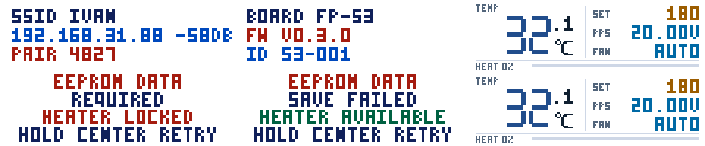
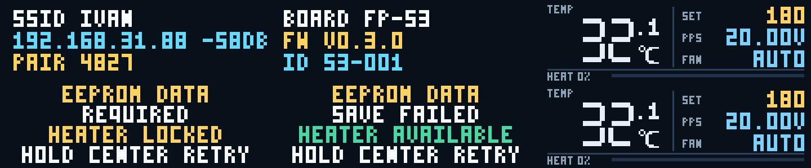
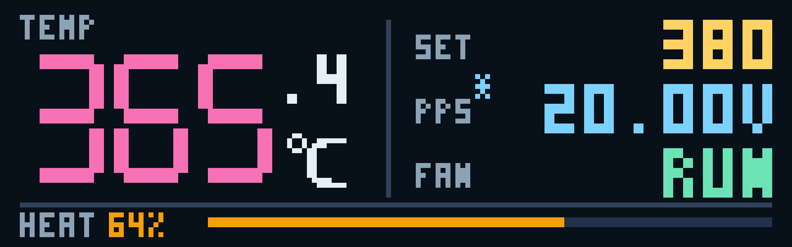
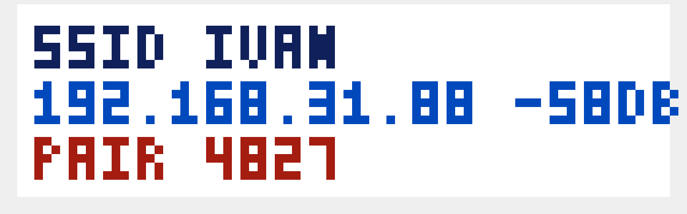
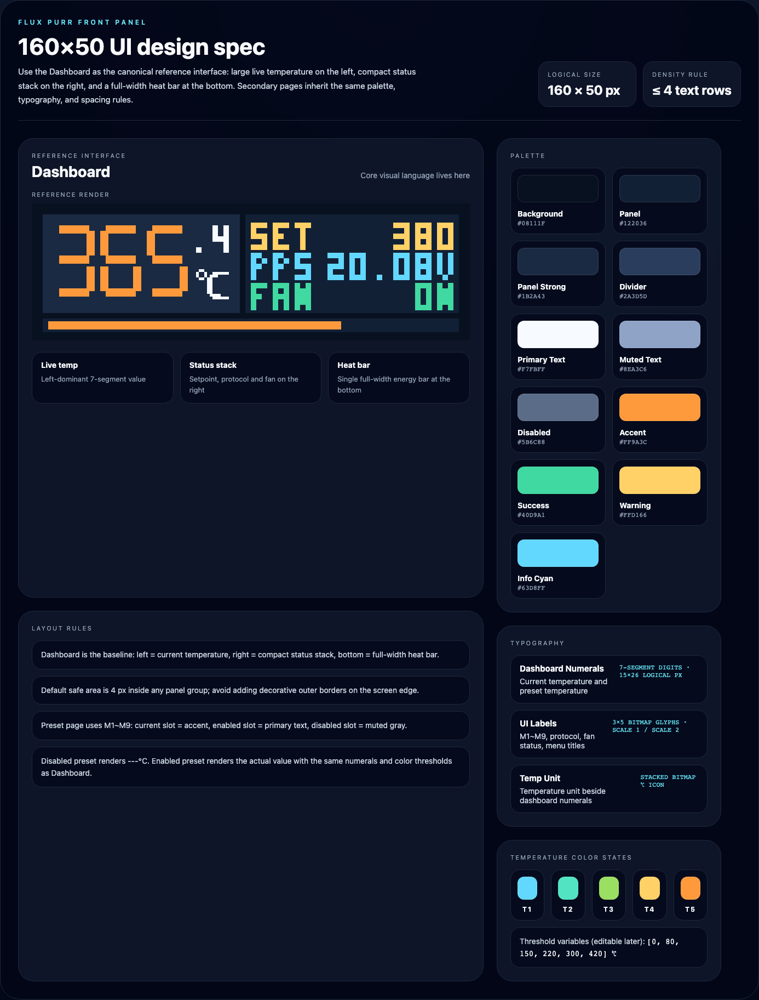

# Flux Purr 160×50 前面板 UI 契约

## 背景 / 问题陈述

- 当前仓库已经冻结 `ESP32-S3` 前面板硬件基线，但还没有一套可复用的前面板显示视觉契约，后续若直接做固件画屏，容易在信息层级、字体预算和导航结构上反复返工。
- 已确认当前显示面板属于与 `iso-usb-hub` 同类的 `1.12"` 小彩屏，按 `160×50` / RGB565 口径处理；这个尺寸极小，不适合移植常规仪表盘式布局，必须围绕“单主值 + 紧凑状态栈”重新设计。
- 若不先冻结 on-device UI 合同，后续热控、风扇、Wi‑Fi 和设备信息页面即使字段齐全，也可能因为文案过长、状态挤压或菜单层级不清而失去可用性。

## 目标 / 非目标

## 交互继承说明

- 本 spec 继续作为 `160×50` 前面板的视觉 token、布局和渲染基线。
- 五向输入、手势阈值、菜单路由和 Key Test 诊断行为，统一迁移到 `frontpanel-input-interaction`。
- heater PID、fan 运行态、fault-latch 与 Dashboard 真相源统一迁移到 `heater-pid-frontpanel-runtime`。
- 若 `frontpanel-ui-contract` 与 `frontpanel-input-interaction` 在导航或交互描述上冲突，以 `frontpanel-input-interaction` 为准。
- 若 `frontpanel-ui-contract` 与 `heater-pid-frontpanel-runtime` 在 heater/fan/runtime 文案上冲突，以 `heater-pid-frontpanel-runtime` 为准。

### Goals

- 冻结 `160×50` 前面板主界面与两级设置菜单的视觉和导航契约。
- 为 `Dashboard`、`Key Test`、`Menu L1`、`Preset Temp`、`FAN CTRL`、`WiFi Info`、`Device Info` 提供确定性渲染源。
- 约束屏幕网格、字体预算、颜色 token、状态文案和五向键导航映射。
- 在 `web/` 中提供可截图的 1:1 预览实现，作为当前最稳定的 render truth source。
- 输出一张界面设计规范图，明确配色、字体、温度分段与小屏布局规则。

### Non-goals

- 不落地真实 LCD 驱动、framebuffer 管线或固件侧 draw API。
- 不扩展 HTTP / WebSocket 契约，也不新增设备遥测字段。
- 不在本轮定义 heater PID 或 Wi‑Fi 配置写回逻辑；FAN CTRL 的多档策略显示与编辑以运行时 spec 为准。
- 不处理多语言字体资产；本轮 on-device 文案默认只用短英文与缩写。

## 范围（Scope）

### In scope

- `docs/specs/frontpanel-ui-contract/SPEC.md` 与 `docs/specs/README.md`。
- `firmware/src/frontpanel/**` 的 FAN CTRL 渲染与交互投影。
- `web/src/features/frontpanel-preview/**` 的显示模型、渲染器与 mock state。
- `web/src/stories/FrontPanelDisplay.stories.tsx` 的 docs/gallery 与状态故事。
- 与该 spec 绑定的前面板视觉证据资产。

### Out of scope

- `docs/interfaces/http-api.md`。
- 现有 device console 的布局重构。

## 需求（Requirements）

### MUST

- 逻辑分辨率固定为 `160×50`。
- 主界面必须把温度作为第一视觉焦点，且在 1× 逻辑尺寸下仍能一眼识别。
- 主界面必须同时显示：实时温度、设定温度、feature-selected 的 `PPS` 电压（默认 `20V`）与 `OFF/AUTO/RUN/SAFE` 风扇显示；风扇策略详情页不得暴露 PD 或电压调节。
- 主界面暂不显示当前命中的 preset 标识，保持既有视觉基线不变。
- `Preset Temp` 页面顶部必须显示 `M1 ~ M9` 预设槽位。
- 预设槽位状态必须固定为：当前项=主题色、已启用=正常文本色、未启用=置灰。
- `Preset Temp` 必须支持 `---℃` 表示预设未启用。
- `Preset Temp` 中灰色 `---` 槽位仍可进入与编辑；灰色仅表示当前值不可用。
- `Preset Temp` 的实际温度显示必须复用 Dashboard 温度字体与温度分段颜色。
- 一级菜单必须一次显示 `Preset Temp`、`FAN CTRL`、`WiFi Info`、`Device Info` 四项。
- 五向键的手势与路由行为不再由本 spec 冻结；输入与导航合同以 `frontpanel-input-interaction` 为准。
- 二级页面必须维持“单主任务”结构，不得塞入多个同级编辑面板。
- 预览实现必须支持确定性截图，不依赖真实固件或真实设备。

### SHOULD

- 前面板默认使用亮色仪表主题，并为所有已实现页面提供完整的深色主题；两套主题均须保持温度、设定值、PPS、风扇、故障与 heater 输出的语义色和可读层级。
- 文案长度应严格控制，避免超过 8 个大写/数字字符的行级标签。
- 页面底部保留轻量按键提示，帮助后续固件移植时维持交互一致性。

### COULD

- 后续在同一预览体系上扩展 fault / negotiating / wifi-disconnected 等状态。

## 功能与行为规格（Functional/Behavior Spec）

## 设计令牌（Design Tokens）

### Front panel palette

Dashboard 使用单一仪表面，不以深浅色卡片切割温度区与状态栈。默认亮色主题用于设备运行；host-side preview 为所有已实现页面提供白色仪表面与深色仪表面，供两种主题的可读性审阅。

| Token | Dark | Light | Usage |
| --- | --- | --- | --- |
| `bg` | `#081421` | `#F7F7F7` | 单一仪表背景 |
| `divider` | `#31415A` | `#CED7E6` | 温度区、状态栈与功率区分隔线 |
| `text` | `#E6EFF7` | `#102031` | 温度单位与主要文字 |
| `muted` | `#8CA2B5` | `#52657B` | `TEMP`、`SET`、`PPS`、`FAN`、`HEAT` 标签 |
| `setpoint` | `#FFD263` | `#9C5D00` | 正常设定温度 |
| `info` | `#7BD2FF` | `#0069A5` | PPS 数值与 `AUTO` 风扇状态 |
| `success` | `#6BE3B5` | `#007952` | `RUN` 风扇状态 |
| `warning` | `#FF7184` | `#B52019` | `WARN`、`POWER/WAIT` 与安全状态 |
| `heater` | `#F79E08` | `#B55108` | heater 输出百分比与进度条 |

### Typography

| Role | Spec | Usage |
| --- | --- | --- |
| Dashboard Numerals | 7-segment digits, `15×26` logical px per glyph | Dashboard / Preset 温度主值 |
| Dashboard status values | Existing `3×5` bitmap glyphs at `2×` | `SET`、`PPS`、`FAN` 的数值与状态；保持与既有 UI 一致的字形 |
| UI Labels | Existing screens retain their current bitmap glyphs; `FAN CTRL` uses `6×10` labels / `8×13` title | 菜单标题、状态标签、`M1~M10`；风扇策略编辑页使用高可读字号 |
| Temp Unit | stacked bitmap `℃` icon | 所有温度主值单位 |

### Temperature states

- 深色主题温度颜色从冰白、蓝、青、绿、黄绿、金黄、橙到粉紫；亮色主题从深蓝、蓝、青、绿、橄榄、棕金、棕橙到紫。
- 默认 8 个阈值变量：`[0, 40, 60, 100, 150, 200, 250, 300]`
- 默认分段语义：`<40 冷`、`40–59 蓝`、`60–99 青`、`100–149 绿`、`150–199 黄绿`、`200–249 金黄`、`250–299 橙`、`300+ 过温紫`。
- 阈值后续允许在设置界面调整，但颜色映射顺序固定不变。

### Core flows

- `Dashboard`
  - 以单一背景构成仪表面：左侧为标有 `TEMP` 的大温度区，右侧用一条竖向分隔线划出紧凑状态栈。
  - 状态栈的 `SET` / `PPS` / `FAN` 标签使用小号 muted 字，数值使用既有 `3×5` 字形的 `2×` 语义色渲染；手动 PPS 覆盖激活时第二行保留 `PPS*` 标记与当前电压数值。
  - 正常 `SET` 使用 setpoint 色，不得与 `WARN`、`POWER/WAIT` 或安全状态共用告警色；告警状态切换为 `WARN / OTEMP`，`FAN` 行仍保持 `OFF/AUTO/RUN/SAFE` 可读。
  - 底部必须显示 `HEAT <n>%` 与 114px 线性功率条；输出为 `0%` 时保留轨道，非零输出按真实百分比填充。
  - 不显示当前命中的 `MAN / Mx` 或其他 preset 标签。
- `Menu L1`
  - 采用横向图标菜单，四个入口按一行切换。
  - 底部显示当前选中项的标题与一行说明文字。
  - 当前选中项以橙色高亮底和反白图标突出。
- `Preset Temp`
  - 顶部一行显示 `M1 ~ M9` 预设槽位。
  - `M1 ~ M9` 标签靠近屏幕上边缘，与主值区拉开足够层级。
  - 当前选中槽位使用主题色；启用槽位用正常文本色；未启用槽位用灰色。
  - 中央主值必须使用与 Dashboard 相同的 7-segment 温度字体。
  - 未启用预设显示 `---℃`；启用预设显示实际温度值并复用 Dashboard 温度分段颜色。
- `FAN CTRL`
  - 只显示 `POST` 与 `HEAT` 两行多档设置和当前暂存项；保存后显示 `OFF/AUTO/RUN/SAFE`、策略来源与抽象 `OFF/LOW/MED/HIGH/LIMITED` 档位。
  - 页面不得显示 PD、电压、PWM、转速、温度阈值或硬编码策略说明。
- `WiFi Info`
  - 显示 `SSID`、`RSSI` 与四位 `PAIR` 码；配对码只在该页面可见且离页立即失效。
- `Device Info`
  - 只显示 `Board`、`FW`、`Serial` 三组紧凑信息。

### Edge cases / errors

- 若连接状态异常，允许把右侧最底行切换为 `FAULT` / `NEGOT.` / `OFFLINE`，但不得挤压温度主视觉区。
- 若字符串超出预算，必须使用缩写或截断，不允许自动缩小主字号来硬塞内容。
- 若风扇策略开启但当前无需工作，状态必须明确显示 `AUTO`；策略关闭显示 `OFF`；安全覆盖显示 `SAFE`。页面不得用占空比数值替代抽象档位。

## 接口契约（Interfaces & Contracts）

### 接口清单（Inventory）

| 接口（Name） | 类型（Kind） | 范围（Scope） | 变更（Change） | 契约文档（Contract Doc） | 负责人（Owner） | 使用方（Consumers） | 备注（Notes） |
| --- | --- | --- | --- | --- | --- | --- | --- |
| `FrontPanelScreen` | TypeScript type | internal | New | None | web | Storybook / future firmware port | 前面板单屏渲染联合类型 |
| `FrontPanelDisplay` | React component | internal | New | None | web | Storybook / preview pages | 160×50 逻辑屏预览组件 |
| `frontPanelStoryStates` | Mock data | internal | Updated | None | web | Storybook | 冻结 Key Test + Dashboard/Menu/subpage 主要画面状态 |

### 契约文档（按 Kind 拆分）

None

## 验收标准（Acceptance Criteria）

- Given `Dashboard` 画面，When 在 1× 逻辑尺寸审视屏幕，Then 实时温度是最显著元素，设定温度是状态栈中最显著值，且 heater / fan 状态均可读。
- Given `Dashboard` 画面且手动 PPS 覆盖激活，When 审视右侧状态栈，Then PPS 行必须显示 `PPS*` 标签并保留当前电压数值。
- Given `Menu L1`，When 在同屏展示 4 个菜单项，Then 所有菜单项完整可见且选中项不与其他行混淆。
- Given `Preset Temp` 页面，When 观察屏幕，Then 目标温度为单一主任务，不出现第二个竞争主视觉块。
- Given `Preset Temp` 页面，When 某个槽位显示为灰色 `---`，Then 该槽位仍可被选中与重新调整为有效值。
- Given `FAN CTRL` 页面，When 观察屏幕，Then `POST`/`HEAT` 两行暂存档位与当前 `OFF/AUTO/RUN/SAFE`、来源、抽象输出档位清晰可读，且不显示 PD 或硬编码规则。
- Given `WiFi Info` 页面，When 观察屏幕，Then SSID 与连接状态来自 WiFi runtime；连接成功时 IP/RSSI 与 `PAIR` 均可读，四位配对码没有超过屏宽的断行；离开页面后不得继续显示或接受该码。
- Given `Device Info` 页面，When 观察屏幕，Then `Board/FW/Serial` 结构清楚且信息密度不显拥挤。
- Given Storybook docs/gallery，When 打开前面板故事集，Then 至少存在 `Key Test`、`Dashboard`、`Menu`、四个子页与 1 个总览画面。

## 实现前置条件（Definition of Ready / Preconditions）

- 前面板硬件基线已明确为 `160×50` / RGB565 级别小彩屏。
- 固件 framebuffer preview 与 Web Storybook 必须共享同一 FAN CTRL 可见字段契约。
- on-device 文案默认使用英文短词和缩写。
- 持久化故障使用同一错误页 renderer：安全域或迁移故障显示 `EEPROM DATA`、`REQUIRED`/`INCOMPATIBLE`、`HEATER LOCKED`；普通偏好/网络失败显示 `EEPROM DATA`、`SAVE FAILED`、`HEATER AVAILABLE`。错误页底部显示 `HOLD CENTER RETRY`，中键长按触发一次持久化 retry，其他按键确认提示后仍可进入菜单、风扇和诊断页；heater、PPS 与 calibration 继续保持独立锁定，详细错误仅由 USB/devd 提供。全 `0xFF` EEPROM 不显示该场景。

## 非功能性验收 / 质量门槛（Quality Gates）

### Testing

- Type/lint: `bun run --cwd web check`
- App build: `bun run --cwd web build`
- Storybook build: `bun run --cwd web storybook:ci`

### UI / Storybook (if applicable)

- Storybook 必须提供 docs/gallery 入口。
- 视觉证据必须绑定到本 spec 目录下的 `assets/`。

## 文档更新（Docs to Update）

- `docs/specs/README.md`: 新增索引项，并在交付收口时更新状态与备注。
- `docs/specs/frontpanel-ui-contract/SPEC.md`: 随实现与视觉证据同步更新。

## 方案概述（Approach, high-level）

- 使用浏览器侧的 `canvas` 作为最小稳定渲染器，把所有前面板画面统一约束到 `160×50` 逻辑像素。
- 主界面采用“左大温度 / 右侧状态栈”的强层级布局，确保小屏条件下先读主值、再读功率和系统状态。
- 菜单页统一使用短词条和单任务二级页，减少主人后续把 Web 控制台思路误搬到前面板上的风险。

## 风险 / 开放问题 / 假设（Risks, Open Questions, Assumptions）

- 风险：浏览器字体渲染和未来固件字体栅格并非同一实现，最终落固件时仍需做像素级微调。
- 风险：`WiFi Info` 与 `Device Info` 一旦字段变长，必须依赖缩写策略，否则会挤压布局。
- 开放问题：后续是否需要加入中文字体或多语言切换，本轮暂不处理。
- 假设（需主人确认）：当前样机的主要显示方向和 `160×50` 横屏布局一致。

## Context and Scope

本主题定义 Flux Purr `160×50` RGB565 前面板的 Dashboard、诊断页、设置页与双配色渲染契约。范围覆盖固件 host preview、设备默认主题和与这些页面绑定的视觉证据；真实 LCD 驱动时序与热控算法不在本主题内。

## Requirements

- `REQ-FP-001`: 前面板逻辑分辨率 MUST 固定为 `160×50`，并复用固件字体、位图与 RGB565 framebuffer 布局。
- `REQ-FP-002`: 前面板 MUST 提供亮色和深色两套主题；亮色主题 MUST 是设备默认主题，深色主题 MUST 可通过显式主题参数渲染。
- `REQ-FP-003`: Dashboard MUST 保持单一主温度值、`SET`/`PPS`/`FAN` 状态栈和 heater 输出语义层级。
- `REQ-FP-004`: 所有已实现非 Dashboard 页面 MUST 在两套主题下保持相同布局、字体和状态文案，并维持白底文字可读性。

## Verification

- `VER-FP-001`: 固件单元测试与 preview 工具测试通过，covers: REQ-FP-001, REQ-FP-003。
- `VER-FP-002`: 默认 framebuffer 与显式 `--theme light` framebuffer 像素完全一致，显式 `--theme dark` 输出不同，covers: REQ-FP-002。
- `VER-FP-003`: `frontpanel_preview` 为全部已实现页面生成两套 RGB565 帧并通过 owner-facing PNG 快照检查，covers: REQ-FP-004。

## Related ADRs

None

## Visual Evidence

- 证据来源：固件 `frontpanel_preview` 的 `firmware_preview` renderer（`160×50` 逻辑像素，nearest-neighbor 放大展示）。
- 绑定说明：以下图片由 host-side preview 直接复用固件字体、布局和状态 renderer；真机校准与最新 runtime 联动验证由 `frontpanel-input-interaction` 持续承接。

### Screen renders

#### Dashboard

默认亮色主题：

深色主题：

#### Other implemented screens

默认亮色主题（从左到右、从上到下依次为按键测试、设置、系统与故障状态）：

深色主题：

#### EEPROM incompatible

该画面由固件 `frontpanel_preview` 直接复用设备 renderer、字体与 `DisplayCanvas` 生成；同目录同时保存 `160×50 RGB565LE` logical framebuffer 与 GC9D01 Landscape panel framebuffer。

#### Dashboard Manual PPS

#### Menu Level 1

#### Preset Temp

#### FAN CTRL

#### WiFi Info

该证据由 host-side `frontpanel_preview` 复用固件 framebuffer renderer 生成，展示 runtime SSID、IPv4、RSSI 与配对码。

#### Device Info

### Design spec board

## 参考（References）

- `docs/hardware/s3-frontpanel-baseline.md`
- `docs/interfaces/http-api.md`
- `repo://IvanLi-CN/iso-usb-hub/sha/51a1a0e9bb0cd0857ff18fdcae34969442c80a35/contents/docs/dashboard_spec.md`
