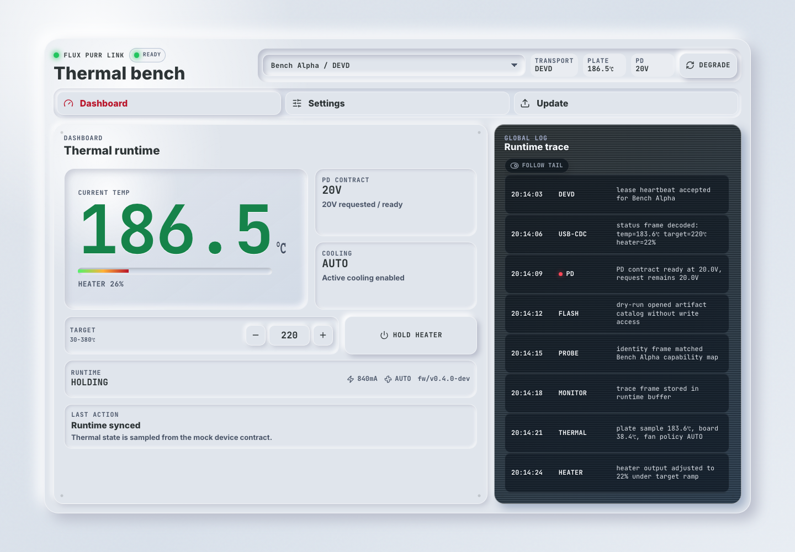
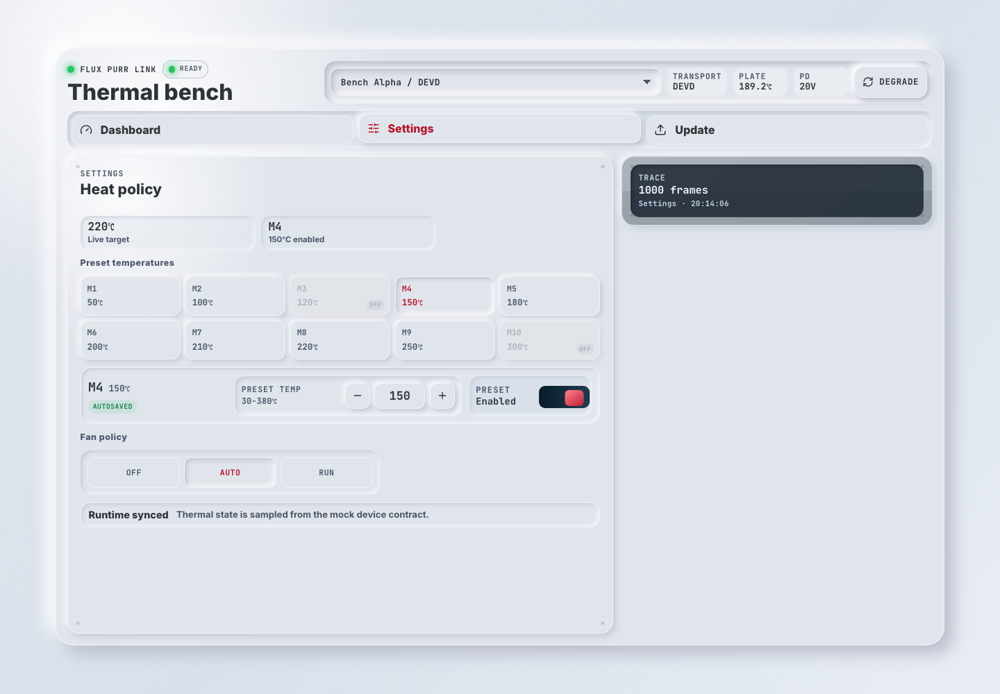
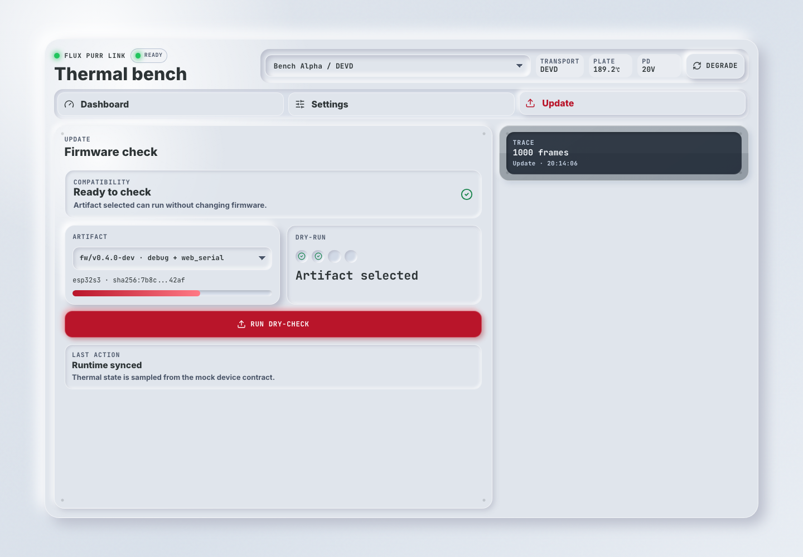
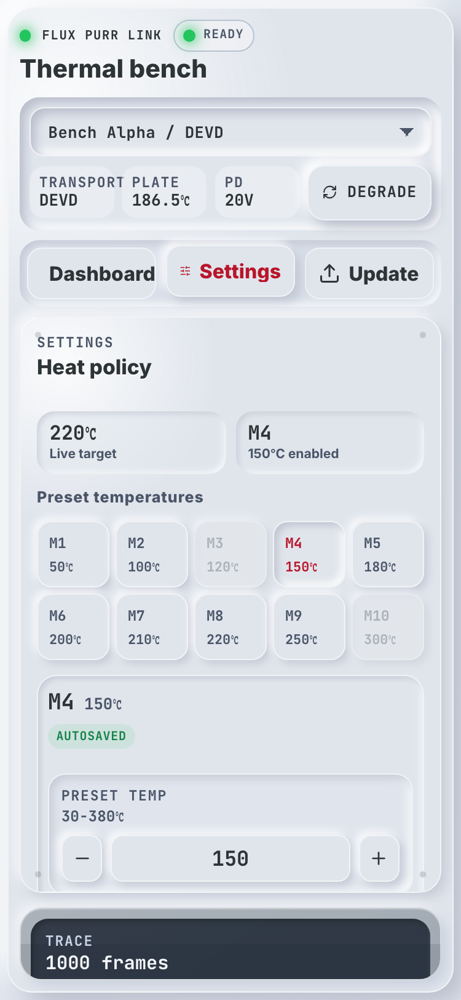

# Flux Purr 热控 Bench Web Demo（#hhwq8）

> 当前有效规范以本文为准；实现覆盖与当前状态见 `./IMPLEMENTATION.md`，关键演进原因见 `./HISTORY.md`。

## 背景 / 问题陈述

- `docs/solutions/device-control/web-native-wifi-bridge-console.md` 已沉淀 Web、native USB daemon、USB CDC、WiFi provisioning、firmware flashing 与 monitoring 的长期控制面方案。
- 本轮 Web demo 不应呈现为管理后台，也不应让用户面对完整 fleet / operations / dashboard 信息墙。
- 当前需要的是一个轻量固定控制台：Dashboard 显示热控运行态，Settings 做 preset / fan policy 配置，Update 做固件 dry-check，桌面端全局日志可与当前页面同时显示。

## 目标 / 非目标

### Goals

- 提供独立的 `control-plane-demo` Web demo，作为 `web/src/App.tsx` 第一屏。
- 把产品形态收敛成固定高度 bench console：顶部辅助状态栏、Dashboard / Settings / Update 三个界面、桌面端常驻全局日志。
- 使用 deterministic mock fixtures 展示 devd、serial、mock 三类设备，不接真实硬件。
- 保留工业拟物视觉：浅色 chassis、物理按钮、内凹数据槽、LED、暗色全局 trace 面。
- 保留现有 `device-console` 与 `frontpanel-preview` 代码和 Storybook stories，不做破坏性重构。
- Storybook 提供 default、degraded、gallery、mobile review 与交互 smoke coverage。

### Non-goals

- 不做管理后台、fleet dashboard、artifact catalog 管理页或全量控制平面配置面。
- 不实现 native USB daemon、USB CDC、WiFi HTTP、真实 firmware flashing 或真实硬件连接。
- 不引入路由框架、后端服务、认证、持久化存储或真实 artifact catalog。
- 不替换 `160×50` 前面板 preview 或既有前面板 specs。
- 不建立生产级视觉回归系统；本 spec 只要求 mock UI 视觉证据。

## 范围（Scope）

### In scope

- `web/src/features/control-plane-demo/**`
- `web/src/stories/ControlPlaneDemo.stories.tsx`
- `web/src/App.tsx`
- `web/src/index.css` 中的工业风 token 与轻工具组件样式
- 本 spec 目录与视觉证据资产
- `docs/solutions/device-control/web-native-wifi-bridge-console.md` 的相关 spec 关联
- `web/README.md` 的 Web demo 说明

### Out of scope

- `firmware/**`
- native daemon 工具链
- `docs/interfaces/http-api.md`
- 真实设备 API 契约变更

## 需求（Requirements）

### MUST

- Demo 必须在无硬件、无 daemon、无网络服务的情况下完整渲染。
- Demo 必须始终保持一屏轻工具心智模型；桌面端默认不依赖页面滚动。
- Demo 必须提供 `Dashboard`、`Settings`、`Update` 三个界面，不得把所有能力堆成一个长页面。
- 桌面端必须提供全局日志面板，并能与 `Dashboard` / `Settings` / `Update` 当前内容同时显示。
- 桌面端全局日志不得退化成窄侧栏；在宽桌面上应以可读 trace console 呈现，保留足够行宽阅读 message。
- Demo 不得出现侧边管理导航、后台式指标墙或多层 fleet 管理结构。
- Demo 必须支持选择至少三个 mock device target，并显示当前 transport、firmware、build、thermal runtime 摘要。
- Dashboard 必须把热板运行状态作为第一层信息，当前温度必须是首要视觉焦点。
- Dashboard 必须显示目标温度、heater 输出、PD 合约电压、风扇/主动降温状态和最常用的热控辅助动作。
- Dashboard 的目标温度必须能直接实时调整，不得依赖提交/应用按钮。
- Settings 必须显示 live summary、preset temperatures、当前 preset 编辑、preset enable switch 与 fan policy 等少量热控配置控件。
- Settings 中 preset 温度调整必须在 debounce 后自动保存；不得提供额外提交按钮。
- Update 必须展示 artifact 选择、compatibility verdict、dry-check progress 与结果摘要，但不得呈现为完整 artifact 管理后台。
- 全局日志必须支持至少 1000 条 mock trace，通过虚拟列表渲染；滚动条仅在 hover/滚动时显示。
- Storybook 必须提供 default、degraded、gallery、mobile review 与交互 smoke story。
- 所有可点击控件必须具备 hover/focus/active 视觉反馈，移动端触控目标高度不低于 48px。

### SHOULD

- Accent 色只用于主动作、状态 LED、危险或当前选择，不作为大面积装饰色。
- 深色技术屏和日志区应轻量嵌入，不主导整个页面。
- 长字符串应换行或截断到容器内，不允许撑破布局。

### COULD

- 后续可在同一轻工具 shell 上接入真实 contract fixtures 或 generated API schema。
- 后续若要做完整控制台，应另建真实控制台 spec，不在本轻 demo 中扩张。

## 功能与行为规格（Functional/Behavior Spec）

### Core flows

- `Device`
  - 展示 `devd`、`serial`、`mock` 三类 target。
  - 设备切换是低频操作，只能放在顶部辅助状态栏，不得成为独立主模块或占用主工作区空间。
  - 选择 target 后，顶部状态栏和当前动作上下文切换到对应设备。
- `Dashboard`
  - 当前温度是唯一主视觉，不得被连接、WiFi 或日志抢占层级。
  - 展示 target temp、heater output、PD contract、fan policy / active cooling 等热控摘要。
  - 目标温度通过同屏 stepper 直接调整，变更立即反映到 mock runtime 和日志。
  - 展示 Hold heater 等热控辅助动作。
  - 连接/transport 只保留在顶部辅助状态栏，不得作为 Dashboard 主指标。
- `Settings`
  - 展示 live target 与当前 preset slot summary，用分隔线把状态展示与可编辑设置分开。
  - 展示 10 个 preset slots，slot 可选择，disabled preset 必须明显降权。
  - 选中 preset 后可以调整 preset 温度，并使用 `Switch` 启用/禁用该 preset。
  - preset 温度变更在 debounce 后自动保存并写入 mock log；没有 Apply / Use as target 按钮。
  - fan policy 用 segmented control 表达，变更立即反映到 mock runtime 和日志。
- `Update`
  - 首屏展示所选 artifact 的 compatibility verdict。
  - 用户可以选择兼容、warning 或 blocked mock artifact；blocked artifact 必须禁用 dry-check。
  - dry-check 只模拟本地校验和进度，不执行真实写入；完成后按钮进入可再次运行状态。
- `Global log`
  - 桌面端与当前界面同时显示 bounded trace rows。
  - Dashboard 使用完整可滚动日志面板；Settings / Update 使用紧凑 trace summary，降低干扰。
  - 日志列表必须使用虚拟列表承载 1000 条 mock trace；follow-tail 是显式 opt-in，不得强制滚动到底部。
  - 主操作按钮只改变 mock state 和视觉 affordance，不连接真实 host 能力。

### Edge cases / errors

- Offline target 不得显示虚假的 RSSI 或运行时成功状态。
- Degraded target 或 blocked artifact 必须以当前动作面呈现，而不是隐藏在日志里。
- 长字符串必须换行或截断到容器内，不允许撑破布局。

## 接口契约（Interfaces & Contracts）

### 接口清单（Inventory）

| 接口（Name） | 类型（Kind） | 范围（Scope） | 变更（Change） | 契约文档（Contract Doc） | 负责人（Owner） | 使用方（Consumers） | 备注（Notes） |
| --- | --- | --- | --- | --- | --- | --- | --- |
| `ControlPlaneScenario` | TypeScript type | internal | New | None | web | demo app-shell / Storybook | Mock scenario model only |
| `DeviceTarget` | TypeScript type | internal | New | None | web | demo app-shell / Storybook | Mock target model only |
| `ControlPlaneDemo` | React component | internal | New | None | web | `App.tsx` / Storybook | Pure web light tool |

### 契约文档（按 Kind 拆分）

- `None`

## 验收标准（Acceptance Criteria）

- Given 本地只安装 Web 依赖，When 执行 `bun run --cwd web build`，Then demo app 能成功构建。
- Given Storybook，When 打开 `Pages/ControlPlaneDemo`，Then 可以看到 default、degraded、gallery、mobile review 与 interaction smoke stories。
- Given 375px mobile viewport，When 查看 demo，Then 顶部状态栏、页签、当前页面与日志不出现不可读重叠。
- Given 1440px desktop viewport，When 查看 demo，Then Dashboard 与全局日志同屏显示，且页面本身不依赖大段滚动。
- Given 在顶部状态栏选择 `Field Kit`，When 查看当前界面，Then 页面显示该 target 的 serial transport、warning severity 与 firmware 摘要。
- Given 在 Dashboard 调整目标温度，When 点击 `+`，Then live target、mock runtime 与日志同步变化，不需要提交按钮。
- Given 点击 `Settings`，When 查看当前界面，Then 可以看到 preset slots、preset temperature editor、preset enable switch 与 fan policy control。
- Given 修改 preset 温度，When debounce 时间结束，Then preset 自动保存并显示 autosaved 状态。
- Given 禁用某个 preset，When 查看 preset grid，Then 对应 slot 变为 disabled 状态，且仍可重新启用。
- Given 点击 `Update`，When 切换 firmware artifact，Then 可以看到 compatibility verdict、dry-check progress 与 blocked/warning 状态。
- Given 点击 `Degrade mock`，When 查看当前页面，Then 能看到 degraded runtime 或 blocked artifact state。

## 验收清单（Acceptance checklist）

- [x] 核心路径的长期行为已被明确描述。
- [x] 关键边界/错误场景已被覆盖。
- [x] 涉及的接口/契约已写清楚或明确为 `None`。
- [x] 相关验收条件已经可以用于实现与 review 对齐。

## 非功能性验收 / 质量门槛（Quality Gates）

### Testing

- `bun run --cwd web check`
- `bun run --cwd web typecheck`
- `bun run --cwd web build`
- `bun run --cwd web build-storybook`
- `bun run --cwd web test:storybook`

### UI / Storybook

- Stories to add/update:
  - `web/src/stories/ControlPlaneDemo.stories.tsx`
- Docs pages / state galleries to add/update:
  - `Pages/ControlPlaneDemo / Docs / Gallery`
- `play` / interaction coverage to add/update:
  - `Pages/ControlPlaneDemo / InteractionSmoke`

### Quality checks

- 视觉证据覆盖 desktop 与 mobile mock UI。
- owner-facing 图片必须先通过 immutable snapshot 回传。

## Visual Evidence

- 证据来源：Storybook / Vite mock UI，deterministic fixtures。
- 绑定说明：以下图片来自 Storybook canvas，覆盖 Dashboard、Settings、Update 与 mobile mock UI。
- 布局检查：1440×1000 与 375×812 均无页面滚动、横向溢出或越界元素。

### Dashboard desktop 1440px

### Settings desktop 1440px

### Update desktop 1440px

### Mobile 375px

## Related PRs

- None

## 风险 / 开放问题 / 假设（Risks, Open Questions, Assumptions）

- 风险：工业拟物阴影在低端设备上可能比扁平工具更重；当前 demo 仍保持 CSS-only，无额外 JS 动画计算。
- 风险：Storybook viewport addon 未配置时，mobile story 通过固定容器宽度表达移动审查面。
- 假设：`#27` solution 是长期控制平面架构真相源，但本 spec 只承接其中的轻量 Web 工具展示面。
- 假设：本 demo 只表达 Web UX 与 mock contract，不代表真实 transport 已交付。

## 参考（References）

- `docs/solutions/device-control/web-native-wifi-bridge-console.md`
- `web/README.md`
