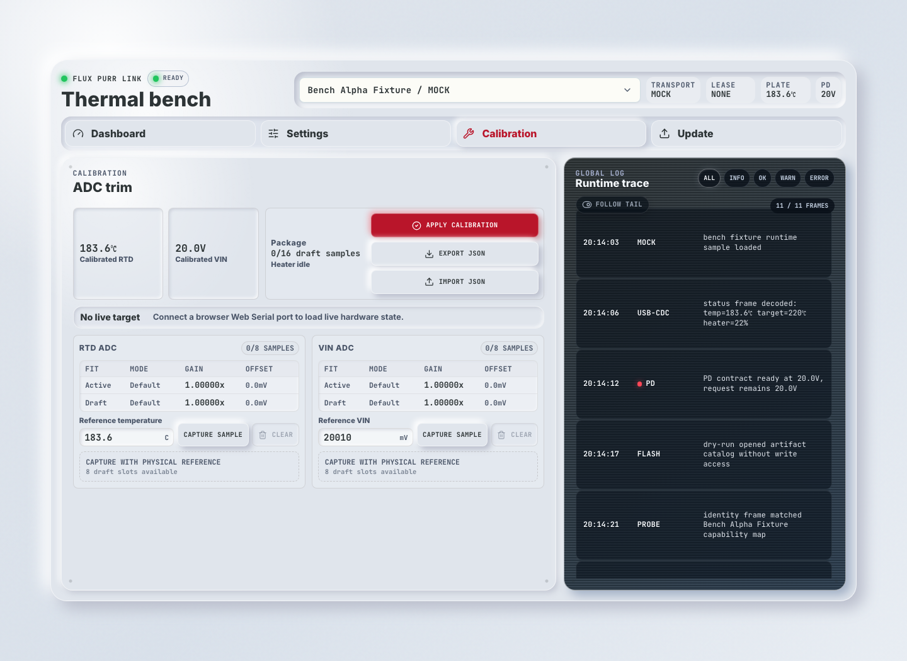
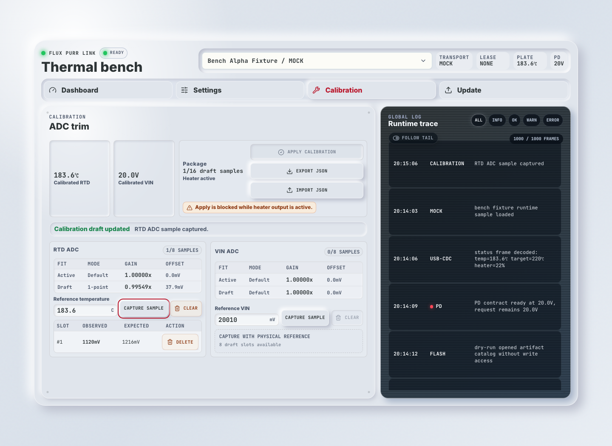
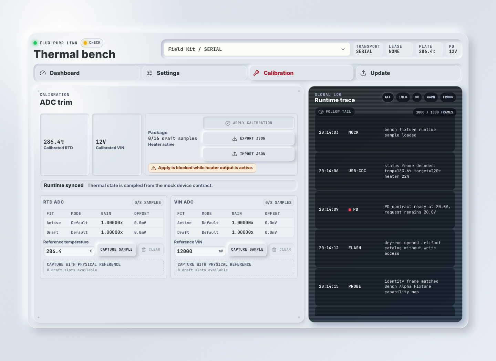
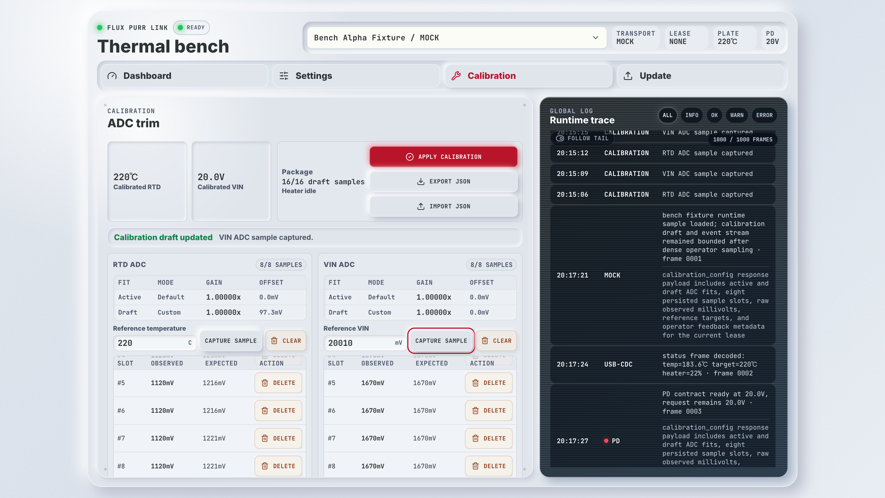

# Flux Purr ADC 校准控制面（#jt8r2）

> 当前有效规范以本文为准；实现覆盖与当前状态见 `./IMPLEMENTATION.md`，关键演进原因见 `./HISTORY.md`。

## 背景 / 问题陈述

- Flux Purr S3 硬件把 `VIN_ADC` 接到 `GPIO1 / ADC1_CH0`，把 `RTD_ADC` 接到 `GPIO2 / ADC1_CH1`。
- RTD 温度与 VIN 输入电压都依赖 MCU ADC 读数；仅在显示层做偏移无法修正控制逻辑，也无法让状态契约表达真实测量值。
- 校准需要从操作者可获得的物理参考值出发：RTD 使用真实温度 `°C`，VIN 使用真实输入电压 `V` / `mV`。

## 目标 / 非目标

### Goals

- 在 ADC 域保存 RTD 与 VIN 两路校准样本，并用线性拟合生成校准系数。
- 同时保存 `draft` 与 `active` 校准；编辑只影响 `draft`，显式 apply 后才更新 `active`。
- RTD 校准必须影响温度显示和闭环控制输入；原始电气开路/短路检查仍基于 raw ADC 行为。
- VIN 校准必须让 `status.voltageMv` 表达校准后的实测输入电压；`pdContractMv` 继续表达 PD contract / target。
- Web、CLI、native `devd` HTTP 与 USB JSONL 使用同一校准领域模型。

### Non-goals

- 不实现多项式、分段或温度相关校准。
- 不把校准当成隐藏传感器故障的手段。
- 不在 heater active 或输出非零时 apply 校准。
- 不改变 PD 协商目标、电流测量或 CH224Q contract 语义。

## 范围（Scope）

### In scope

- `firmware/src/memory.rs` 持久化模型、TLV 编解码、拟合与 ADC correction。
- `firmware/src/control_plane.rs` USB JSONL 校准 contract。
- `firmware/src/bin/flux_purr.rs` RTD/VIN ADC 采样、校准应用与 apply 安全门禁。
- `tools/flux-purr-devd/**` HTTP bridge、mock calibration、CLI 子命令。
- `web/src/features/control-plane-demo/**` Calibration tab、client contract 与 Storybook 覆盖。
- `docs/interfaces/http-api.md` 当前 HTTP/USB/CLI contract。

### Out of scope

- 前面板本机校准菜单。
- 自动化校准工装流程。
- 校准数据加密或设备证书绑定。

## 需求（Requirements）

### MUST

- 每个 channel 最多保存 `8` 个 user samples；样本结构为 `{ observedMv, expectedMv }`。
- Channel 名称固定为 `rtd_adc` 与 `vin_adc`。
- `0` 个 custom point 时使用默认 identity points；`1` 个 custom point 时与默认 identity points 混合；`>=2` 个 custom points 时仅使用 custom points 拟合。
- 拟合模型固定为 `expectedMv = gain * observedMv + offsetMv`。
- RTD capture 必须把 `referenceTempC` 通过 PT1000 + divider 模型转换为 `expectedMv`。
- VIN capture 必须把 `referenceVinMv` / `referenceVinVolts` 通过 `56 kOhm / 5.1 kOhm` 分压模型转换为 `expectedMv`。
- `observedMv` 可由固件当前 raw ADC 读数填充；调试路径可显式传入 `observedMv` / `expectedMv`。
- Import 接收完整 calibration package 并替换 draft，不做 merge。
- Apply 必须在 heater enabled 或 heater output 非零时返回 `calibration_apply_heater_active`。
- Active 与 draft 校准都必须持久化到 EEPROM 记忆 record，并随启动恢复。

### SHOULD

- HTTP/devd 与 Web mock 路径应复用同一拟合规则，避免无硬件验证与固件行为漂移。
- 校准事件应进入 bounded event stream，包含 draft/active sample count 与 fit summary。

## 接口契约（Interfaces & Contracts）

### Calibration state

```json
{
  "active": {
    "rtdAdc": [null],
    "vinAdc": [null]
  },
  "draft": {
    "rtdAdc": [{ "observedMv": 1120, "expectedMv": 1118 }],
    "vinAdc": [{ "observedMv": 1670, "expectedMv": 1820 }]
  },
  "activeFit": {
    "rtdAdc": { "gain": 1.0, "offsetMv": 0.0, "customSampleCount": 0, "defaultSampleCount": 2 },
    "vinAdc": { "gain": 1.0, "offsetMv": 0.0, "customSampleCount": 0, "defaultSampleCount": 2 }
  },
  "draftFit": {
    "rtdAdc": { "gain": 1.0, "offsetMv": 0.0, "customSampleCount": 1, "defaultSampleCount": 2 },
    "vinAdc": { "gain": 1.0, "offsetMv": 0.0, "customSampleCount": 1, "defaultSampleCount": 2 }
  }
}
```

Arrays normalize to length `8`; empty slots are `null`.

### Native `devd` HTTP

- `GET /api/v1/devices/:id/calibration?lease_id=...` returns `CalibrationState`.
- `PUT /api/v1/devices/:id/calibration` mutates draft. Body includes `leaseId`, `op=capture|delete|clear|import`, optional `channel`, references, explicit ADC values, `sampleIndex`, or `package`.
- `POST /api/v1/devices/:id/calibration/apply` applies draft to active. Body includes `leaseId`.

### USB JSONL

- `request` op `get_calibration` returns `CalibrationState`.
- `calibration_config` mutates draft and returns `CalibrationState`.
- `calibration_apply` applies draft to active and returns `CalibrationState`.

### CLI

- `flux-purr calibration get --device <id>|--hardware <saved-id>`
- `flux-purr calibration capture --channel rtd-adc --reference-temp-c <c> ...`
- `flux-purr calibration capture --channel vin-adc --reference-vin-volts <v>` or `--reference-vin-mv <mv>`
- `flux-purr calibration delete --channel <channel> --sample-index <index>`
- `flux-purr calibration clear --channel <channel>`
- `flux-purr calibration import --file <json>`
- `flux-purr calibration export --file <json>`
- `flux-purr calibration apply`

## 验收标准（Acceptance Criteria）

- Given no custom samples, When fit is computed, Then both channels report identity gain/offset with two default points.
- Given one custom sample, When fit is computed, Then default identity points remain in the fit.
- Given two or more custom samples, When fit is computed, Then only custom samples define the fit.
- Given RTD reference temperature, When capture runs, Then the stored expected ADC point is computed from the PT1000 divider model.
- Given VIN reference voltage, When capture runs, Then the stored expected ADC point is computed from the VIN divider model.
- Given heater is active or output is nonzero, When apply is requested, Then active calibration is unchanged and the response is `calibration_apply_heater_active`.
- Given draft samples are imported from JSON, When import succeeds, Then existing draft package is replaced and active package is unchanged.
- Given firmware status is read after VIN ADC sampling, Then `voltageMv` is the calibrated measured VIN and `pdContractMv` is still the PD contract.
- Given raw RTD ADC indicates open or short, Then fault detection uses raw ADC thresholds regardless of calibration.
- Given Web Calibration tab is opened, Then RTD ADC and VIN ADC panels show raw/corrected preview, fit summary, samples, capture/delete/clear/import/export/apply controls, and heater-active apply rejection feedback.

## 非功能性验收 / 质量门槛

- `bun run check:firmware:fmt`
- `bun run check:firmware:clippy`
- `bun run check:firmware:build`
- `bun run check:devd`
- `bun run check:web`
- `bun run check:web:build`
- `bun run check:storybook`
- Storybook visual evidence for Calibration tab default/capture/apply-rejected states.

## 文档更新

- `docs/interfaces/http-api.md`
- `docs/solutions/device-control/web-native-wifi-bridge-console.md`
- `docs/specs/README.md`

## 实现里程碑（Milestones / Delivery checklist）

- [x] M1: 固件持久化、拟合、RTD/VIN ADC correction 与安全门禁
- [x] M2: USB JSONL、devd HTTP 与 CLI calibration commands
- [x] M3: Web Calibration tab、mock mutation 与 Storybook coverage
- [x] M4: 文档同步、验证与视觉证据

## Visual Evidence

- source_type: `storybook_canvas`
- target_program: `mock-only`
- capture_scope: `element`
- requested_viewport: `1440x1050`
- viewport_strategy: `devtools-emulate`
- sensitive_exclusion: `N/A`

`assets/calibration-idle.trimmed.png` shows the compact Calibration workbench with top-level package actions, calibrated RTD/VIN readouts, empty RTD/VIN draft packages, fit mode rows, aligned reference/capture controls, disabled clear actions, and guided empty-state copy.



`assets/calibration-sample-apply-blocked.trimmed.png` shows an RTD capture producing a `1/8` draft sample, updated `1-point` draft fit in the channel matrix, the sample table row, danger-styled clear/delete actions, and package feedback remaining visible above the channel panels.



`assets/calibration-apply-blocked-package.trimmed.png` shows the Package controls with Apply visually disabled and the heater-active rejection message visible at the action point.



`assets/calibration-dense-scroll.trimmed.png` shows the dense `16/16` draft-sample state at a `1596x900` Storybook canvas viewport, with RTD/VIN sample lists scrolled to their lower rows and long global-log entries rendered without row overlap.



## 风险 / 开放问题 / 假设

- 高精度绝对温度仍受 RTD 传感器、分压阻值、ADC 噪声和热耦合影响；当前模型只校准 ADC-domain linear error。
- 如果硬件分压电阻值变更，VIN expected-point 转换必须同步硬件基线。
