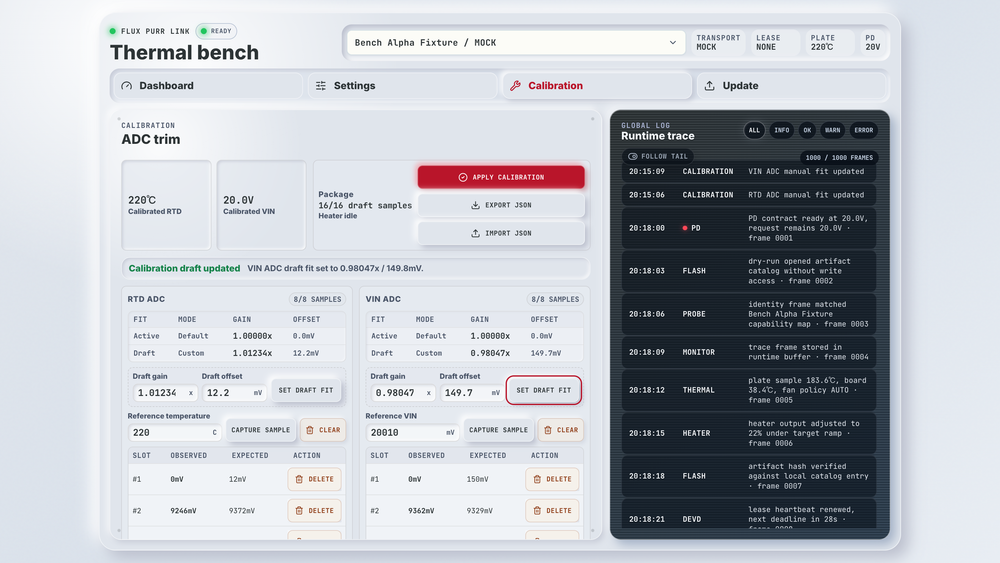
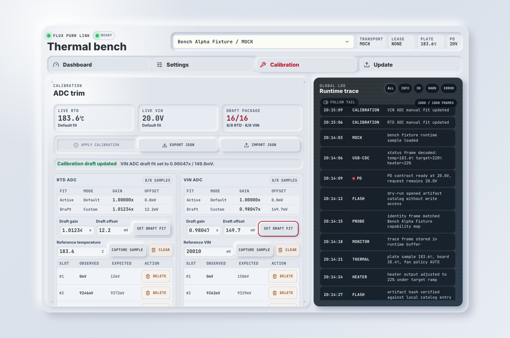
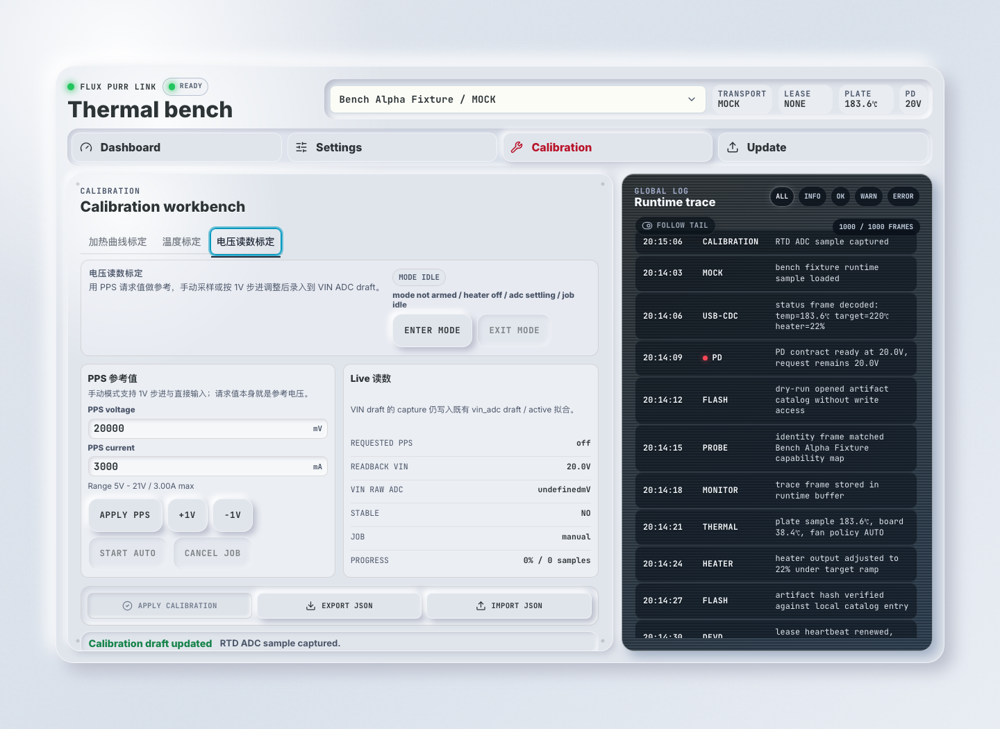
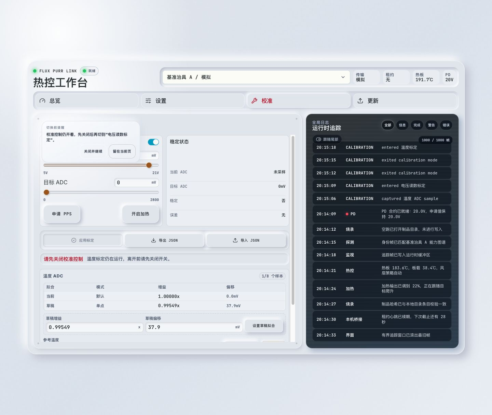

# Flux Purr ADC 校准控制面（#jt8r2）

> 当前有效规范以本文为准；实现覆盖与当前状态见 `./IMPLEMENTATION.md`，关键演进原因见 `./HISTORY.md`。

## 背景 / 问题陈述

- Flux Purr S3 硬件把 `VIN_ADC` 接到 `GPIO1 / ADC1_CH0`，把 `RTD_ADC` 接到 `GPIO2 / ADC1_CH1`。
- RTD 温度与 VIN 输入电压都依赖 MCU ADC 读数；仅在显示层做偏移无法修正控制逻辑，也无法让状态契约表达真实测量值。
- 校准需要从操作者可获得的物理参考值出发：RTD 使用真实温度 `°C`，VIN 使用真实输入电压 `V` / `mV`。
- 现有技术化分栏不适合人工操作；需要把 ADC 校准与加热曲线控制收口成面向人的模式化工作台，同时保持 `vin_adc` / `rtd_adc` / `heater_curve` 作为唯一持久化真相源。

## 目标 / 非目标

### Goals

- 在 ADC 域保存 RTD 与 VIN 两路校准样本，并用线性拟合生成校准系数。
- 同时保存 `draft` 与 `active` 校准；编辑只影响 `draft`，显式 apply 后才更新 `active`。
- RTD 校准必须影响温度显示和闭环控制输入；原始电气开路/短路检查仍基于 raw ADC 行为。
- VIN 校准必须让 `status.voltageMv` 表达校准后的实测输入电压；`pdContractMv` 继续表达 PD contract / target。
- Web、CLI、native `devd` HTTP 与 USB JSONL 使用同一校准领域模型。
- owner-facing 入口固定为 `电压读数标定`、`温度标定`、`加热曲线标定` 三种模式；技术术语只作为模式内次级信息出现。
- 标定 live control 与自动任务只支持 PPS；任何路径都必须先满足硬件 `5V~28V` 约束，再满足设备实时 PPS capability。

### Non-goals

- 不实现多项式、分段或温度相关校准。
- 不把校准当成隐藏传感器故障的手段。
- 不在 heater active 或输出非零时 apply 校准。
- 不改变 PD 协商目标、电流测量或 CH224Q contract 语义。
- 不新增第四套持久化校准对象，不把 `vin_adc` / `rtd_adc` / `heater_curve` 合并。
- 不把温度标定对象从 `PT1000 / RTD_ADC` 改成 NTC。

## 范围（Scope）

### In scope

- `firmware/src/memory.rs` 持久化模型、TLV 编解码、拟合与 ADC correction。
- `firmware/src/control_plane.rs` USB JSONL 校准 contract。
- `firmware/src/bin/flux_purr.rs` RTD/VIN ADC 采样、校准应用与 apply 安全门禁。
- `tools/flux-purr-devd/**` HTTP bridge、mock calibration、CLI 子命令与 calibration job 入口。
- `web/src/features/control-plane-demo/**` Calibration workbench、client contract 与 Storybook 覆盖。
- `docs/interfaces/http-api.md` 当前 HTTP/USB/CLI contract。

### Out of scope

- 前面板本机校准菜单。
- 自动化校准工装流程。
- 校准数据加密或设备证书绑定。
- AVS 或超出 PPS 的可调控制路径。

## 需求（Requirements）

### MUST

- 每个 channel 最多保存 `8` 个 user samples；样本结构必须保存 ADC 域点位 `{ observedMv, expectedMv }`，并在 RTD/VIN channel 上分别原样保存操作者输入的 `referenceTempC` / `referenceVinMv`，避免 owner-facing physical reference 只能靠 ADC 反推恢复。
- Channel 名称固定为 `rtd_adc` 与 `vin_adc`。
- 加热曲线继续保存到 `heater_curve.active` / `heater_curve.preview`；`preview` 只在显式 `Save` 后才能写入 `active`。
- `0` 个 custom point 时使用默认 identity points；`1` 个 custom point 时与默认 identity points 混合；`>=2` 个 custom points 时仅使用 custom points 拟合。
- 拟合模型固定为 `expectedMv = gain * observedMv + offsetMv`。
- RTD capture 必须把 `referenceTempC` 通过 PT1000 + divider 模型转换为 `expectedMv`。
- VIN capture 必须把 `referenceVinMv` / `referenceVinVolts` 通过 `56 kOhm / 5.1 kOhm` 分压模型转换为 `expectedMv`。
- `observedMv` 可由固件当前 raw ADC 读数填充；调试路径可显式传入 `observedMv` / `expectedMv`。
- Import 接收完整 calibration package 并替换 draft，不做 merge。
- Apply 必须在 heater enabled 或 heater output 非零时返回 `calibration_apply_heater_active`。
- Active 与 draft 校准都必须持久化到 EEPROM 记忆 record，并随启动恢复。
- `Status` / `runtime_config` 必须暴露当前 calibration mode live state：`mode`、`ppsEnabled`、`ppsMv`、`ppsMa`、`heaterEnabled`、`targetAdcMv`、`stable`、`stabilityErrorMv`、`error` 与 `job`。其中 `ppsMa` 只作为状态读数暴露，不作为 owner-facing 校准控制输入。
- calibration live state 必须与旧 `manualPps*` 调试字段分离；后者继续保留给调试语义，不能作为新模式的 owner-facing 真相源。
- `电压读数标定` 手动模式必须支持直接输入和 `1V` 步进；自动模式必须按 `1V` 步进在实时 PPS capability 内扫点，并以“请求 PPS 电压”作为 reference 写入 `vin_adc draft`。
- `温度标定` 只能是手动/半自动；firmware 必须按目标 `RTD_ADC` 毫伏值持续控热并暴露稳定状态，最终 capture 继续写 `rtd_adc draft`。
- `温度标定` 样本表必须让操作者同时看见目标 ADC 毫伏值和对应的标定温度，避免把物理参考温度完全折叠成纯 ADC 域数字。
- 当 RTD/VIN draft 或 active package 从设备回读、导入 JSON、页面刷新或设备重启后，样本表显示的物理参考值必须优先使用原样持久化的 `referenceTempC` / `referenceVinMv`；只有历史旧样本缺失该字段时才允许回退到派生显示。
- `加热曲线标定` 自动模式必须丢弃启动瞬态，在稳定温区内做分段统计和单调平滑，再生成 `heater_curve preview`；手动模式继续保留当前最终结果填写形态。
- Web 必须用受限控件直接钳位 `5V~28V` 硬边界，并对超出实时 capability 的原始输入给出 inline error 与提交阻断；CLI 必须主动报错退出；firmware 和 `devd` 必须作为最终拒绝真相源。

### SHOULD

- HTTP/devd 与 Web mock 路径应复用同一拟合规则，避免无硬件验证与固件行为漂移。
- 校准事件应进入 bounded event stream，包含 draft/active sample count 与 fit summary。
- 自动结果默认先落到 `draft` / `preview`，继续要求显式 `Apply` / `Save` 完成持久化。

## 接口契约（Interfaces & Contracts）

### Calibration state

```json
{
  "active": {
    "rtdAdc": [null],
    "vinAdc": [null]
  },
  "draft": {
    "rtdAdc": [{ "observedMv": 1120, "expectedMv": 1118, "referenceTempC": 25.0 }],
    "vinAdc": [{ "observedMv": 1670, "expectedMv": 1820, "referenceVinMv": 20000 }]
  },
  "activeFit": {
    "rtdAdc": { "gain": 1.0, "offsetMv": 0.0, "customSampleCount": 0, "defaultSampleCount": 2 },
    "vinAdc": { "gain": 1.0, "offsetMv": 0.0, "customSampleCount": 0, "defaultSampleCount": 2 }
  },
  "draftFit": {
    "rtdAdc": { "gain": 1.0, "offsetMv": 0.0, "customSampleCount": 1, "defaultSampleCount": 2 },
    "vinAdc": { "gain": 1.0, "offsetMv": 0.0, "customSampleCount": 1, "defaultSampleCount": 2 }
  }
}
```

Arrays normalize to length `8`; empty slots are `null`.

### Native `devd` HTTP

- `GET /api/v1/devices/:id/calibration?lease_id=...` returns `CalibrationState`.
- `PUT /api/v1/devices/:id/calibration` mutates draft. Body includes `leaseId`, `op=capture|delete|clear|import`, optional `channel`, references, explicit ADC values, `sampleIndex`, or `package`.
- `POST /api/v1/devices/:id/calibration/apply` applies draft to active. Body includes `leaseId`.
- `GET /api/v1/devices/:id/calibration/job?lease_id=...` returns the current calibration auto-job state.
- `POST /api/v1/devices/:id/calibration/job` starts or cancels first-class auto jobs. `start` accepts `kind=vin_adc_auto|heater_curve_auto`; `cancel` stops the running job and clears calibration-owned live PPS / heater state.

### USB JSONL

- `request` op `get_calibration` returns `CalibrationState`.
- `calibration_config` mutates draft and returns `CalibrationState`.
- `calibration_apply` applies draft to active and returns `CalibrationState`.
- `request` op `get_calibration_job` returns the current auto-job state.
- `runtime_config.calibration` mutates calibration live control state and returns updated `Status`.
- `calibration_job` starts or cancels first-class auto jobs and returns the updated job state.

### CLI

- `flux-purr calibration get --device <id>|--hardware <saved-id>`
- `flux-purr calibration capture --channel rtd-adc --reference-temp-c <c> ...`
- `flux-purr calibration capture --channel vin-adc --reference-vin-volts <v>` or `--reference-vin-mv <mv>`
- `flux-purr calibration delete --channel <channel> --sample-index <index>`
- `flux-purr calibration clear --channel <channel>`
- `flux-purr calibration import --file <json>`
- `flux-purr calibration export --file <json>`
- `flux-purr calibration apply`
- `flux-purr calibration-mode status|exit --device <id>|--hardware <saved-id>`
- `flux-purr calibration-mode voltage ...` enters `电压读数标定`, supports manual PPS, `+1V/-1V`, and `auto`.
- `flux-purr calibration-mode temperature ...` enters `温度标定`, supports PPS + ADC hold target + heater on/off.
- `flux-purr calibration-mode heater-curve ...` enters `加热曲线标定`, supports manual PPS/heater control plus `auto`.

## 验收标准（Acceptance Criteria）

- Given no custom samples, When fit is computed, Then both channels report identity gain/offset with two default points.
- Given one custom sample, When fit is computed, Then default identity points remain in the fit.
- Given two or more custom samples, When fit is computed, Then only custom samples define the fit.
- Given RTD reference temperature, When capture runs, Then the stored expected ADC point is computed from the PT1000 divider model.
- Given VIN reference voltage, When capture runs, Then the stored expected ADC point is computed from the VIN divider model.
- Given heater is active or output is nonzero, When apply is requested, Then active calibration is unchanged and the response is `calibration_apply_heater_active`.
- Given draft samples are imported from JSON, When import succeeds, Then existing draft package is replaced and active package is unchanged.
- Given firmware status is read after VIN ADC sampling, Then `voltageMv` is the calibrated measured VIN and `pdContractMv` is still the PD contract.
- Given raw RTD ADC indicates open or short, Then fault detection uses raw ADC thresholds regardless of calibration.
- Given Web Calibration workbench is opened, Then it shows `电压读数标定`、`温度标定`、`加热曲线标定` three-mode entry points, with RTD/VIN technical panels retained as secondary sections inside the relevant mode.
- Given a PPS request falls outside `5V~28V` or the advertised capability, When any live control or auto job is started, Then Web blocks submit inline, CLI exits with an error, and firmware/devd refuse the request without issuing an illegal voltage request.
- Given `电压读数标定` auto is started, When the device exposes PPS capability, Then the job walks `1V` steps within that capability and writes captured points to `vin_adc draft`.
- Given `温度标定` mode is armed, When the target ADC and heater are enabled, Then runtime status reports whether the RTD ADC has stabilized so the operator can capture against an external thermometer.
- Given `加热曲线标定` auto is started, When stable bins are collected after startup transient, Then the generated curve is monotonic-smoothed into `heater_curve preview` and requires an explicit `Save`.
- Given any calibration mode switch is still on, When the operator attempts a page-internal view/device/calibration-tab change, Then Web blocks that navigation and shows an inline prompt near the switch to close calibration mode first before continuing.

## 非功能性验收 / 质量门槛

- `bun run check:firmware:fmt`
- `bun run check:firmware:clippy`
- `bun run check:firmware:build`
- `bun run check:devd`
- `bun run check:web`
- `bun run check:web:build`
- `bun run check:storybook`
- Storybook visual evidence for the Calibration workbench default, temperature capture, voltage/heater auto-control entry, and apply-rejected states.

## 文档更新

- `docs/interfaces/http-api.md`
- `docs/solutions/device-control/web-native-wifi-bridge-console.md`
- `docs/specs/README.md`

## 实现里程碑（Milestones / Delivery checklist）

- [x] M1: 固件持久化、拟合、RTD/VIN ADC correction 与安全门禁
- [x] M2: USB JSONL、devd HTTP 与 CLI calibration commands
- [x] M3: Web Calibration tab、mock mutation 与 Storybook coverage
- [x] M4: 文档同步、验证与视觉证据

## Visual Evidence

- source_type: `storybook_canvas`
- target_program: `mock-only`
- capture_scope: `element`
- requested_viewport: `1440x1050`
- viewport_strategy: `devtools-emulate`
- sensitive_exclusion: `N/A`

`assets/calibration-idle.trimmed.png` shows the compact Calibration workbench with top-level package actions, calibrated RTD/VIN readouts, empty RTD/VIN draft packages, fit mode rows, aligned reference/capture controls, disabled clear actions, and guided empty-state copy.


`assets/calibration-sample-apply-blocked.trimmed.png` shows an RTD capture producing a `1/8` draft sample, updated `1-point` draft fit in the channel matrix, the sample table row, danger-styled clear/delete actions, and package feedback remaining visible above the channel panels.


`assets/calibration-apply-blocked-package.trimmed.png` shows the Package controls with Apply visually disabled and the heater-active rejection message visible at the action point.


`assets/calibration-dense-scroll.trimmed.png` shows the dense `16/16` draft-sample state at a `1596x900` Storybook canvas viewport, with RTD/VIN sample lists scrolled to their lower rows and long global-log entries rendered without row overlap.


`assets/calibration-manual-fit.trimmed.png` shows RTD ADC and VIN ADC draft gain/offset edited directly through the channel panels, with each manual draft fit represented as an `8/8` custom sample package before Apply.



`assets/calibration-layout-polish.trimmed.png` shows the final calibration header layout: a compact four-cell status bar for live RTD, live VIN, draft package readiness, and apply state, followed by a single-row command bar for Apply, Export, and Import without explanatory copy.



`assets/calibration-workbench-modes.png` shows the current owner-facing calibration workbench with the three top-level modes `加热曲线标定 / 温度标定 / 电压读数标定`, the voltage-reading mode armed as the active operator surface, PPS-only controls constrained by the live capability range, auto-job entry buttons, and the shared Runtime trace visible in the same workbench.



`assets/calibration-leave-guard-bubble.trimmed.png` shows the page-internal leave guard rendered as a floating bubble near the calibration switch while `温度标定` is still armed, without shifting the static document flow of the workbench content below it.



`assets/calibration-rtd-sample-reference.trimmed.png` shows the RTD sample table rendering the persisted owner-entered calibration temperature and the hardware target ADC as two explicit values in the same cell after capture, proving the UI no longer relies on reverse-derived placeholder temperatures.


## 风险 / 开放问题 / 假设

- 高精度绝对温度仍受 RTD 传感器、分压阻值、ADC 噪声和热耦合影响；当前模型只校准 ADC-domain linear error。
- 如果硬件分压电阻值变更，VIN expected-point 转换必须同步硬件基线。
