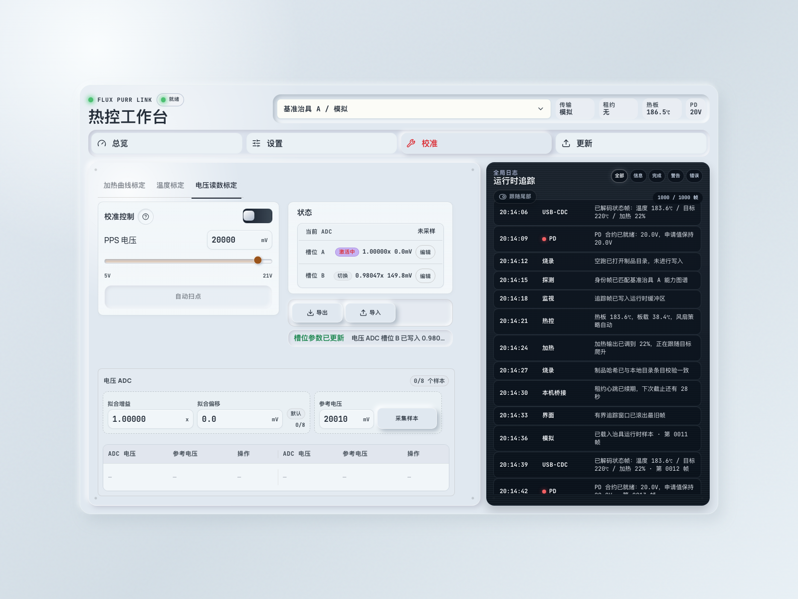

# Flux Purr ADC 校准控制面（#jt8r2）

> 当前有效规范以本文为准；实现覆盖与当前状态见 `./IMPLEMENTATION.md`，关键演进原因见 `./HISTORY.md`。

## 背景 / 问题陈述

- Flux Purr S3 硬件把 `VIN_ADC` 接到 `GPIO1 / ADC1_CH0`，把 `RTD_ADC` 接到 `GPIO2 / ADC1_CH1`。
- RTD 温度与 VIN 输入电压都依赖 MCU ADC 读数；仅在显示层做偏移无法修正控制逻辑，也无法让状态契约表达真实测量值。
- 校准需要从操作者可获得的物理参考值出发：RTD 使用真实温度 `°C`，VIN 使用真实输入电压 `V` / `mV`。
- 旧 `active/draft/apply` 模型把“样本拟合建议”和“硬件真实生效参数”混在一起，导致页面语义混乱、回读难以解释、真机行为难以验证。

## 目标 / 非目标

### Goals

- 在 ADC 域保存 RTD 与 VIN 两路共享校准样本，并用线性拟合生成建议系数。
- 每个 channel 保存两个持久化参数槽位 `A/B`，以及当前激活槽位；硬件运行时只读取当前激活槽位。
- RTD 校准必须影响温度显示和闭环控制输入；原始电气开路/短路检查仍基于 raw ADC 行为。
- VIN 校准必须让 `status.voltageMv` 表达校准后的实测输入电压；`pdContractMv` 继续表达 PD contract / target。
- Web、CLI、native `devd` HTTP 与 USB JSONL 使用同一校准领域模型。
- owner-facing 入口固定为 `电压读数标定`、`温度标定`、`加热曲线标定` 三种模式；技术术语只作为模式内次级信息出现。
- 标定样本只负责生成拟合建议值；A/B 槽位才是硬件真正使用并持久化的参数。

### Non-goals

- 不实现多项式、分段或温度相关校准。
- 不把校准当成隐藏传感器故障的手段。
- 不保留旧 `active/draft/apply` 提升语义。
- 不改变 PD 协商目标、电流测量或 CH224Q contract 语义。
- 不新增第四套持久化校准对象，不把 `vin_adc` / `rtd_adc` / `heater_curve` 合并。
- 不把温度标定对象从 `PT1000 / RTD_ADC` 改成 NTC。

## 范围（Scope）

### In scope

- `firmware/src/memory.rs` 持久化模型、TLV 编解码、拟合与 ADC correction。
- `firmware/src/control_plane.rs` USB JSONL 校准 contract。
- `firmware/src/bin/flux_purr.rs` RTD/VIN ADC 采样、校准应用与槽位切换。
- `tools/flux-purr-devd/**` HTTP bridge、mock calibration、CLI 子命令与 calibration job 入口。
- `web/src/features/control-plane-demo/**` Calibration workbench、client contract 与 Storybook 覆盖。
- `docs/interfaces/http-api.md` 当前 HTTP/USB/CLI contract。

### Out of scope

- 前面板本机校准菜单。
- 自动化校准工装流程。
- 校准数据加密或设备证书绑定。
- AVS 或超出 PPS 的可调控制路径。

## 需求（Requirements）

### MUST

- 每个 channel 最多保存 `8` 个 user samples；样本结构必须保存 ADC 域点位 `{ observedMv, expectedMv }`，并在 RTD/VIN channel 上分别原样保存操作者输入的 `referenceTempC` / `referenceVinMv`。RTD 温度标定样本还必须保存 capture 当下的硬件目标 `targetAdcMv`。
- Channel 名称固定为 `rtd_adc` 与 `vin_adc`。
- 每个 ADC channel 必须持久化：
  - `samples`
  - `fittedFit`
  - `slots.a`
  - `slots.b`
  - `activeSlot`
- `0` 个样本时拟合建议固定为 `gain=1`、`offset=0`。
- `1` 个样本时拟合建议必须固定 `gain=1`，只计算 `offset = expected - observed`。
- `>=2` 个样本时拟合建议使用共享样本做线性拟合。
- 样本不足时不得混入默认 identity point。
- 拟合模型固定为 `expectedMv = gain * observedMv + offsetMv`。
- RTD 温度标定 capture 必须把硬件目标 `targetAdcMv` 作为 `expectedMv` 写入 ADC-domain point，并把操作者输入的 `referenceTempC` 原样随样本保存；不得把 `referenceTempC` 通过 PT1000 + divider 模型反推成 `expectedMv`。
- VIN capture 必须把 `referenceVinMv` / `referenceVinVolts` 通过 `56 kOhm / 5.1 kOhm` 分压模型转换为 `expectedMv`。
- `observedMv` 可由固件当前 raw ADC 读数填充；调试路径可显式传入 `observedMv` / `expectedMv`。
- 导入/导出必须以完整 calibration state 为单位，包含共享样本、A/B 槽位与当前激活槽位。
- 样本操作、槽位编辑和激活槽位切换都必须立即写入设备持久化后端；不存在额外 preview/apply 层。固件优先使用 EEPROM，EEPROM 不可达时使用 ESP flash fallback。
- 运行时 ADC 修正必须统一读取当前 `activeSlot` 对应的 `gain + offset`。
- `Status` / `runtime_config` 必须暴露当前 calibration mode live state：`mode`、`ppsEnabled`、`ppsMv`、`ppsMa`、`heaterEnabled`、`targetAdcMv`、`stable`、`stabilityErrorMv`、`error` 与 `job`。其中 `ppsMa` 只作为状态读数暴露，不作为 owner-facing 校准控制输入。
- calibration live state 必须与旧 `manualPps*` 调试字段分离；后者继续保留给调试语义，不能作为新模式的 owner-facing 真相源。
- `电压读数标定` 手动模式必须支持直接输入和 `1V` 步进；自动模式必须按 `1V` 步进在实时 PPS capability 内扫点，并以“请求 PPS 电压”作为 reference 写入 `vin_adc samples`。
- `温度标定` 只能是手动/半自动；firmware 必须按目标 `RTD_ADC` 毫伏值持续控热并暴露稳定状态，最终 capture 继续写 `rtd_adc samples`。
- 任一校准/标定模式一旦开启，Web 必须立即接管 calibration-owned PPS 供电；不得再要求操作者额外点击 `申请 PPS` 才让滑块与加热控制生效。
- 校准模式已开启时，`PPS 电压` 滑块与数值输入必须以节流方式直接更新 calibration-owned PPS 目标，不再依赖单独的 apply/submit 按钮。
- `温度标定` 的加热控制仅在 `温度标定` 校准模式已开启时可用；关闭该校准模式时必须同步停止加热。除校准模式本身外，Web 不得再对 `开启加热` 追加额外前置条件。
- 三个校准模式里的加热控制都必须使用 owner-facing Toggle 开关语义，而不是 `开启加热` / `关闭加热` 按钮文案；该开关只表达“请求是否允许加热”，实际出热仍以后端返回的 `heaterOutputPercent` 为真相源。
- `温度标定` 是否实际出热必须以硬件返回的 `heaterOutputPercent` 为真相源；Web 必须把该反馈显示为 owner-facing 的能量强度图示，而不是根据 `targetAdcMv` 与当前 ADC 的比较自行推断“应当在加热”。
- `温度标定` 样本表必须只展示两项 owner-facing 数据：硬件目标 ADC 毫伏值与操作者输入的标定温度；不得混入额外技术字段或说明文案。
- `温度标定` 样本表应优先使用双栏配对布局展示 RTD 样本，并保持数值垂直居中，以减少列表高度同时维持可读性。
- `温度标定` 与 `电压读数标定` 的右上状态卡必须收口为 `状态`，顶部保留 live `当前 ADC`，下方展示 `A/B` 两个槽位的 `gain + offset` 摘要，并明确当前激活槽位。
- 状态卡中的每个槽位行都必须提供编辑入口；编辑弹窗允许直接填写 `gain` / `offset`，并支持“一键采用当前拟合结果”填充。
- 样本区顶部不得再展示当前/草稿摘要；只能展示“当前共享样本拟合建议值”。
- 样本变化只允许更新拟合建议值，不得自动覆盖 `A/B` 槽位。
- `标定温度` 输入必须是纯手动 value；硬件上报温度只能作为 placeholder/辅助提示，不得自动写入 value。
- 当 RTD/VIN calibration state 从设备回读、导入 JSON、页面刷新或设备重启后，样本表显示的物理参考值必须优先使用原样持久化的 `referenceTempC` / `referenceVinMv`；只有历史旧样本缺失该字段时才允许回退到派生显示。
- `加热曲线标定` 自动模式必须丢弃启动瞬态，在稳定温区内做分段统计和单调平滑，再生成 `heater_curve preview`；自动生成的每个温阻点不得低于硬件名义 `R20 + TCR` 模型对应阻值，防止把整机输入等效阻抗误写为过低的 heater resistance 并在 5A 高温调优时错误限功率；手动模式继续保留当前最终结果填写形态。
- Web 必须用受限控件直接钳位 `5V~28V` 硬边界，并对超出实时 capability 的原始输入给出 inline error 与提交阻断；CLI 必须主动报错退出；firmware 和 `devd` 必须作为最终拒绝真相源。

### SHOULD

- HTTP/devd 与 Web mock 路径应复用同一拟合规则，避免无硬件验证与固件行为漂移。
- 校准事件应进入 bounded event stream，包含共享样本数量、拟合建议值、A/B 槽位值与当前激活槽位。
- 自动结果默认只更新共享样本；是否采用拟合结果写入 A/B 仍由操作者显式确认。

## 接口契约（Interfaces & Contracts）

### Calibration state

```json
{
  "rtdAdc": {
    "samples": [{ "observedMv": 1120, "expectedMv": 1118, "referenceTempC": 25.0, "targetAdcMv": 1118 }],
    "fittedFit": { "gain": 1.0, "offsetMv": -2.0, "sampleCount": 1 },
    "slots": {
      "a": { "gain": 1.0, "offsetMv": 0.0 },
      "b": { "gain": 0.9982, "offsetMv": 5.4 }
    },
    "activeSlot": "a"
  },
  "vinAdc": {
    "samples": [{ "observedMv": 1670, "expectedMv": 1820, "referenceVinMv": 20000 }],
    "fittedFit": { "gain": 1.0, "offsetMv": 150.0, "sampleCount": 1 },
    "slots": {
      "a": { "gain": 1.0, "offsetMv": 0.0 },
      "b": { "gain": 1.0, "offsetMv": 150.0 }
    },
    "activeSlot": "b"
  }
}
```

Arrays normalize to length `8`; empty slots are `null`.

### Native `devd` HTTP

- `GET /api/v1/devices/:id/calibration?lease_id=...` returns `CalibrationState`.
- `PUT /api/v1/devices/:id/calibration` mutates shared samples or slots. Body includes `leaseId`, `op=capture|delete|clear|import|set_active_slot|set_slot_fit`, optional `channel`, references, explicit ADC values, `sampleIndex`, `state`, `slot`, or `fit`.
- `GET /api/v1/devices/:id/calibration/job?lease_id=...` returns the current calibration auto-job state.
- `POST /api/v1/devices/:id/calibration/job` starts or cancels first-class auto jobs. `start` accepts `kind=vin_adc_auto|heater_curve_auto`; `cancel` stops the running job and clears calibration-owned live PPS / heater state.

### USB JSONL

- `request` op `get_calibration` returns `CalibrationState`.
- `calibration_config` mutates shared samples or slots and returns `CalibrationState`.
- `request` op `get_calibration_job` returns the current auto-job state.
- `runtime_config.calibration` mutates calibration live control state and returns updated `Status`.
- `calibration_job` starts or cancels first-class auto jobs and returns the updated job state.

### CLI

- `flux-purr calibration get --device <id>|--hardware <saved-id>`
- `flux-purr calibration capture --channel rtd-adc --reference-temp-c <c> ...`
- `flux-purr calibration capture --channel vin-adc --reference-vin-volts <v>` or `--reference-vin-mv <mv>`
- `flux-purr calibration delete --channel <channel> --sample-index <index>`
- `flux-purr calibration clear --channel <channel>`
- `flux-purr calibration import --file <json>`
- `flux-purr calibration export --file <json>`
- `flux-purr calibration set-slot-fit --channel <channel> --slot a|b --gain <n> --offset-mv <n>`
- `flux-purr calibration set-active-slot --channel <channel> --slot a|b`
- `flux-purr calibration-mode status|exit --device <id>|--hardware <saved-id>`
- `flux-purr calibration-mode voltage ...` enters `电压读数标定`, supports manual PPS, `+1V/-1V`, and `auto`.
- `flux-purr calibration-mode temperature ...` enters `温度标定`, supports PPS + ADC hold target + heater on/off.
- `flux-purr calibration-mode heater-curve ...` enters `加热曲线标定`, supports manual PPS/heater control plus `auto`.

## 验收标准（Acceptance Criteria）

- Given no samples, When fit is computed, Then both channels report `gain=1` and `offset=0`.
- Given one sample, When fit is computed, Then the suggested fit uses `gain=1` and `offset=expected-observed`.
- Given two or more samples, When fit is computed, Then only shared samples define the fit.
- Given RTD target ADC and calibration temperature, When capture runs, Then the stored ADC point uses the target ADC as `expectedMv` and preserves the entered calibration temperature as `referenceTempC`.
- Given VIN reference voltage, When capture runs, Then the stored expected ADC point is computed from the VIN divider model.
- Given calibration state is imported from JSON, When import succeeds, Then shared samples、A/B 槽位和激活槽位一起被替换。
- Given shared samples change, When fit is recomputed, Then `fittedFit` updates but `slots.a` / `slots.b` remain unchanged.
- Given operator saves slot A or B, When that slot is also the active slot, Then runtime corrected ADC / temperature / voltage immediately switch to the new slot values.
- Given firmware status is read after VIN ADC sampling, Then `voltageMv` is the calibrated measured VIN and `pdContractMv` is still the PD contract.
- Given raw RTD ADC indicates open or short, Then fault detection uses raw ADC thresholds regardless of calibration.
- Given Web Calibration workbench is opened, Then it shows `电压读数标定`、`温度标定`、`加热曲线标定` three-mode entry points, with RTD/VIN technical panels retained as secondary sections inside the relevant mode.
- Given a PPS request falls outside `5V~28V` or the advertised capability, When any live control or auto job is started, Then Web blocks submit inline, CLI exits with an error, and firmware/devd refuse the request without issuing an illegal voltage request.
- Given `电压读数标定` auto is started, When the device exposes PPS capability, Then the job walks `1V` steps within that capability and writes captured points to `vin_adc samples`.
- Given `温度标定` mode is armed, When the target ADC and heater are enabled, Then runtime status reports whether the RTD ADC has stabilized so the operator can capture against an external thermometer.
- Given any calibration mode is armed, When the operator drags the PPS slider or edits its numeric input, Then Web automatically updates calibration-owned PPS runtime without requiring a separate `申请 PPS` action.
- Given `温度标定` mode is armed, When the operator toggles `开启加热`, Then Web must accept the action without imposing extra ADC-comparison gates and leave actual heating behavior to hardware feedback.
- Given any calibration mode is armed, When the operator uses the heating control, Then Web presents that control as a Toggle switch rather than a text command button.
- Given `温度标定` mode is armed, When hardware reports `heaterOutputPercent`, Then the status card must reflect that percentage through an energy-intensity visualization even if the heater switch is already on.
- Given `加热曲线标定` auto is started, When stable bins are collected after startup transient, Then the generated curve includes low-temperature anchors from the heater hardware model, merges the stable-bin points, clamps each generated point to at least the hardware nominal `R20 + TCR` resistance floor, is monotonic-smoothed into `heater_curve preview`, and requires an explicit `Save`.
- Given `heater_curve preview` is generated from high-temperature bins only, When firmware estimates heater resistance below the first measured bin, Then the estimate must be bounded by the low-temperature anchors instead of clamping the whole low-temperature range to the first high-temperature measurement.
- Given any calibration mode switch is still on, When the operator attempts a page-internal view/device/calibration-tab change, Then Web blocks that navigation and shows an inline prompt near the switch to close calibration mode first before continuing.

## 非功能性验收 / 质量门槛

- `bun run check:firmware:fmt`
- `bun run check:firmware:clippy`
- `bun run check:firmware:build`
- `bun run check:devd`
- `bun run check:web`
- `bun run check:web:build`
- `bun run check:storybook`
- Storybook visual evidence for the Calibration workbench default, temperature capture, voltage/heater auto-control entry, and slot-edit states.

## 文档更新

- `docs/interfaces/http-api.md`
- `docs/solutions/device-control/web-native-wifi-bridge-console.md`
- `docs/specs/README.md`

## 实现里程碑（Milestones / Delivery checklist）

- [x] M1: 固件持久化、拟合、RTD/VIN ADC correction 与槽位模型
- [x] M2: USB JSONL、devd HTTP 与 CLI calibration slot commands
- [x] M3: Web Calibration workbench、slot editor 与 Storybook coverage
- [x] M4: 文档同步、验证与视觉证据

## Visual Evidence

- source_type: `storybook_canvas`
- target_program: `mock-only`
- capture_scope: `element`
- requested_viewport: `1440x1050`
- viewport_strategy: `devtools-emulate`
- sensitive_exclusion: `N/A`

`assets/adc-calibration-rtd-layout.png` shows the `温度标定` workbench using the channel-centered model: the status card carries live ADC plus A/B slot summaries, actions sit below status, and the sample card shows fitted suggestions separately from shared calibration samples.


`assets/adc-calibration-vin-layout.png` shows the matching `电压读数标定` layout with the same status, A/B slot, fitted suggestion, and sample list semantics.



## 风险 / 开放问题 / 假设

- 高精度绝对温度仍受 RTD 传感器、分压阻值、ADC 噪声和热耦合影响；当前模型只校准 ADC-domain linear error。
- 如果硬件分压电阻值变更，VIN expected-point 转换必须同步硬件基线。
