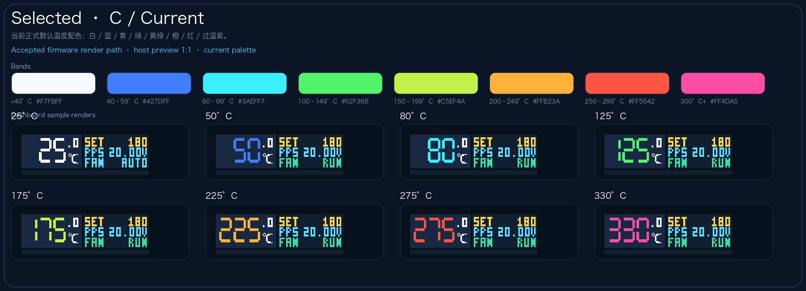

# Flux Purr 正式 PID 加热闭环与前面板运行态同步（#q2aw6）

## 状态

- Status: 已完成
- Created: 2026-04-21
- Last: 2026-04-24

## 背景 / 问题陈述

- 当前 `flux-purr` 已完成前面板输入、RTD 读取、CH224Q 默认电压请求与 heater/fan bring-up，但 Dashboard 的风扇语义仍残留旧的单布尔开关口径。
- `#223uj` 与 `#fk3u7` 已冻结前面板视觉和五向输入基线，但 Dashboard 的 fan line、Active Cooling 页面和过温告警仍缺少统一真相源。
- 若不把风扇策略、过温停热、feature-selected PD 默认请求与前面板显示一次收口，后续板级调试会持续混淆“策略开关”“实际输出”“保护联动”三套状态。

## 目标 / 非目标

### Goals

- 把 `GPIO47` 固定占空比加热替换为按 `target_temp_c` 驱动的正式 PID PWM 闭环。
- 让 Dashboard 稳定显示实时温度、设定温度、`OFF/AUTO/RUN` 三态风扇显示与实际 heater 输出强度。
- 冻结正式风扇/保护包线：
  - heater `OFF` 且 active cooling `ON`：`<35°C` 停止、`>40°C` 以 `50%` 档启动、`>60°C` 全速，`35~40°C` 保持回差。
  - heater `ON`：`<=100°C` 不主动散热，超过 `100°C` 后由安全链路接管。
  - active cooling `OFF`：`>100°C` 进入最低电压 `0.1Hz` 使能脉冲，脉冲占空比按 `floor((temp-100)/10)%` 递增并封顶 `25%`。
  - active cooling `OFF` 且 `>350°C`：锁住停热并保持风扇 `50%`；`>360°C` 改为全速。
  - `temp >= 420°C`：保持 heater hard cutoff fault-latch。
- 默认启动时把 CH224Q 请求固定为 `20V`，并通过 build features 提供 `12V / 28V` 变体，同时保持外部 `fan_enabled + fan_pwm_permille` 归一化契约不变。
- 产出 merge-ready 所需的 spec、视觉证据、板级验证与 review 收敛材料。

### Non-goals

- 不提供运行时 PID 参数调节入口。
- 不实现 fan tach 闭环、4 线 PWM、持久化风扇档位或按 VIN 自动切换 PD 请求。
- 不修改外部 HTTP / RPC / 持久化字段结构。
- 不扩展新的前面板菜单层级或联网业务逻辑。

## 范围（Scope）

### In scope

- `firmware/src/bin/flux_purr.rs`
- `firmware/src/frontpanel/**`
- `firmware/src/bin/frontpanel_preview.rs`
- `web/src/features/frontpanel-preview/**`
- `web/src/stories/FrontPanelDisplay.stories.tsx`
- `firmware/README.md`
- `docs/interfaces/http-api.md`
- `docs/specs/q2aw6-heater-pid-frontpanel-runtime/**`
- `docs/specs/fk3u7-frontpanel-input-interaction/SPEC.md`
- `docs/specs/223uj-frontpanel-ui-contract/SPEC.md`

### Out of scope

- Web 控制台、HTTP API、Wi‑Fi 配置写回字段扩展
- 多电压 / 多功率档位与自动 PD 策略切换
- RTD 额外校准界面或外部校准协议

## 需求（Requirements）

### MUST

- heater PWM 频率固定为 `2 kHz`，控制周期固定为 `1 Hz`。
- 目标温度与 preset 写入都必须 clamp 到 `0~400°C`。
- RTD 开路、短路、ADC 读失败、`temp >= 420°C` 时，heater 必须立即关断并进入 fault-latch。
- fault-latch 期间 heater 不得自动恢复；故障解除后必须由用户再次短按中键重臂。
- CH224Q 在启动时默认请求 `20V`；`pd-request-12v` / `pd-request-28v` 仅改变默认请求值。PD 状态变化只允许进入日志/状态观测，不得触发 heater 锁死或自动关断。
- `active_cooling_enabled=true` 时，Dashboard fan line 必须只显示 `AUTO` 或 `RUN`；`active_cooling_enabled=false` 时必须显示 `OFF`，即使保护链路正在临时驱动真实风扇。
- Dashboard 中键短按只切 heater arm；中键双击切换 `active_cooling_enabled`；中键长按只进菜单。
- 过温保护不得占用 Dashboard 的风扇元素；SET 行必须在告警激活时以 `1Hz` 闪烁 `WARN / OTEMP` 两关键帧。
- `Active Cooling` 页面在正式 runtime 中为只读安全策略说明页，必须同步默认 `20V`（及 `12V / 28V` build variants）、`<35 / >40 / >60 / >100 / >350 / >360°C` 新包线。
- defmt 日志必须覆盖 RTD 读数、PID 输入/输出、fault 原因、fan policy 输出与 PD 状态变化。

### SHOULD

- cooling-disabled lock 的标签与恢复路径保持稳定，便于 monitor 与后续 review 收敛。
- 初始 UI 应在第一次有效 RTD 样本后就显示实际温度，而不是长时间保留 bring-up 默认值。
- firmware preview 与 Storybook 的 Dashboard/Active Cooling 文案和颜色层级保持一致。

### COULD

- 后续在同一条 PID 日志上扩展功率估算或 duty limit 观察字段。

## 功能与行为规格（Functional / Behavior Spec）

### Core flows

- 启动后先请求 feature-selected PD 电压（默认 `20V`），随后初始化 RTD、heater PWM、fan 运行态和前面板 UI。
- 用户短按中键后，heater 进入 arm 状态；若无 fault-latch，则 PID 开始按 `target_temp_c - current_temp_c` 驱动 duty。
- Dashboard fan line 只反映“策略开关 + 当前是否实际运行”：
  - `OFF`：风扇策略关闭
  - `AUTO`：风扇策略开启但当前无需工作
  - `RUN`：风扇策略开启且当前已使能输出
- 当 `active_cooling_enabled=false` 且 `temp > 350°C` 时，heater 必须被强制关断并锁住；用户重新开启风扇策略或手动重新使能 heater 后才允许退出该锁态。
- 当 `active_cooling_enabled=false` 且 `temp > 360°C` 时，真实风扇输出升级为全速，但 Dashboard fan line 仍保持 `OFF`。
- PD 状态只做观测：即使 PD 丢失或降档，也不自动清空 `heater_enabled`，只在日志中体现。

### Edge cases / errors

- 首次 RTD 采样失败时，heater 必须保持关断，直到后续有效样本恢复且用户重新 arm。
- fault-latch 期间若用户再次短按中键：
  - 当前 fault 仍存在时，必须拒绝重臂并保持 `heater_enabled=false`
  - 当前 fault 已消失时，允许清除 latch 并重新进入 arm
- cooling-disabled lock 清除后，若温度仍高于 `350°C`，必须等待温度回到 `<=350°C` 再次越线后才允许重新触发锁定。
- 双击中键不再直接改真实 fan runtime；它只切换风扇策略位。

## 接口契约（Interfaces & Contracts）

### 接口清单（Inventory）

| 接口（Name） | 类型（Kind） | 范围（Scope） | 变更（Change） | 契约文档（Contract Doc） | 负责人（Owner） | 使用方（Consumers） | 备注（Notes） |
| --- | --- | --- | --- | --- | --- | --- | --- |
| `FrontPanelUiState.fan_display_state` | Rust state model | internal | New | None | firmware | runtime / preview / render tests | Dashboard 风扇三态真相源 |
| `FrontPanelUiState.heater_lock_reason` | Rust state model | internal | New | None | firmware | runtime / preview / render tests | `cooling-disabled-overtemp` / `hard-overtemp` |
| `FrontPanelUiState.dashboard_warning_visible` | Rust state model | internal | New | None | firmware | runtime / preview / render tests | SET 行告警闪烁相位 |
| `FrontPanelRuntimeState` / `FrontPanelScreen` | TypeScript type | internal | Updated | None | web | Storybook / preview harness | 对齐 firmware 三态 fan 与告警关键帧 |

### 契约文档（按 Kind 拆分）

None

## 验收标准（Acceptance Criteria）

- Given 固件刚启动，When RTD 已有有效样本，Then Dashboard 左侧显示实时温度，右侧显示 `SET/PPS/FAN`，其中 `FAN` 只会显示 `OFF/AUTO/RUN`。
- Given Dashboard，When 用户短按中键，Then 只切换 heater arm；When 双击中键，Then 只切换 `active_cooling_enabled`；When 长按中键，Then 仍进入菜单。
- Given heater 关闭且 active cooling 开启，When 温度 `<35°C / >40°C / >60°C`，Then fan 必须分别进入停止 / `50%` / 全速，并在 `35~40°C` 维持回差。
- Given heater 开启，When 温度 `<=100°C`，Then fan 不得因为 idle cooling 阈值而提前启动。
- Given active cooling 关闭，When 温度 `100 / 110 / 350 / 351 / 361°C`，Then fan 必须分别满足无脉冲 / `1%` 脉冲 / `25%` 脉冲 / `50%` / 全速。
- Given active cooling 关闭且温度 `>350°C`，When 控制循环更新，Then heater 必须被锁住停热；When 用户重新开启风扇策略或手动重新 arm heater，Then 才允许离开锁态。
- Given `temp >= 420°C`，When 故障出现，Then heater 立即归零并进入 `hard-overtemp` fault-latch。
- Given Dashboard 过温告警，When 页面刷新，Then 告警只占据 SET 行并以两关键帧闪烁，FAN 行不切换到告警文案。

## 实现前置条件（Definition of Ready / Preconditions）

- `flux-purr` 已完成 RTD 经验标定（当前按约 `3000 mV` 有效分压换算）。
- 前面板五向输入与现有 Dashboard / Menu 路由已可在真机上稳定使用。
- 板级 flash / monitor 统一通过 `mcu-agentd` 执行。

## 非功能性验收 / 质量门槛（Quality Gates）

### Testing

- `cargo test --manifest-path firmware/Cargo.toml`
- `source /Users/ivan/export-esp.sh && cargo +esp build --manifest-path firmware/Cargo.toml --target xtensa-esp32s3-none-elf --features esp32s3 --bin flux-purr --release`
- `bun run --cwd web check`
- `bun run --cwd web typecheck`
- `bun run --cwd web build-storybook`
- `cargo run --manifest-path firmware/Cargo.toml --features host-preview --bin frontpanel_preview -- dashboard-fan-off docs/specs/q2aw6-heater-pid-frontpanel-runtime/assets/dashboard-fan-off.framebuffer.bin`
- `cargo run --manifest-path firmware/Cargo.toml --features host-preview --bin frontpanel_preview -- dashboard-fan-auto docs/specs/q2aw6-heater-pid-frontpanel-runtime/assets/dashboard-fan-auto.framebuffer.bin`
- `cargo run --manifest-path firmware/Cargo.toml --features host-preview --bin frontpanel_preview -- dashboard-fan-run docs/specs/q2aw6-heater-pid-frontpanel-runtime/assets/dashboard-fan-run.framebuffer.bin`
- `cargo run --manifest-path firmware/Cargo.toml --features host-preview --bin frontpanel_preview -- dashboard-overtemp-a docs/specs/q2aw6-heater-pid-frontpanel-runtime/assets/dashboard-overtemp-a.framebuffer.bin`
- `cargo run --manifest-path firmware/Cargo.toml --features host-preview --bin frontpanel_preview -- dashboard-overtemp-b docs/specs/q2aw6-heater-pid-frontpanel-runtime/assets/dashboard-overtemp-b.framebuffer.bin`

### UI / Firmware Preview

- owner-facing 预览必须来自 `frontpanel_preview` 或 Storybook 的确定性输出。
- 视觉证据必须落在本 spec 的 `./assets/` 下，并和聊天回图保持同源。

## 文档更新（Docs to Update）

- `docs/specs/fk3u7-frontpanel-input-interaction/SPEC.md`
- `docs/specs/223uj-frontpanel-ui-contract/SPEC.md`
- `firmware/README.md`
- `docs/interfaces/http-api.md`

## Visual Evidence

- Dashboard fan `OFF`：

- Dashboard fan `AUTO`：

- Dashboard fan `RUN`：

- Dashboard overtemp warning frame A：

- Dashboard overtemp warning frame B：

- Current default temperature palette（Aurora / C）：

## 实现里程碑（Milestones / Delivery checklist）

- [x] M1: 落地正式 `HeaterController`、heater fault-latch 与风扇策略状态机
- [x] M2: 落地 Dashboard 三态风扇显示、SET 行告警闪烁与 Active Cooling 只读说明页
- [x] M3: 补齐单测、host preview、Storybook 故事与视觉证据
- [x] M4: 完成 xtensa build / review 收敛并准备 merge-ready PR

## 方案概述（Approach, high-level）

- 用单一 `HeaterController` 管理 PID 与 hard fault-latch，再把 cooling-disabled lock 作为独立安全层挂在 fan policy 旁边。
- 用 `fan_display_state + heater_lock_reason + dashboard_warning_visible` 作为 Dashboard 真相源，不再复用单布尔 fan 标记表达全部运行态。
- 继续把 CH224Q 作为电源准备层而不是 heater interlock，只把 feature-selected 默认请求（默认 `20V`）和观测日志纳入当前合同。

## 风险 / 开放问题 / 假设（Risks, Open Questions, Assumptions）

- 风险：当前 PID 默认参数仍需依赖实板热惯性验证，首次实现只能先选保守固定值。
- 风险：RTD 经验标定仍是经验值，不是外部标准校准；高温绝对精度仍可能需要后续单独处理。
- 风险：`0.1Hz` 风扇脉冲与半速 / 全速切换基于当前板级风扇 rail 映射，后续若硬件变更需重新验证。
- 假设：当前 heater 与 fan 硬件极性已经按现有 bring-up 经验验证为正确。

## 参考（References）

- `../223uj-frontpanel-ui-contract/SPEC.md`
- `../fk3u7-frontpanel-input-interaction/SPEC.md`
- `../../hardware/heater-power-switch-design.md`
- `../../hardware/s3-frontpanel-baseline.md`
