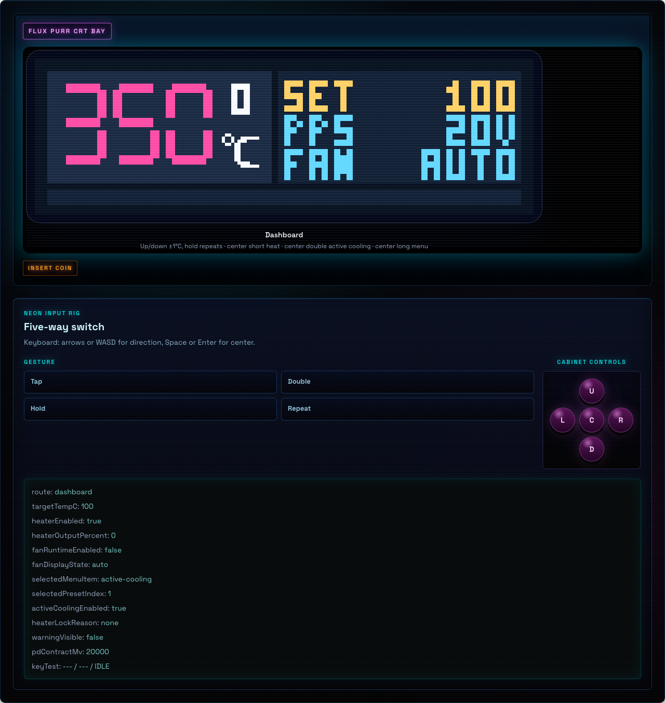
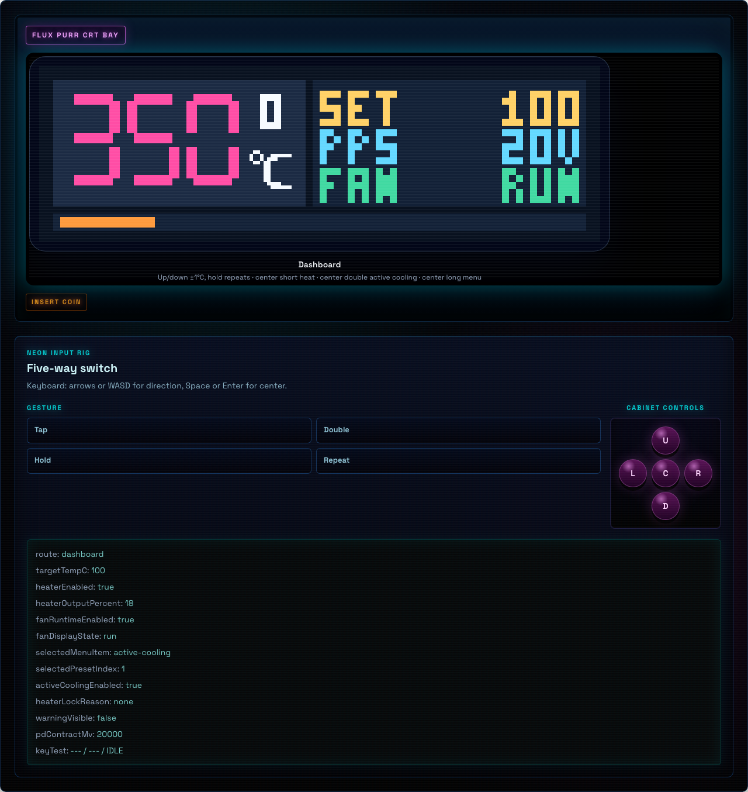
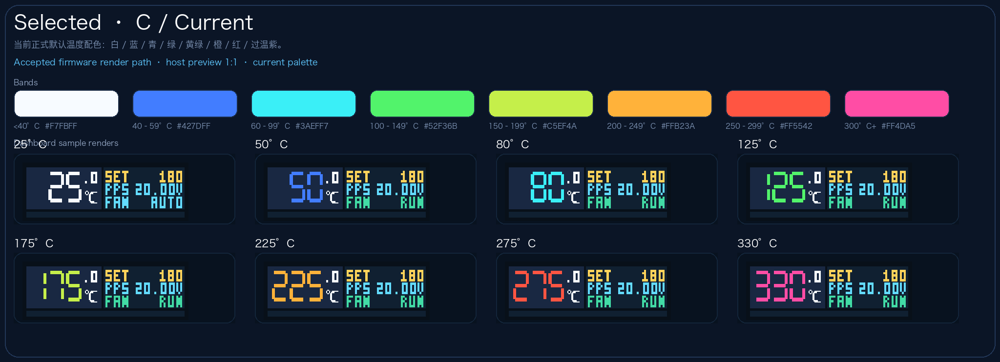

# Flux Purr 正式 PID 加热闭环与前面板运行态同步（#q2aw6）

## 状态

- Status: 已完成
- Created: 2026-04-21
- Last: 2026-04-25

## 背景 / 问题陈述

- 当前 `flux-purr` 已完成前面板输入、RTD 读取、CH224Q 默认电压请求与 heater/fan bring-up，但 Dashboard 的风扇语义仍残留旧的单布尔开关口径。
- `#223uj` 与 `#fk3u7` 已冻结前面板视觉和五向输入基线，但 Dashboard 的 fan line、Active Cooling 页面和过温告警仍缺少统一真相源。
- 若不把风扇策略、过温停热、feature-selected PD 默认请求与前面板显示一次收口，后续板级调试会持续混淆“策略开关”“实际输出”“保护联动”三套状态。

## 目标 / 非目标

### Goals

- 把 `GPIO47` 固定占空比加热替换为按 `target_temp_c` 驱动的正式闭环；当 CH224Q 读取到 PPS APDO 覆盖 `20V` 时，heater 后端使用 `PPS/AVS 调压 + MOS 静态通断`，否则回退原 `GPIO47` PWM 调功。
- 加热闭环采用模型辅助 ramp/soak 与保温 PI 微调的混合控制器。控制器输出统一的等效热功率请求；PPS 后端映射为 `100mV` 对齐电压并静态控制 MOS，固定 PD 后端选择不低于目标等效电压的 PDO 并用 MOS PWM 合成等效功率。
- 支持 `ThermalControlProfile` preview 与显式保存。RAM preview 最多 10 个目标点；EEPROM save 最多 6 个非空锚点并压紧稀疏槽位，超出持久化容量的请求必须在返回成功前拒绝。point 包含 `targetTempC`、`brakeDistanceCentiC`、`approachPowerPermille`、`approachFloorPowerPermille`、`holdPowerPermille`、`holdReheatPowerPermille`，以及 `holdEntryCentiC`、`holdExitCentiC`、`holdOnCentiC`、`holdOffCentiC`、`overshootCutoffCentiC`、`holdKpPermillePerC`、`holdKiPermillePerCTick`、`holdBlendTicks`。profile settings 包含 `heaterCurrentReserveMa`，用于从 source current capability 中扣除板级供电与转换损耗余量。目标落在两个点之间时对点字段统一线性插值；`holdPowerPermille` 表达温区保温基线，`approachFloorPowerPermille` 表达接近目标时允许维持的最小加热功率下限，`holdReheatPowerPermille` 表达接近目标时仍低于目标温度的更强 sustain/recovery 补热下限；RAM preview 优先于 EEPROM 中的 saved profile；清除 preview 后回到 saved profile 或保守默认曲线；显式 save 写入 EEPROM。
- 提供 CLI/devd 自测试入口，使用 IsolaPurr released CLI 准备 `65W`、PD Fixed enabled、PPS enabled、`auto_follow` 外部 source，输出 `run.json`、`samples.ndjson`、`thermal-profile.candidate.json` 与带图表的 `report.html`。
- 让 Dashboard 稳定显示实时温度、设定温度、`OFF/AUTO/RUN` 三态风扇显示与实际 heater 输出强度。
- 冻结正式风扇/保护包线：
  - heater `OFF` 且 active cooling `ON`：`40~60°C` 以 `GPIO36 duty=50%`（`500‰`）运行、`>60°C` 以 `GPIO36 duty=0%`（`0‰`）全速；一旦温度回落到 `<40°C`，继续以 `GPIO36 duty=100%`（`1000‰`）拖尾 `30s` 后再关闭。
  - heater `ON`：`<=100°C` 不主动散热；超过 `100°C` 后，只有实时 heater 输出大于 `0%` 时才进入最低电压 `0.2Hz` 使能脉冲，脉冲占空比为 cooling-disabled 脉冲的两倍并封顶 `50%`。
  - active cooling `OFF`：`>100°C` 进入最低电压 `0.2Hz` 使能脉冲，脉冲占空比按 `floor((temp-100)/10)%` 递增并封顶 `25%`。
  - active cooling `OFF` 且 `>350°C`：锁住停热并保持风扇 `50%`；`>360°C` 改为全速。
  - `temp >= 420°C`：保持 heater hard cutoff fault-latch。
- 默认启动时把 CH224Q 请求固定为 `20V`，再读取 CH224Q `0x60~0x8F` power data；只有 PPS capability 覆盖 `20V` 时才启用可调加热后端。自动加热时可调请求上限必须受 source capability 与 `I_source_max * R_estimated(T)` 的较小值限制；`R_estimated(T)` 使用当前 `3.2 ohm` heater load class 的一阶铜电阻估算。
- 产出 merge-ready 所需的 spec、视觉证据、板级验证与 review 收敛材料。

### Non-goals

- 不提供任意源码常量热调参入口；运行时调参必须通过 `ThermalControlProfile` 的 EEPROM/API 可控字段完成。
- 不把 `>250°C` 纳入 thermal self-test 或首版调参验收。
- 不实现 fan tach 闭环、4 线 PWM、持久化风扇档位或按 VIN 自动切换固定 PD 请求。
- 不修改外部 HTTP / RPC / 持久化字段结构。
- 不扩展新的前面板菜单层级或联网业务逻辑。

## 范围（Scope）

### In scope

- `firmware/src/bin/flux_purr.rs`
- `firmware/src/frontpanel/**`
- `firmware/src/bin/frontpanel_preview.rs`
- `web/src/features/frontpanel-preview/**`
- `web/src/stories/FrontPanelDisplay.stories.tsx`
- `firmware/README.md`
- `docs/interfaces/http-api.md`
- `docs/specs/q2aw6-heater-pid-frontpanel-runtime/**`
- `docs/specs/fk3u7-frontpanel-input-interaction/SPEC.md`
- `docs/specs/223uj-frontpanel-ui-contract/SPEC.md`

### Out of scope

- Web 控制台、HTTP API、Wi‑Fi 配置写回字段扩展
- 多电压 / 多功率档位与自动 PD 策略切换
- RTD 额外校准界面或外部校准协议

## 需求（Requirements）

### MUST

- heater 控制周期固定为 `100ms (10Hz)`。每个周期聚合 `32` 次 RTD ADC conversion，并保留分数毫伏均值；`pps-mos` 后端下 `GPIO47` 只允许静态 `0% / 100%` 输出，中间功率由受温度/电流合同限制的可调 PD 请求承担；fallback 后端继续使用 `2 kHz` PWM。
- heater 控制器必须按目标温区选择 ramp/approach/hold 参数，以及所有会显著影响 near-target damping 的调节量。远离目标时按 profile 的 warmup power 加热；warmup 退出距离必须取静态 `brakeDistanceCentiC` 与“滤波升温斜率 × `approachLeadTicks`”预测距离的较大值，并受 `warmupReenterCentiC` 滞回边界约束，不能在热惯性增大时仍固定等到静态刹车距离才降功率。进入 approach 后线性降到 profile 的 `approachFloorPowerPermille` 下限；只要仍低于目标温度，approach 段的近目标 sustain floor 必须允许继续抬到温区 `holdReheatPowerPermille`，避免高温段在接近目标时掉到低于平衡功率。保温阶段在 `holdPowerPermille` 基线上做连续 PI 微调；过冲时必须立即把输出降到 `0%` 并限制积分累积。预测滑行只允许在实际误差与滤波误差都已经落入该温区 `holdExit` 守门范围内时触发，不能因为单次预测提前把仍显著低于目标的温区拉成零输出。若 approach 已因预测储热切到 `0%` 后进入 hold，控制器必须保持 coast `0%`，直到温度不再上升且实际低温误差达到 profile 的 `holdOnCentiC`，再恢复 PI；hold 入口宽度不得同时放大滤波滞后参与 PI 的误差，滤波滞后补偿上限由 `holdOnCentiC` 约束。进入 hold 时必须允许把最后一次 approach 输出平滑 blend 到 hold PI 输出，并允许用可持久化的温区参数控制 `holdEntry / holdExit / holdOn / holdOff / overshootCutoff / holdKp / holdKi / holdBlendTicks / approachLead / holdLead`。用于 acceptance/HIL 的 saved profile 必须允许低温段使用更长的 approach 窗口，不能把接近目标的降功率阶段压缩到亚秒级；同一组全局 hold dynamics 不得被视为足够覆盖 `60~250°C` 全范围，低温与高温的 near-target damping 必须能够通过 API/EEPROM 控制数据独立收敛。
- 对 HIL / self-test 的硬判定中，“从全速加热到温度稳定不得超过 `10s`”的定义固定为：单个 stage 内从控制器首次离开 `warmup` phase 的时刻开始计时，到首次进入“稳定窗口”的时刻不得超过 `10_000ms`。稳定窗口定义为：后续连续 `10s`、采样频率至少 `3Hz` 的样本中，`heaterControlPhase` 必须持续为 `hold`，且 `abs(currentTempC - targetTempC) <= 1.5°C`。此外，控制器首次进入 `approach` 后，若连续 `10_000ms` 仍未达到 `holdThresholdTempC = targetTempC - holdEntryCentiC / 100`，必须立即判定该 stage 失败；若首次进入 `approach` 后又回到 `warmup`，必须立即判定该 stage 失败；若首次进入 `approach` 后连续 `30_000ms` 仍未首次进入 `hold`，必须立即判定该 stage 失败。脚本必须按这些定义自动判定并给出 pass/fail，不得依赖人工观察。
- self-test candidate 的在线识别不得在一次失败中同时搜索全部 profile 字段。脚本必须先从 `holdMedianOutputPermille` 识别温区平衡功率，再结合 `holdP90OutputPermille`、near-target approach 输出、残余热量、首个 hold 温差和 hold 波动，按“供热不足 / 残余热主导 / hold ripple”三类故障分别更新关联参数。首次进入 hold 后若仍持续上冲，且高侧幅度明显大于低侧幅度，必须优先增加 `brakeDistance / approachDamping / approachLead` 并按实测平衡功率校正 hold 基线；不得把这种残余热误判为普通 hold ripple 后继续抬高 hold 功率。`approachPower / approachFloor` 与 `holdPower / holdReheat` 是独立通道：尚无有效 hold 样本的 approach 失败不得抬高 hold 参数，`holdReheat` 不得被 `approachFloor` 强制抬高。`brakeDistance / approachDamping / approachLead` 只用于过冲刹车；`holdOn / holdOff / holdBlend / holdKp` 只用于 hold entry/exit 阻尼。采样、供电、通信或 runtime 故障不得修改 candidate。每次 candidate 更新后，所有运行时影响字段必须 materialize 到 profile 并通过 preview/save API 写入，禁止用替换固件的隐藏常量承载调参结果。
- profile preview 必须只驻留 RAM。`runtime_config.thermalControlProfile.op=preview` 需要完整 profile，`op=clear_preview` 清除 preview；`op=save` 需要完整 profile 并写入 EEPROM-backed active thermal profile，`op=clear_saved` 清除 EEPROM-backed active profile；状态回显必须暴露 `thermalControlProfilePreview` 区分当前是否处于 RAM preview。
- CH224Q PPS 电压请求只按 `0x53` 的 `100mV` 单位对齐；AVS `25mV` 不作为首版 PPS 保温细分路径。
- 目标温度与 preset 写入都必须 clamp 到 `0~400°C`。
- RTD 开路、短路、ADC 读失败、`temp >= 420°C` 时，heater 必须立即关断并进入 fault-latch。
- heater 已启用时，32x 均值后的 RTD 温度若连续两次同向跨越 `measurementSpikeRejectCentiC`，必须判定 `sensor-discontinuity` 并 fault-latch 停热；首个异常样本只允许保持上一有效温度等待确认，不得按固定斜率逐 tick 追赶异常读数并伪造连续升温曲线。`measurementSpikeRejectCentiC` 必须继续由 thermal profile API/EEPROM 控制。
- fault-latch 期间 heater 不得自动恢复；故障解除后必须由用户再次短按中键重臂。
- CH224Q 在启动时默认请求 `20V`；`pd-request-12v` / `pd-request-28v` 仅改变默认固定请求值。随后必须读取 CH224Q power data 并只在 PPS APDO 覆盖 `20V` 时启用 `pps-mos`。固定 `20V` PDO 不得被当作 PPS 覆盖 `20V`。
- `pps-mos` 后端中，控制输出 `0%` 必须关 MOS；若 heater 仍处于 armed 加热会话，则保持当前 PPS 请求不变，避免 predictive coast 期间因无意义调压造成 VBUS 重协商或 MCU 复位；只有 heater 真正关闭时才恢复 idle `12V` 或 source 宣告的更高 PPS 最小电压。控制输出 `1..100%` 必须映射到 `source PPS minimum .. safe_max_mv`，其中 `safe_max_mv = floor_100mV(min(V_source_max, I_source_max * R_estimated(T)))`，并继续受 PPS/AVS capability 上下限钳制。目标请求相对当前请求不足 `500mV` 时必须抑制调压；每次实际 PPS 电压变化都必须先关 MOS，升压等待 `150ms`、降压等待 `500ms` 后才可恢复 gate，避免带载调压及降压未稳定造成供电复位。PPS/AVS 模式切换、固定 PDO/current-limit fallback、首次模式建立或失败降级等离散电源路径切换同样必须先关 MOS 并等待 settle。所有 CH224Q 可调电压请求在最终写寄存器前都必须 clamp 到不低于 `5V`；若 source capability 或上层控制请求低于 `5V`，实际请求必须提升为 `5V` 并记录 warning 日志。若加热时 `safe_max_mv < PPS minimum`，则必须临时请求固定 `9V` 并切回 `GPIO47` PWM，且 PWM duty 必须继续按 `I_source_max * R_estimated(T) / 9V` 钳制，直到 `safe_max_mv >= PPS minimum + 200mV` 才恢复 `pps-mos`；任一关键调压写入失败必须切回默认固定 PD + `GPIO47` PWM fallback。
- `I_source_max` 必须先取 PPS capability 与有效 CH224Q live current 的较小值，再扣除 EEPROM/API 可控的 `heaterCurrentReserveMa`。默认 reserve 为 `200mA`，合法范围 `0..1000mA`；source readback、板级掉电或后续硬件差异允许通过 profile API 调整，禁止为了改变该余量替换固件。
- 手动 PPS 覆盖是非持久化调试状态，不写 EEPROM。启用时暂停自动 PPS/PID 电压写入，但 heater/PID 输出与 MOS gate 仍按既有逻辑运行；改压时不得主动干预 MOS gate。
- 手动 PPS 覆盖不依赖 `pps_covers_20v`，但必须存在 PPS APDO capability，目标电压必须在 capability 内、按 `100mV` 对齐且不高于 `21.0V`。CH224Q 写入失败或 PD 状态丢失时必须自动清除覆盖，回到默认固定 PD 请求或既有 fallback，并通过 status/trace 暴露错误。
- `active_cooling_enabled=true` 时，Dashboard fan line 必须只显示 `AUTO` 或 `RUN`；`active_cooling_enabled=false` 时必须显示 `OFF`，即使保护链路正在临时驱动真实风扇。
- Dashboard 中键短按只切 heater arm；中键双击切换主动降温（`active_cooling_enabled`）；中键长按只进菜单。
- `GPIO48` 蜂鸣器必须使用独立 PWM 通道；boot 和 idle 保持静音，不得复用 heater/fan 已占用的 PWM 输出。
- heater 成功切换必须播放 `heater_on / heater_off`；主动降温成功切换必须播放 `active_cooling_on / active_cooling_off`；heater 重臂被拒绝时必须播放 `heater_reject`。
- 任何已接受的前面板用户操作都必须有提示音；其中非 heater / 主动降温专用反馈的已接受操作（如菜单导航、子页进入/退出、预设编辑）统一播放通用 `ui_input` 提示音。
- 同一个蜂鸣器 cue 被重复触发时，必须从第一拍重新开始，不得沿用上一轮尚未结束的频率段。
- 过温保护不得占用 Dashboard 的风扇元素；SET 行必须在告警激活时以 `1Hz` 闪烁 `WARN / OTEMP` 两关键帧。
- `Active Cooling` 页面在正式 runtime 中为只读安全策略说明页；用户开启这一项时，口径统一称为“开启主动降温”，并必须同步默认 `20V`（及 `12V / 28V` build variants）、`40~60°C => 50% PWM`、`>60°C => 0% PWM`、`<40°C => 100% PWM + 30s`、加热期 `>100°C` 输出门控脉冲与 `>350 / >360°C` 包线。
- 当前风扇硬件为反相 `FB` 注入控制：`GPIO36 duty=0%` 表示最高风扇轨电压，`GPIO36 duty=100%`（`1000‰`）才表示最低风扇轨电压；所有 `minimum-voltage profile` 语义都必须落到该 `1000‰` 档位。
- 任一活动保护（`SensorShort / SensorOpen / AdcReadFailed / OverTemp`）出现时，蜂鸣器必须立即进入急促、持续的循环警告音；保护解除后改为每 `10s` 一次 reminder，直到用户任意输入确认。
- defmt 日志必须覆盖 RTD 读数、PID 输入/输出、heater backend 选择、PPS/AVS 请求电压、MOS gate 输出、fault 原因、fan policy 输出与 PD 状态变化。

### SHOULD

- cooling-disabled lock 的标签与恢复路径保持稳定，便于 monitor 与后续 review 收敛。
- 初始 UI 应在第一次有效 RTD 样本后就显示实际温度，而不是长时间保留 bring-up 默认值。
- firmware preview 与 Storybook 的 Dashboard/Active Cooling 文案和颜色层级保持一致。

### COULD

- 后续在同一条 PID 日志上扩展功率估算或 duty limit 观察字段。

## 功能与行为规格（Functional / Behavior Spec）

### Core flows

- 启动后先请求 feature-selected 固定 PD 电压（默认 `20V`），随后读取 CH224Q status 与 power data。若 PPS APDO 覆盖 `20V`，heater 后端进入 `pps-mos`；否则进入 `fixed-pd-pwm-fallback`。
- 用户短按中键后，heater 进入 arm 状态；若无 fault-latch，则控制器按 `target_temp_c - current_temp_c` 输出 `0..100%` 控制量。`pps-mos` 后端先按 `3.2 ohm` heater load class 估算 `R_estimated(T)`，再用 `min(PPS APDO max current, valid CH224Q status current)` 计算动态电压上限；控制量 `1..100%` 仅在该安全上限内映射为可调 PD 电压并静态打开 MOS。若当前安全上限低于 PPS minimum，则临时改为固定 `9V` + `GPIO47` PWM，并继续按当前电流合同钳制 fallback PWM duty，待安全上限恢复后再回到 `pps-mos`。
- Dashboard 上/下短按和 hold-repeat 都只调整 `target_temp_c`，每次事件步进 `1°C` 并继续 clamp 到 `0~400°C`；中键 heater / active cooling / menu 语义不受 hold-repeat 影响。
- 用户双击中键后，切换的是“主动降温”策略位，而不是直接强制 fan GPIO。
- Dashboard fan line 只反映“策略开关 + 当前是否实际运行”：
  - `OFF`：风扇策略关闭
  - `AUTO`：风扇策略开启但当前无需工作
  - `RUN`：风扇策略开启且当前已使能输出
- 当 `active_cooling_enabled=true` 且温度位于 `40~60°C` 时，真实风扇必须使用 `GPIO36 duty=50%`（`500‰`）；当温度 `>60°C` 时必须切到 `GPIO36 duty=0%`（`0‰`）全速；当温度从 `>=40°C` 回落到 `<40°C` 时，真实风扇必须继续以 `GPIO36 duty=100%`（`1000‰`）运行 `30s`，然后才关闭。
- 当 heater 已 arm 但实时 heater 输出为 `0%` 时，`100<T<=350°C` 的普通加热期风扇脉冲必须关闭；当实时 heater 输出大于 `0%` 时，该区间的最低电压脉冲周期为 `5s`，占空比必须为 cooling-disabled 脉冲的两倍并封顶 `50%`。
- 当 `active_cooling_enabled=false` 且 `temp > 350°C` 时，heater 必须被强制关断并锁住；用户重新开启风扇策略或手动重新使能 heater 后才允许退出该锁态。
- 当 `active_cooling_enabled=false` 且 `temp > 360°C` 时，真实风扇输出升级为全速，但 Dashboard fan line 仍保持 `OFF`。
- PD 状态只做观测：即使 PD 丢失或降档，也不自动清空 `heater_enabled`。但 PPS/AVS 调压写入失败会把 heater 后端降级到固定 PD PWM fallback。
- 手动 PPS 覆盖激活期间，自动 heater backend 不再写 CH224Q 电压；固定 PD fallback 仍可继续使用 `GPIO47` PWM duty，`pps-mos` 仍可继续由 PID/MOS gate 表达加热输出。
- 任一活动保护出现时，蜂鸣器立即切到持续 alarm；fault clear 后停止连续 alarm，并改为每 `10s` 的 reminder cadence，直到任意输入确认。

### Edge cases / errors

- 首次 RTD 采样失败时，heater 必须保持关断，直到后续有效样本恢复且用户重新 arm。
- fault-latch 期间若用户再次短按中键：
  - 当前 fault 仍存在时，必须拒绝重臂并保持 `heater_enabled=false`
  - 当前 fault 已消失时，允许清除 latch 并重新进入 arm
- cooling-disabled lock 清除后，若温度仍高于 `350°C`，必须等待温度回到 `<=350°C` 再次越线后才允许重新触发锁定。
- reminder pending 期间，第一次任意输入只能作为确认/静音；该输入不得顺带切 heater、切主动降温或发生页面导航。

## 接口契约（Interfaces & Contracts）

### 接口清单（Inventory）

| 接口（Name） | 类型（Kind） | 范围（Scope） | 变更（Change） | 契约文档（Contract Doc） | 负责人（Owner） | 使用方（Consumers） | 备注（Notes） |
| --- | --- | --- | --- | --- | --- | --- | --- |
| `FrontPanelUiState.fan_display_state` | Rust state model | internal | New | None | firmware | runtime / preview / render tests | Dashboard 风扇三态真相源 |
| `FrontPanelUiState.heater_lock_reason` | Rust state model | internal | New | None | firmware | runtime / preview / render tests | `cooling-disabled-overtemp` / `hard-overtemp` |
| `FrontPanelUiState.dashboard_warning_visible` | Rust state model | internal | New | None | firmware | runtime / preview / render tests | SET 行告警闪烁相位 |
| `FrontPanelUiState.manual_pps_enabled` | Rust state model | internal | New | None | firmware | runtime / preview / render tests | Dashboard `PPS*` 调试覆盖提示 |
| `ThermalControlProfile` | USB/devd runtime config + EEPROM config | external | New | `docs/interfaces/http-api.md` | firmware / devd | CLI / devd / Web Serial | RAM preview 与 EEPROM-backed saved profile，最多 10 个点；每点同时携带 power baseline 与 damping 字段 |
| `FrontPanelRuntimeState` / `FrontPanelScreen` | TypeScript type | internal | Updated | None | web | Storybook / preview harness | 对齐 firmware 三态 fan 与告警关键帧 |

### 契约文档（按 Kind 拆分）

None

## 验收标准（Acceptance Criteria）

- Given 固件刚启动，When RTD 已有有效样本，Then Dashboard 左侧显示实时温度，右侧显示 `SET/PPS/FAN`，其中 `FAN` 只会显示 `OFF/AUTO/RUN`。
- Given Dashboard，When 用户短按中键，Then 只切换 heater arm；When 双击中键，Then 只切换主动降温；When 长按中键，Then 仍进入菜单；When 长按保持上/下，Then 只连续调整 `target_temp_c`。
- Given heater 关闭且主动降温开启，When 温度 `39°C / 40°C / 60°C / 61°C`，Then fan 必须分别进入停止或 30 秒拖尾 / `50% PWM` / `50% PWM` / `0% PWM`。
- Given 主动降温已经把风扇拉起，When 温度跌到 `<40°C`，Then fan 必须以 `100% PWM` 再持续 `30s` 后关闭。
- Given heater 开启但实时输出为 `0%`，When 温度 `110°C`，Then fan 不得触发普通加热期脉冲。
- Given heater 开启且实时输出大于 `0%`，When 温度 `100 / 110 / 350 / 351 / 361°C`，Then fan 必须分别满足无脉冲 / `2%` 脉冲 / `50%` 脉冲 / `50%` / 全速。
- Given active cooling 关闭，When 温度 `100 / 110 / 350 / 351 / 361°C`，Then fan 必须分别满足无脉冲 / `1%` 脉冲 / `25%` 脉冲 / `50%` / 全速。
- Given active cooling 关闭且温度 `>350°C`，When 控制循环更新，Then heater 必须被锁住停热；When 用户重新开启风扇策略或手动重新 arm heater，Then 才允许离开锁态。
- Given `temp >= 420°C`，When 故障出现，Then heater 立即归零并进入 `hard-overtemp` fault-latch。
- Given heater runtime 正常运行，When RTD 控制周期触发，Then 控制环必须以 `10Hz` 更新，每个周期聚合 `32` 次 ADC conversion，并把分数毫伏均值贯穿 calibration 与 PT1000 转换；`tempFilterAlphaPermille` 默认值为 `700`，且必须继续由 thermal profile API/EEPROM 控制。
- Given native/Web Serial status 被读取，When 固件发布当前温度，Then `boardTempCenti/currentTempC` 必须直接由内部浮点 RTD 测量值四舍五入到 `0.01°C`，不得从前面板 `0.1°C` 显示值反推；前面板显示精度不得限制控制环或遥测精度。
- Given Dashboard 过温告警，When 页面刷新，Then 告警只占据 SET 行并以两关键帧闪烁，FAN 行不切换到告警文案。
- Given CH224Q power data 包含覆盖 `20V` 的 PPS APDO，When runtime 初始化 heater 后端，Then 选择 `pps-mos`；heater armed 且控制输出为 `0%` 时保持当前 PPS 请求并关闭 MOS，heater disabled 时才恢复 idle `12V` 或更高 PPS minimum；`1..100%` 只在 `min(V_source_max, I_source_max * R_estimated(T))` 允许的范围内请求 PPS/AVS 电压。对于 `3.25A` source，`0C / 20C` 下的自动加热不得直接请求超出电流合同的静态全开电压，必要时必须先关 MOS 再切到固定 `9V` + PWM fallback；对于更低电流 source，fallback duty 必须继续被压到不高于该电流合同对应的等效占空比，且 GPIO47 在 `pps-mos` 正常路径中仍只输出静态关/开。
- Given CH224Q 只提供固定 `20V` PDO 或 PPS APDO 不覆盖 `20V`，When runtime 初始化 heater 后端，Then 选择 `fixed-pd-pwm-fallback`，不得把固定 `20V` 误判为 PPS 可调能力。
- Given source 回报 PPS APDO capability，When 手动 PPS 覆盖启用为 `10.4V`，Then 自动 PPS/PID 电压写入暂停，MOS gate 不被设置动作额外改写，status 回显 manual/capability；When 覆盖清除、PD 丢失或写入失败，Then 自动控制恢复且错误码可见。
- Given `runtime_config.thermalControlProfile.op=preview`，When profile 含有最多 10 个槽位，Then firmware 只在 RAM 中启用 profile preview，目标温度落在点间时按 profile 线性插值所有 power/damping 字段；status 的 `thermalControl` 必须回显当前目标经过插值、继承和安全 clamp 后的有效参数、profile source 与 target coverage；When `op=clear_preview`，Then status 回显 `thermalControlProfilePreview=false` 且控制器回到 EEPROM saved profile 或默认曲线。
- Given `runtime_config.thermalControlProfile.op=save`，When profile 含有最多 10 个槽位，Then firmware 立即启用该 profile 并经现有 memory commit 路径写入 EEPROM；EEPROM 编码必须只占用实际已配置点位，而不是强制写满 10 个空槽，避免 profile 扩展后挤爆现有 record 空间；When 设备重启后，Then 控制器继续使用 saved profile；When `op=clear_saved`，Then EEPROM-backed active profile 被清除，RAM preview 不被隐式保存。
- Given `flux-purr thermal self-test` dry-run 或 mock devd，When 未显式传入 `--targets-c` 生成候选 profile，Then `targetsC` 默认只包含 `60 / 140 / 220°C`，不得包含 `300°C`；When 显式传入 `--targets-c`，Then `targetsC` 必须是标定网格 `60 / 80 / 100 / 120 / 140 / 160 / 180 / 200 / 220 / 240°C` 加终端验收点 `250°C` 的有序子集，且仍不得包含 `300°C`。密集标定点允许使用相邻 profile 锚点插值运行，最终保存的 profile 仍受持久化点数上限约束。
- Given 真实 HIL self-test，When IsolaPurr 通过 released `isolapurr` 工具的显式 `--source-url` LAN 路径准备 bench source 且 Flux Purr 端口已由主人明确授权，Then source setup 不得使用 IsolaPurr USB transport、manual TPS 或 port replug；必须校验 device id，设置并读回 `65W`、PD Fixed enabled、PPS enabled、`auto_follow`，并在开始温控前确认 USB-C 实测电压 `>5V`。任一命令非 0 退出、身份不一致或读回不一致都必须失败。self-test 必须在 run 期间通过 `thermalControlProfile.op=preview` 用 RAM profile 逐段执行 target ladder，并在全部 stage 满足 `maxOvershootC <= 3.0°C`、`holdPeakToPeakC <= 3.0°C` 以及 full-speed-to-stable 硬判据后，再通过 `thermalControlProfile.op=save` 一次性把最终 tuned candidate 写入 EEPROM-backed active profile；host 默认采样间隔必须为 `300ms`，请求更慢值也必须 clamp 到 `300ms`，实测频率必须至少 `3Hz`，并显式记录外部电源实时电压/电流、热台电压读数、PPS 请求/合同电压、当前温度与当前加热参数。applied run 产生 `run.json`、`samples.ndjson`、`thermal-profile.candidate.json` 与 `report.html`；默认保温采样窗口为 `60s`，每个 stage 默认 `300s` 安全上限，超时或 runtime 故障必须主动关闭 heater 并停止 ladder。进入 hold 后，整段 `60s` 采样窗口必须连续计入峰峰值，不因为中途掉温而重置计时；报告必须额外包含 `holdThresholdTempC`、`approachStartedAtMs`、`holdThresholdCrossedAtMs`、`firstHoldAtMs`、`warmupReenteredAtMs`、`warmupExitedAtMs`、`stableWindowStartedAtMs`、`stableWindowVerifiedAtMs`、`settleTimeMs` 与失败原因。
- Given 真实 HIL self-test 准备启动任一 stage，When host 以 `heaterEnabled=false` 设定 target 后读取 `thermalControl`，Then profile source 必须为 `preview`、profile 必须覆盖该 target，且 host 必须使用与 firmware 相同的相邻锚点线性插值及取整规则计算该 target 的有效 point；readback 中 point/settings 的每一有效字段必须与这组有效参数完全一致。锚点目标与插值目标都必须在每个 stage arm 前独立执行该校验；密集验证目标不要求在持久化 profile 中存在同温度锚点。任一字段缺失或不一致时必须在 MOS arm 前失败并执行 cleanup。
- Given 真实 HIL self-test 正在采样，When 固定 `3s` 窗口的实测滚动频率连续另一个 `3s` 宽限期保持低于 `3Hz`，Then self-test 必须记录单次间隔、滚动频率和电源快照年龄，以 `sample_rate_below_3hz` 停热并判失败；单次主机调度或串口停顿必须保留在样本中，但不得单独终止总体频率仍合格的 run。`--sample-interval-ms` 的请求值不得替代这一实测判定。IsolaPurr released CLI 采集不得阻塞 Flux Purr 控制采样循环；底层电源 telemetry 连续 `2s` 未推进必须判定 source telemetry stale 并停热。
- Given 真实 HIL self-test 的任一 stage，When 控制器首次离开 `warmup` phase，Then 脚本必须开始统计 “full-speed-to-stable” settle time，并要求在 `10_000ms` 内首次满足稳定窗口；稳定窗口固定为后续连续 `10s` 内 `heaterControlPhase == hold` 且 `abs(currentTempC - targetTempC) <= 1.5°C`。若在时限后未存在已经开始的连续稳定窗口，脚本必须立刻关热并以 `full_speed_to_stable_timeout` 结束 stage；若窗口已在时限内开始，脚本只允许继续采样至该窗口被验证或中断。同时，当控制器首次进入 `approach` phase 时，脚本必须开始统计 approach 守门时序：`10_000ms` 内必须至少一次达到 `holdThresholdTempC = targetTempC - holdEntryCentiC / 100`，`30_000ms` 内必须至少一次进入 `hold`，且在首次进入 `hold` 前不得回退到 `warmup`。任一条件失败都必须直接判定该 stage 失败，并在报告中给出 `approachStartedAtMs`、`holdThresholdCrossedAtMs`、`firstHoldAtMs`、`warmupReenteredAtMs`、`warmupExitedAtMs`、稳定窗口时序、失败原因与对应原始样本；runtime 掉电、重启、heater 意外 disarm、错误 target/mode 不得自动重臂后计为通过。

## 实现前置条件（Definition of Ready / Preconditions）

- `flux-purr` 已完成 RTD 经验标定（当前按约 `3000 mV` 有效分压换算）。
- 前面板五向输入与现有 Dashboard / Menu 路由已可在真机上稳定使用。
- 板级 flash / monitor 统一通过 `mcu-agentd` 执行。

## 非功能性验收 / 质量门槛（Quality Gates）

### Testing

- `cargo test --manifest-path firmware/Cargo.toml`
- `cargo test --manifest-path tools/flux-purr-devd/Cargo.toml`
- `bun run check:devd`
- `cargo run --manifest-path tools/flux-purr-devd/Cargo.toml --bin flux-purr -- --json thermal self-test --device mock-fp-lab-01 --source-device-id iso-mock --source-url http://127.0.0.1:1 --dry-run`
- `source /Users/ivan/export-esp.sh && cargo +esp build --manifest-path firmware/Cargo.toml --target xtensa-esp32s3-none-elf --features esp32s3 --bin flux-purr --release`
- `cargo run --manifest-path firmware/Cargo.toml --features host-preview --bin frontpanel_preview -- dashboard docs/specs/q2aw6-heater-pid-frontpanel-runtime/assets/dashboard-pps-12v.framebuffer.bin --pd-mv 12000`
- `cargo run --manifest-path firmware/Cargo.toml --features host-preview --bin frontpanel_preview -- dashboard docs/specs/q2aw6-heater-pid-frontpanel-runtime/assets/dashboard-pps-28v.framebuffer.bin --pd-mv 28000`
- `bun run --cwd web check`
- `bun run --cwd web typecheck`
- `bun run --cwd web test:unit`
- `bun run --cwd web build-storybook`
- `cargo run --manifest-path firmware/Cargo.toml --features host-preview --bin frontpanel_preview -- dashboard-fan-off docs/specs/q2aw6-heater-pid-frontpanel-runtime/assets/dashboard-fan-off.framebuffer.bin`
- `cargo run --manifest-path firmware/Cargo.toml --features host-preview --bin frontpanel_preview -- dashboard-fan-auto docs/specs/q2aw6-heater-pid-frontpanel-runtime/assets/dashboard-fan-auto.framebuffer.bin`
- `cargo run --manifest-path firmware/Cargo.toml --features host-preview --bin frontpanel_preview -- dashboard-fan-run docs/specs/q2aw6-heater-pid-frontpanel-runtime/assets/dashboard-fan-run.framebuffer.bin`
- `cargo run --manifest-path firmware/Cargo.toml --features host-preview --bin frontpanel_preview -- dashboard-overtemp-a docs/specs/q2aw6-heater-pid-frontpanel-runtime/assets/dashboard-overtemp-a.framebuffer.bin`
- `cargo run --manifest-path firmware/Cargo.toml --features host-preview --bin frontpanel_preview -- dashboard-overtemp-b docs/specs/q2aw6-heater-pid-frontpanel-runtime/assets/dashboard-overtemp-b.framebuffer.bin`

### UI / Firmware Preview

- owner-facing 预览必须来自 `frontpanel_preview` 或 Storybook 的确定性输出。
- 视觉证据必须落在本 spec 的 `./assets/` 下，并和聊天回图保持同源。

## 文档更新（Docs to Update）

- `docs/specs/fk3u7-frontpanel-input-interaction/SPEC.md`
- `docs/specs/223uj-frontpanel-ui-contract/SPEC.md`
- `firmware/README.md`
- `docs/interfaces/http-api.md`

## Visual Evidence

- Dashboard fan `OFF`：

- Dashboard fan `AUTO`：

- Dashboard fan `RUN`：

- Heating fan pulse gated by zero heater output：

- Heating fan pulse active with live heater output：

- Dashboard PPS `12V`：

- Dashboard manual PPS override：

PR: include

- Dashboard PPS `28V`：

- Dashboard overtemp warning frame A：

- Dashboard overtemp warning frame B：

- Active Cooling policy page：

- Current default temperature palette（Aurora / C）：

## 实现里程碑（Milestones / Delivery checklist）

- [x] M1: 落地正式 `HeaterController`、heater fault-latch 与风扇策略状态机
- [x] M2: 落地 Dashboard 三态风扇显示、SET 行告警闪烁与 Active Cooling 只读说明页
- [x] M3: 补齐单测、host preview、Storybook 故事与视觉证据
- [x] M4: 完成 xtensa build / review 收敛并准备 merge-ready PR

## 方案概述（Approach, high-level）

- 用单一 `HeaterController` 管理 PID 与 hard fault-latch，再把 cooling-disabled lock 作为独立安全层挂在 fan policy 旁边。
- 用 `fan_display_state + heater_lock_reason + dashboard_warning_visible` 作为 Dashboard 真相源，不再复用单布尔 fan 标记表达全部运行态。
- 用 `HeaterPowerBackend` 把控制器输出与硬件输出解耦：`pps-mos` 后端只做 MOS 静态通断并通过 CH224Q PPS/AVS 调压；`fixed-pd-pwm-fallback` 保留原 `GPIO47` PWM 调功。
- CH224Q 仍作为电源准备层而不是 heater interlock；只有启动 capability gate 与后续调压写入失败会影响 heater 后端选择。

## 风险 / 开放问题 / 假设（Risks, Open Questions, Assumptions）

- 风险：当前 PID 默认参数仍需依赖实板热惯性验证，首次实现只能先选保守固定值。
- 风险：RTD 经验标定仍是经验值，不是外部标准校准；高温绝对精度仍可能需要后续单独处理。
- 风险：`0.2Hz` 风扇脉冲与半速 / 全速切换基于当前板级风扇 rail 映射，后续若硬件变更需重新验证。
- 假设：当前 heater 与 fan 硬件极性已经按现有 bring-up 经验验证为正确。

## 参考（References）

- `../223uj-frontpanel-ui-contract/SPEC.md`
- `../fk3u7-frontpanel-input-interaction/SPEC.md`
- `../../hardware/heater-power-switch-design.md`
- `../../hardware/s3-frontpanel-baseline.md`
