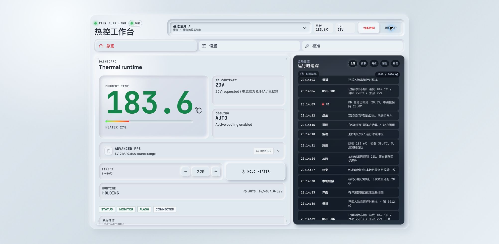
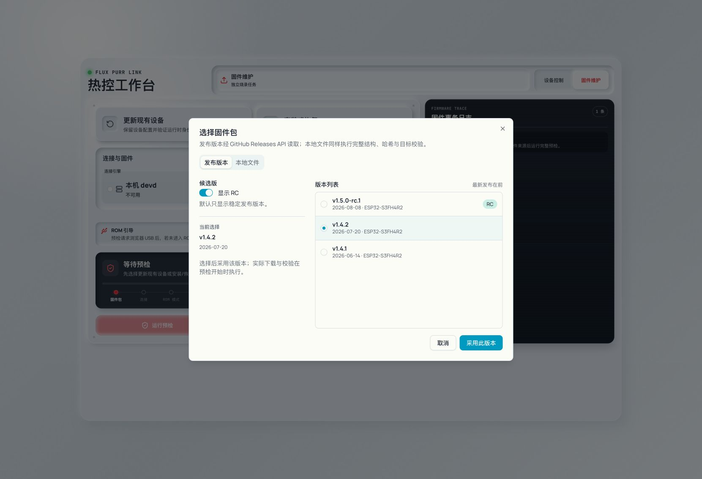
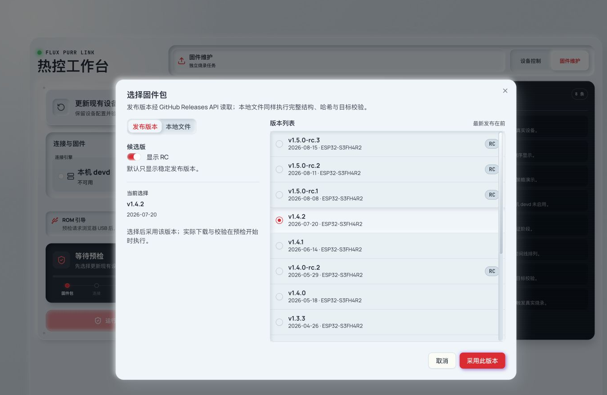
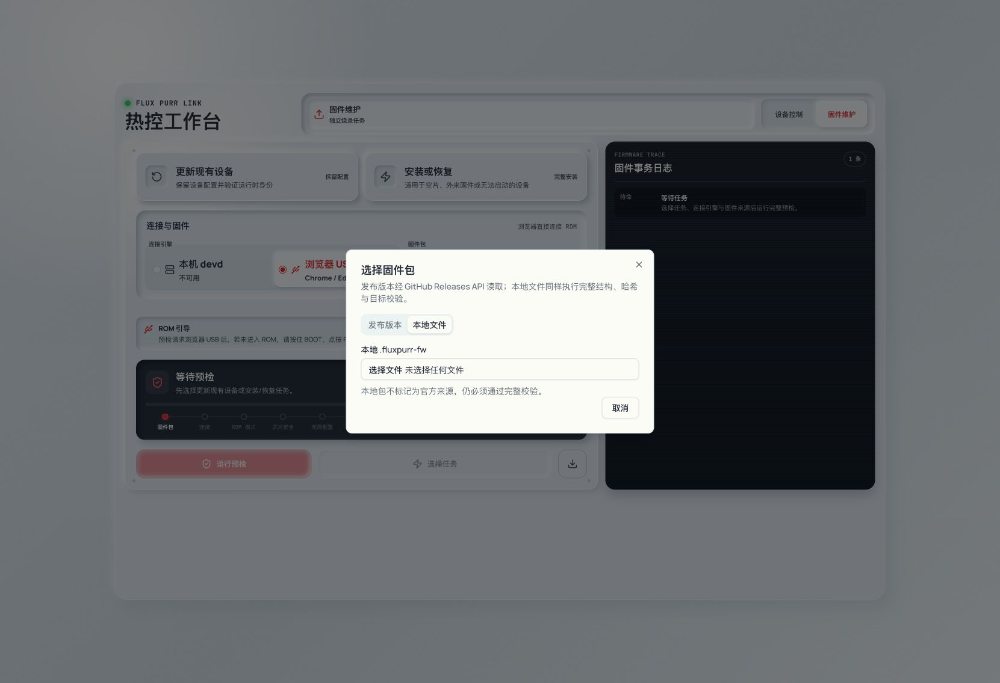
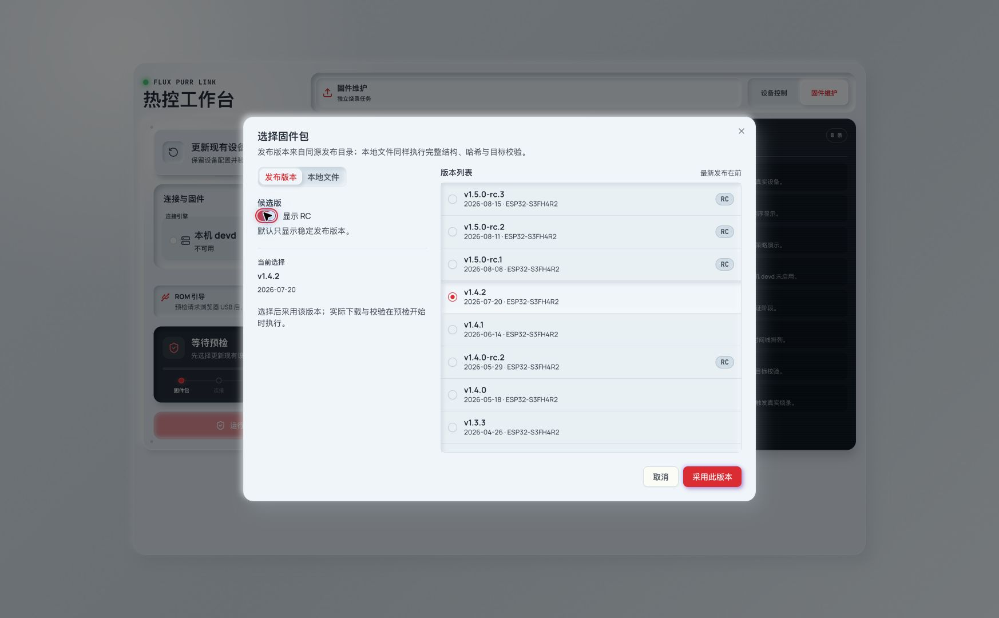
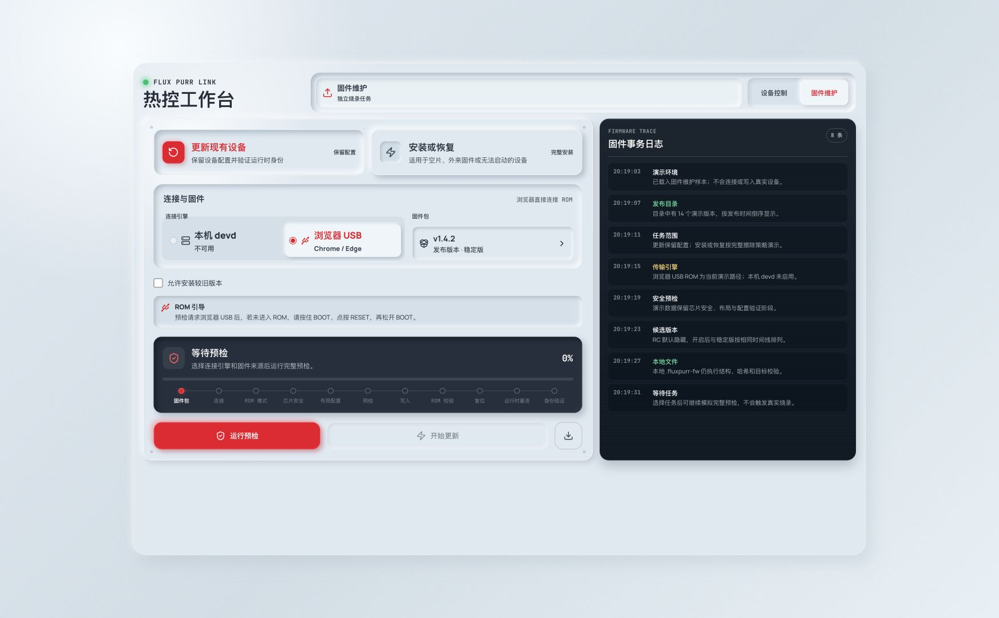
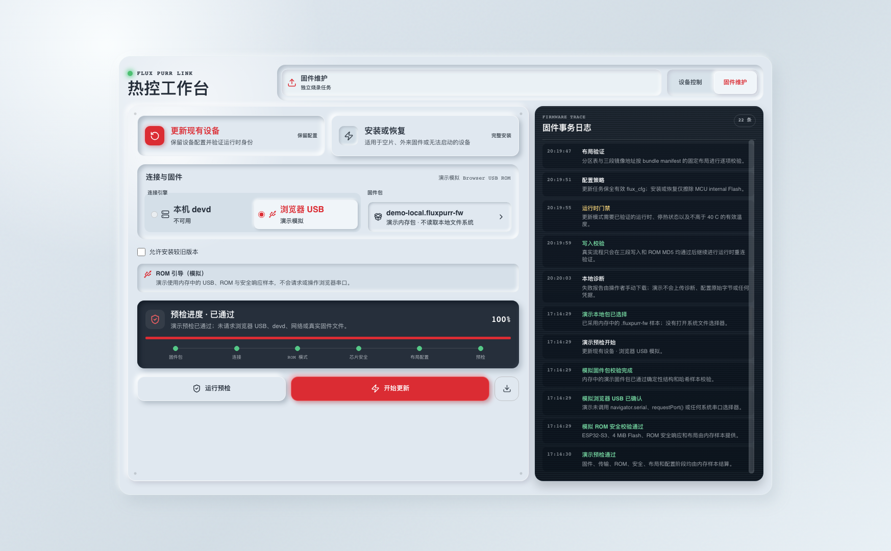
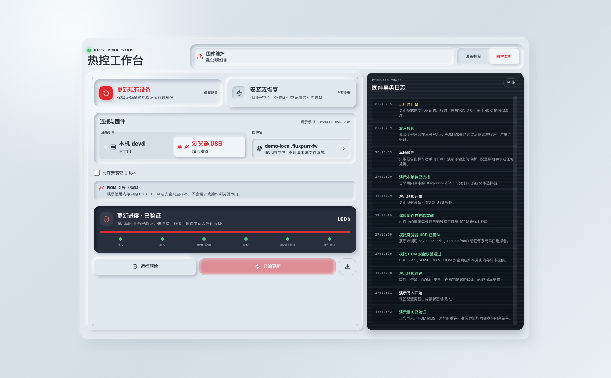
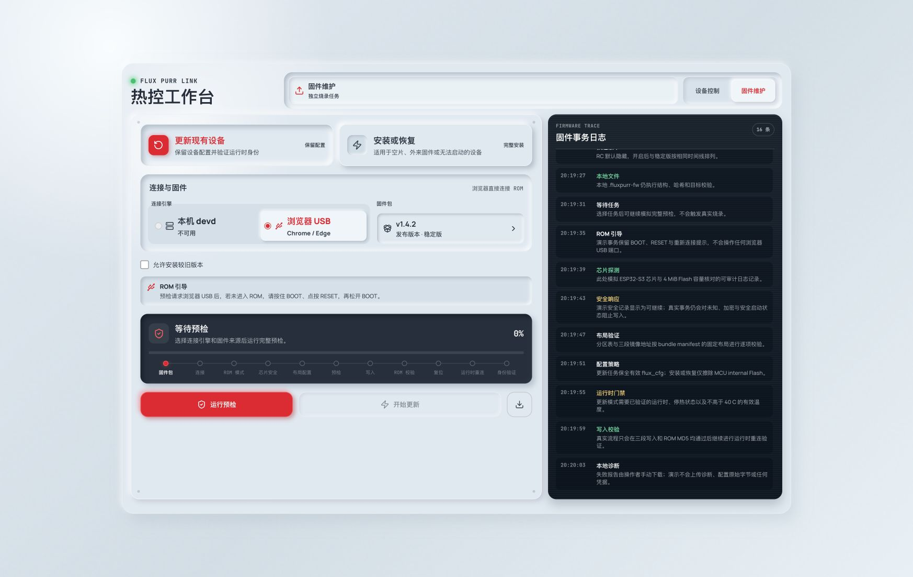

# Flux Purr Web 固件安装与恢复

> 当前有效规范以本文为准；实现覆盖与当前状态见 `./IMPLEMENTATION.md`，关键演进原因见 `./HISTORY.md`。

## 背景 / 问题陈述

- Web 控制台现有 Web Serial 仅承载运行时 JSONL，更新页的烧录能力只来自本机 `flux-purr-devd`。
- DIY 场景中的目标可能是空片、来自其他设备的 ESP32-S3，或运行非 Flux Purr 固件，不能依赖运行时身份完成首次安装或恢复。
- Browser 与 devd 若各自定义包格式、安全检查和结果语义，会造成相同固件在两条路径上产生不同安全结论。

## 目标 / 非目标

### Goals

- 提供“更新现有 Flux Purr”和“安装或恢复”两个一等任务。
- 默认优先 devd，不可用时允许桌面 Chromium 在 HTTPS/localhost 上使用 Web Serial。
- 两条引擎共享唯一、已签名的 `.fluxpurr-fw`、layout、安全、状态机和结果合同。
- 允许安装到空片或非 Flux Purr 固件目标；恢复流程不询问、推断或限制 PCB/加热器连接状态。
- 更新流程不承载 MCU 配置迁移，EEPROM 始终独立于 MCU internal-flash 擦写。

### Non-goals

- 不做 A/B、OTA rollback、断点续烧、静默重试或从未知候选中自动选择重新枚举的端口。
- Web 不接受裸 BIN、ELF、手工地址、任意 ESP32 板型或 LAN 烧录。
- 不接受未签名 bundle 或将本地文件视为免验证来源。
- 不让 `mcu-agentd` 参与实现、测试或验收。

## 范围（Scope）

### In scope

- `firmware/` build identity、layout、install status 与 commissioning persistence。
- `tools/flux-purr-devd/` bundle parser/packager、bundle API 和受保护烧录事务。
- `web/` bundle catalog/import、Browser Web Serial 烧录引擎、统一状态机和任务优先 UI。
- release workflow 与 product manifest 的 `.fluxpurr-fw` 产物。

### Out of scope

- 旧 devd-only ELF/raw CLI 开发者接口的移除。
- 未经主人精确端口授权的任何串口、复位、擦除或烧录操作。
- GitHub Release 正式发布与 PR merge。

## 需求（Requirements）

### MUST

- Bundle 必须符合 `contracts/firmware-bundle.schema.json`，携带产品发布签名，ZIP 解压前后均不得超过 8 MiB，且严格只含一个 manifest、一个 detached signature 和 bootloader、partition-table、factory-app 三段镜像。
- 目标固定为 ESP32-S3FH4R2、4 MiB Flash、2 MiB PSRAM、DIO/40 MHz；段地址固定为 `0x0`、`0x8000`、`0x10000`，边界由 `firmware/flash-layout.json` 定义。
- 每段声明实际长度、SHA-256 和 ESP ROM MD5；未知字段、路径穿越、重复、缺段、重叠、越界或 hash 不一致均 fail closed。
- Browser 与 devd 只接受 registry 中声明的 migration ID；update 的当前 partition-table SHA-256 必须精确匹配 migration source。
- update 仅适用于可验证 Flux Purr runtime；烧录前必须停热并取得有效温度 `<=40°C`。它不得保全、迁移或验证 MCU 内部配置分区。
- install/recovery 允许无 Flux 身份并全擦 MCU internal Flash；不得提出、推断或执行任何 PCB/加热器物理连接确认或限制。
- `get_install_status` 的 `setupReason` 在 commissioning 已完成时可以为 `null`；devd 必须按可选字段解码。固件维护目标必须保留已授权 native serial candidate，即使运行时 identity 的 capability 列表不包含 `flash`。
- Secure Boot、Flash Encryption、Secure Download Mode、未知安全响应、非 ESP32-S3 或非 4 MiB Flash 一律阻止。
- 写入中断后不得续传或静默重试；重新执行必须从完整 preflight 开始。
- preflight 与 execution 必须使用独立的阶段集合、operation ID、百分比和终态。preflight 通过可以显示 100%，但不得推进 execution；用户开始写入时 execution 必须从 0% 开始，且只有写入校验与运行时验证均成功的 `verified` 才能显示 execution 100%。
- devd update preflight 必须在进入 ROM 前从目标运行时重新读取 identity 与 status；不得使用发现缓存代替当前版本、停热和温度事实。独立 ROM preflight 一旦成功建立 ROM 连接，无论探测结论通过或阻止，都必须在返回前复位目标回到 runtime。
- devd 的单次烧录事务只能在开始时进入 ROM 一次，并在全部验证完成后复位到 runtime 一次；中间的擦除、段写入与 ROM MD5 必须保持 `no-reset`，不得为每个子命令复位目标。
- `verified` 必须同时满足段写入/ROM MD5 验证与 runtime identity/layout/install-status 验证；重连超时返回 `write_complete_unverified`。
- 失败报告只能由用户下载到本地，不自动上传，且不得包含配置原始字节、凭据或任意主机路径。
- Browser 预检必须在本地记录用户点击、已授权端口复用或 `requestPort()` 发起、端口选择或拒绝、运行时连接、ROM 连接和终态的有序追踪；该追踪必须写入本地诊断报告，且不得包含配置原始字节、凭据或任意主机路径。
- Browser 在预检前可只读调用 `navigator.serial.getPorts()`。当同一 origin 恰有一个已授权且 `getInfo()` 精确匹配 ESP32-S3 USB Serial/JTAG `0x303A:0x1001` 的端口时，默认必须复用该对象且不得调用 `requestPort()`；没有、信息不匹配或多于一个匹配端口时，必须在用户点击同步栈中以该 USB 过滤器调用 `requestPort()`。首次打开 USB Serial/JTAG 可能复位 MCU：Browser 只发送一次初始化 JSONL 请求；若该请求超时或返回 `startup_busy`，必须在总计 8 秒的启动窗口内等待固件 `boot_stage=runtime_ready`，之后只重发该请求一次，禁止基于定时器的盲目重试。Browser USB 区必须提供“选择 / 更换浏览器 USB 端口”入口：操作者主动点击时，即使有唯一已授权对象也必须在同一同步点击栈调用该过滤器的 `requestPort()`，所选对象替换当前事务目标、清除旧预检凭据并要求重新预检；取消选择不得自动替换到任何候选。授权属于 Chrome profile 中同一 `scheme + host + port` 的 Web Serial permission；清除站点数据、使用另一个 profile、或在开发中切换 `localhost`/`127.0.0.1`/端口时，必须视为未授权并重新要求用户选择。不得将蓝牙、调试控制台或其他无关主机串口暴露为候选项，不得据此自动选择或替换另一个端口。
- Browser 写后运行时验证不得调用 `requestPort()`、系统串口扫描或从未知候选自动换口。原 `SerialPort` 对象因 USB CDC 重枚举失效时，允许只读调用 `navigator.serial.getPorts()` 重新解析：仅当同一 origin 的已授权集合中恰有一个端口与当前事务原端口的 `getInfo()` 精确匹配 `0x303A:0x1001` 时，才可使用该新对象；没有匹配或存在多个匹配都必须失败，绝不猜测目标。断开、重枚举等待、打开、JSONL 请求、读取和关闭都必须受同一个有限总时限约束；端口暂时不可用时可以在这个唯一目标上重试。身份请求在总时限内必须有界且可见地重试，启动日志或 `runtime_ready` 标记仅作诊断、不得成为协议前提；超时必须结算为 `write_complete_unverified`，不得无限停留在进度中。
- 真实写入继续受 exact-port、lease、串口独占和 `FLUX_PURR_DEVD_ALLOW_REAL_FLASH=1` 门禁约束。
- Browser 只能读取当前 Web origin 的 `firmware/releases-manifest.json` 与其中声明的精确 `firmware/releases/**.fluxpurr-fw` 路径；不得访问 GitHub API、GitHub download URL、任意目录路径或任意代理 URL。
- `demo=true`、`uiDemo=firmware-workspace` 和发布 public demo 都是 mock-only UI 入口；其中 `uiDemo=firmware-workspace` 仅用于开发期视觉证据，不能作为发布产品路由。固件目录、发布包、本地包、USB 端口、ROM/security 响应和事务结果必须来自确定性的内存样本。所有这些 Demo 入口不得调用 devd HTTP/EventSource、业务 `fetch()`、`navigator.serial.getPorts()`、`navigator.serial.requestPort()`、串口打开/复位/esptool 或系统文件选择器；也不得产生跨源网络请求（包括远程字体）。预检与写入交互只推进模拟状态机。发布 public demo 必须剥离 `uiDemo` 参数，不得暴露开发证据入口。

### SHOULD

- 固件包选择必须是单一入口，打开组件库对话框后在“发布版本”和“本地文件”之间切换；发布版本采用受视口约束的左右两栏，左栏仅承载 RC opt-in、当前选择与说明，右栏通过共享 `ScrollArea` 呈现独立可滚动的版本列表。发布对话框高度为 `min(36rem, 100dvh - 4rem)`，版本列表必须占满 tabs 与公共操作区之间的全部可用高度，列表不得按稳定版或候选版分组，必须按 `publishedAt` 倒序展示；非稳定版本必须显示 `RC` chip，默认选中最新 stable。本地文件由用户信任但不豁免校验，且不把发布渠道本身伪装成可写入固件。
- 正式 release 构建必须在服务器侧分页读取 GitHub Releases REST API 的所有非 draft 版本，以 `Accept: application/octet-stream` 下载并严格验证有效 `.fluxpurr-fw`，再写入 Web 静态包中的同源目录与 `firmware/releases-manifest.json`。当前 release bundle 必须在 GitHub Release 创建前一并写入该目录。
- 本地 Vite 开发服务必须接管固定 `/firmware/**`，只提供已打包或服务器端验证过签名的 release bundle 同源目录。开发构建的本地 ELF 不得被包装、缓存或暴露为 General User bundle；它只能走 Developer `flash`。GitHub 刷新失败时仍返回已打包的已签名 release，不把失败传给 Browser。
- devd 可用时自动选中，但在操作开始前允许切换 Browser；开始后 transport 冻结。
- Browser 写入完成后，ESP32-S3 原生 USB Serial/JTAG 必须使用 esptool-js `UsbJtagSerialReset` 等价序列复位到运行时；不得以 UART RTS `hard_reset` 代替。Browser manual BOOT/reset fallback 必须给出可操作状态，而非自动猜测端口变化。

## 功能与行为规格（Functional/Behavior Spec）

### Core flows

统一状态机：`artifact -> transport -> rom_reset -> chip_flash_security -> preflight -> erase? -> write_segments -> rom_md5 -> reset -> runtime_reconnect -> runtime_verify`。

- Update：要求已识别 runtime；停热与温度门禁通过后写入三段，最后验证目标 identity/install status。MCU 内部配置迁移不属于该流程。
- Install/recovery：直接从 ROM security/chip/flash preflight 开始，全擦 internal Flash 后写三段；EEPROM 不属于擦除范围；首次启动进入 setup-required，heater 保持 locked。
- 传输选择：devd health 可用时默认 devd；否则符合条件的 Chromium 提供 Browser；LAN 永不提供 flash capability。
- Browser ROM/stub 顺序：Browser 先通过 ROM bootloader 完成芯片、Flash package 和 `GET_SECURITY_INFO` 安全预检；只有通过后才上传 esptool stub 读取布局或写入。ESP32-S3 原生 USB Serial/JTAG 的 stub 启动必须使用 `ESP_MEM_END` 的 2 秒交接超时，写后先执行 `hard_reset`，再按 `D0|R0|W50|D1|R0|W50|D0|R1|W50|D0|R0|W250` 复位回应用，并释放 ROM transport 后才进入运行时验证。写入必须消费同一连接的成功预检状态，不能重新在 stub 状态探测安全信息或绕过 ROM 预检。
- 降级：默认阻止，只有高级确认 `allowDowngrade=true` 后可继续，并仍执行全部门禁。
- 工作区导航：设备控制与固件维护是同级根工作区。设备态顶部固定为设备选择器、热板、PD、工作区切换；设备选择器只包含设备与连接方式。固件态不显示设备选择器、设备页签或设备运行日志，而显示仅包含当前烧录任务的固件事务日志；未选择控制设备时同样不显示总览、设置或校准页签。

### Edge cases / errors

- 端口消失或重新枚举：除 Browser 写后运行时验证中对同一 origin 已授权集合的唯一 `0x303A:0x1001` 精确匹配重解析外，当前事务失败，绝不自动选择新端口；重解析有多个或零个候选同样失败。
- Browser `GET_SECURITY_INFO`：接受恰好 20 字节的完整安全记录，或不少于 24 字节的完整 ROM/扩展响应；后者只解释协议定义的前 20 字节并忽略 ROM transport trailer 与后续扩展。少于 20 字节、21–23 字节截断响应、未知安全位或任一安全功能启用时：`blocked`，不得尝试写入。
- 写入已完成但 runtime 未在时限内重连：`write_complete_unverified`，不得宣称成功。
- 空白或损坏 persistence：写入安全默认，`commissioningRequired=true`；旧有效 record 缺少该 TLV 时视为已完成。

## 接口契约（Interfaces & Contracts）

### 接口清单（Inventory）

| 接口（Name） | 类型（Kind） | 范围（Scope） | 变更（Change） | 契约文档（Contract Doc） | 负责人（Owner） | 使用方（Consumers） | 备注（Notes） |
| --- | --- | --- | --- | --- | --- | --- | --- |
| `.fluxpurr-fw` | file format | external | New | `./contracts/file-formats.md` | bundle tool | Web/devd/release | strict ZIP |
| bundle manifest | JSON Schema | external | New | `./contracts/firmware-bundle.schema.json` | bundle tool | Web/devd | single schema |
| release catalog | JSON Schema | external | New | `./contracts/firmware-release-catalog.schema.json` | release builder | Web/Vite | same-origin only |
| firmware bundle catalog/import | HTTP | external | New | `./contracts/http-apis.md` | devd | Web | content addressed |
| protected firmware operation | HTTP | external | New | `./contracts/http-apis.md` | devd | Web | approval-bound |
| firmware operation progress | device SSE | external | New | `./contracts/http-apis.md` | devd | Web | operation-scoped ordered stages |
| install status | USB JSONL | external | New | `./contracts/device-install-status.md` | firmware | Web/devd | no secrets |

### 契约文档（按 Kind 拆分）

- [`contracts/file-formats.md`](./contracts/file-formats.md)
- [`contracts/http-apis.md`](./contracts/http-apis.md)
- [`contracts/device-install-status.md`](./contracts/device-install-status.md)
- [`contracts/firmware-bundle.schema.json`](./contracts/firmware-bundle.schema.json)
- [`contracts/firmware-release-catalog.schema.json`](./contracts/firmware-release-catalog.schema.json)
- [`contracts/migrations.json`](./contracts/migrations.json)

## 验收标准（Acceptance Criteria）

- Given 合法与恶意 ZIP fixtures，When 两个 validator 校验，Then 只接受签名有效、三段完整、hash 正确、无路径风险且不超过 8 MiB 的 bundle。
- Given devd 可用或不可用，When 打开固件工作台，Then 默认选择 devd 或回退 Browser，并可在 preflight 前手动切换。
- Given 空片或外来固件 ESP32-S3FH4R2，When 选择 install/recovery，Then 不要求 Flux 身份，也不存在 PCB/heater 物理确认限制。
- Given update 目标温度无效或高于 40C，When preflight，Then 写入被阻止且 heater 已保持停止。
- Given未知 security 响应或安全功能启用，When preflight，Then 两条引擎均 fail closed。
- Given Browser 收到 20 字节安全记录或不少于 24 字节的完整 ROM/扩展响应，When preflight，Then 从前 20 字节一致解析安全位；Given 21–23 字节截断响应，Then `blocked`。
- Given 写入和 ROM MD5 完成但 runtime 重连超时，When 结算，Then outcome 为 `write_complete_unverified`。
- Given preflight 已通过，When 用户开始写入，Then execution 使用独立步骤并从 0% 开始；Given execution 尚未得到 `verified`，Then execution 百分比不得为 100%。
- Given Browser 写入后 USB CDC 正在重新枚举或原端口短暂占用，When 运行时验证，Then 只对原授权对象或同一 origin 已授权集合中唯一精确匹配的 `0x303A:0x1001` 对象有界重试，并记录当前重连/请求/读取阶段；Given 匹配存在歧义或总时限耗尽，Then 清理读写锁、关闭端口并返回 `write_complete_unverified`。
- Given Browser 打开发布版本选择器，When 读取目录并选择版本，Then 只请求同源 `releases-manifest.json` 和清单中的精确 bundle 路径；Given Vite 开发模式中 GitHub 暂时不可用，Then 仍列出已打包和本地产物。
- Given 任一 Demo 入口（`demo=true`、`uiDemo=firmware-workspace` 或发布 public demo），When 选择发布版本或演示本地包、运行预检并开始更新，Then UI 显示确定性的模拟阶段与事务结果，且没有业务网络请求、devd 请求、跨源资源请求、浏览器串口调用或系统文件选择器。

## 验收清单（Acceptance checklist）

- [x] 核心路径的长期行为已被明确描述。
- [x] 关键边界/错误场景已被覆盖。
- [x] 外部合同已拆分并链接。
- [x] 真机授权边界保持不变。

## 实现前置条件（Definition of Ready）

- [x] ESP32-S3FH4R2 layout、bundle 与状态机冻结。
- [x] update/recovery 的身份和 persistence 语义冻结。
- [x] transport 优先级、channel 和 downgrade 选择冻结。
- [x] devd HIL 已在主人给出的单一精确串口与明确全擦授权下执行；授权不延伸到任何重新枚举的端口。

## 非功能性验收 / 质量门槛（Quality Gates）

- `bun run check:firmware:fmt`
- `bun run check:firmware:clippy`
- `bun run check:firmware:build`
- `bun run check:devd`
- `bun run check:web`
- `bun run check:web:build`
- `bun run check:e2e`
- bundle、security、migration、fake SerialPort 和 fake espflash fixture suites。
- ui_demo desktop 视觉证据。

## 文档更新（Docs to Update）

- `docs/specs/README.md`
- `docs/interfaces/http-api.md`
- `docs/specs/35bta-eeprom-memory-config/SPEC.md`
- `docs/specs/m8r4q-real-control-plane-runtime/SPEC.md`
- `firmware/README.md`
- `web/README.md`

## Visual Evidence

桌面 Demo 使用确定性 mock 数据和内存状态机；`demo=true` 是可交互的模拟产品入口，`uiDemo=firmware-workspace` 是开发期视觉证据路径，发布 public demo 不提供后者。所有入口都不依赖且不调用 devd、业务网络、跨源资源、浏览器串口、系统文件选择器或硬件设备。

非 Demo 入口支持 `?workspace=firmware` 直达固件维护工作区；本地构建包由同源目录提供，页面不会请求或操作浏览器串口直到用户明确运行预检。

## 实现里程碑（Milestones / Delivery checklist）

- [ ] M1: bundle/layout/schema/fixtures 与 release artifact 合同
- [ ] M2: firmware identity、install status 与 commissioning persistence
- [ ] M3: devd bundle API 与 protected update/recovery transaction
- [ ] M4: Browser engine、统一状态机、UI/E2E 与视觉证据
- [ ] M5: 非硬件门禁、授权 HIL、review 与 PR Step 5C 收敛

## 风险 / 开放问题 / 假设

- 每次 HIL 都要求主人提供精确端口与全擦授权；该授权不允许自动发现、重新枚举或切换端口。devd 与 Browser HIL 分别验收。
- Web Serial 正式支持 HTTPS/localhost 下桌面 Chrome 与 Edge；其他浏览器只能使用可用 devd。
- stable 为默认源，RC opt-in；发布版本在 Browser 中始终通过同源静态目录读取，本地文件由用户信任但不豁免校验。

## Related ADRs

- [`../../adr/0007-firmware-update-and-developer-flash-boundaries.md`](../../adr/0007-firmware-update-and-developer-flash-boundaries.md)
- [`../../adr/0008-eeprom-only-configuration-persistence.md`](../../adr/0008-eeprom-only-configuration-persistence.md)

## 参考（References）

- `../m8r4q-real-control-plane-runtime/SPEC.md`
- `../35bta-eeprom-memory-config/SPEC.md`
- `../hhwq8-web-control-plane-demo/SPEC.md`
